# Data Management plan for ACTRIS - Aerosol, Clouds and Trace Gases Research InfraStructure

# Table of contents

* [1. Introduction to The ACTRIS Data Centre and ACTRIS Data Management Plan](#1--introduction-to-the-actris-data-centre-and-actris-data-management-plan)
  * [1.1 The mission, overall goal and structure of the ACTRIS Data Centre](#11-the-mission-overall-goal-and-structure-of-the-actris-data-centre)
  * [1.2 The overall goal and structure of ACTRIS Data Management Plan](#12-the-overall-goal-and-structure-of-actris-data-management-plan)
* [2. ACTRIS data and ACTRIS data levels](#2-actris-data-and-actris-data-levels)
* [3. Data summary of the ACTRIS data centre](#3-data-summary-of-the-actris-data-centre)
  * [3.1. ACTRIS In Situ data centre unit (In-Situ)](#31-actris-in-situ-data-centre-unit-in-situ)
  * [3.2. ACTRIS Aerosol remote sensing data centre unit (ARES)](#32-actris-aerosol-remote-sensing-data-centre-unit-ares)
  * [3.3. ACTRIS Cloud remote sensing data centre unit (CLU)](#33-actris-cloud-remote-sensing-data-centre-unit-clu)
  * [3.4. ACTRIS trace gases remote sensing data centre unit (GRES)](#34-actris-trace-gases-remote-sensing-data-centre-unit-gres)
  * [3.5. ACTRIS Atmospheric simulation chamber data centre unit (ASC)](#35-actris-atmospheric-simulation-chamber-data-centre-unit-asc)
  * [3.6. ACTRIS Data Discovery, Virtual Access and Services (DVAS)](#36-actris-data-discovery-virtual-access-and-services-dvas)
* [4. Data Management at the ACTRIS data centre](#4-Data-Management-at-the-ACTRIS-data-centre)
  * [4.1 ACTRIS access and service policy](#41-actris-access-and-service-policy)
  * [4.2 Introduction and overview of ACTRIS Data Management architecture](#42-introduction-and-overview-of-actris-data-management-architecture)
    * [4.2.1 DVAS role and data management](#421-dvas-role-and-data-management)
    * [4.2.2 In-Situ dataflow and data management](#422-in-situ-dataflow-and-data-management)
      * [4.2.2.1 General Characteristics of In Situ Data Production](#4221-general-characteristics-of-in-situ-data-production)
      * [4.2.2.2 Online In Situ Data Production](#4222-online-in-situ-data-production)
      * [4.2.2.3 Offline In Situ Data Production](#4223-offline-in-situ-data-production)
    * [4.2.3 ARES dataflow and data management](#423-ares-dataflow-and-data-management)
    * [4.2.4 CLU dataflow and data management](#424-clu-dataflow-and-data-management)
    * [4.2.5 GRES dataflow and data management](#425-gres-dataflow-and-data-management)
    * [4.2.6 ASC dataflow and data management](#426-asc-dataflow-and-data-management)
  * [4.3 Findable: Making data findable, including provisions for metadata (FAIR data)](#43-findable-making-data-findable-including-provisions-for-metadata-fair-data)
    * [4.3.1 ACTRIS variable names and implementation of vocabulary](#431-actris-variable-names-and-implementation-of-vocabulary)
    * [4.3.2 Metadata standards and meta data services](#432-metadata-standards-and-meta-data-services)
    * [4.3.3 Traceability of ACTRIS data](#433-traceability-of-actris-data)
    * [4.3.4: Version control of ACTRIS (meta)data](#434-version-control-of-actris-metadata)
  * [4.4 Accessible: Making data openly accessible [FAIR data]](#44-accessible-making-data-openly-accessible-fair-data)
    * [4.4.1 ACTRIS data access and access protocols](#441-actris-data-access-and-access-protocols)
    * [4.4.2 ACTRIS Metadata Longevity Plan](#442-actris-metadata-longevity-plan)
  * [4.5 Interoperable: Making data interoperable [FAIR data]](#45-interoperable-making-data-interoperable-fair-data)
  * [4.6 Reuseable: Increase data re-use [FAIR data]](#46-reuseable-increase-data-re-use-fair-data)
* [5. Allocation of resources](#5-Allocation-of-resources)
* [6. Data security](#6-data-security)
  * [6.1 Archiving and preservation of In-Situ data](#61-archiving-and-preservation-of-in-situ-data)
  * [6.2 Archiving and preservation of ARES data](#62-archiving-and-preservation-of-ares-data)
  * [6.3 Archiving and preservation of CLU data](#63-archiving-and-preservation-of-clu-data)
  * [6.4 Archiving and preservation of GRES data](#64-archiving-and-preservation-of-gres-data)
  * [6.5 Archiving and preservation of ASC data](#65-archiving-and-preservation-of-asc-data)
  * [6.6 Archiving and preservation of DVAS metadata](#66-archiving-and-preservation-of-dvas-metadata)
* [7. Ethical aspects](#7-Ethical-aspects)
* [8. Appendix](#8-Appendix)
  * [Appendix 1: List of ACTRIS variables from observational platforms and associated recommended methodology](#appendix-1-list-of-actris-variables-from-observational-platforms-and-associated-recommended-methodology)
  * [Appendix 2: List of ACTRIS level 3 data products](#appendix-2-list-of-actris-level-3-data-products)
  * [Appendix 3: ACTRIS In situ data centre unit (In-Situ) data life cycle](#appendix-3-actris-in-situ-data-centre-unit-in-situ-data-life-cycle)
  * [Appendix 4: ACTRIS Aerosol remote sensing data centre unit (ARES) data life cycle and workflow diagram](#appendix-4-actris-aerosol-remote-sensing-data-centre-unit-ares-data-life-cycle-and-workflow-diagram)
  * [Appendix 5: ACTRIS Cloud remote sensing data centre unit (CLU) data life cycle and workflow diagram](#appendix-5-actris-cloud-remote-sensing-data-centre-unit-clu-data-life-cycle-and-workflow-diagram)
  * [Appendix 6: ACTRIS trace gases remote sensing data centre unit (GRES) data life cycle and workflow diagram](#appendix-6-actris-trace-gases-remote-sensing-data-centre-unit-gres-data-life-cycle-and-workflow-diagram)
  * [Appendix 7: ACTRIS Atmospheric simulation chamber data centre unit (ASC) data life cycle and workflow diagram](#appendix-7-actris-atmospheric-simulation-chamber-data-centre-unit-asc-data-life-cycle-and-workflow-diagram)
  * [Appendix 8: Data lifecycle and workflow for DVAS Data Centre Unit](#appendix-8-data-lifecycle-and-workflow-for-DVAS-data-centre-unit)
  * [Appendix 9: Format and external data sources for level 3 variables](#appendix-9-format-and-external-data-sources-for-level-3-variables)
  * [Appendix 10: ReOBS workflow diagram](#appendix-10-ReOBS-workflow-diagram)
  * [Appendix 11: Satellite data subsets workflow diagram](#appendix-11-Satellite-data-subsets-workflow-diagram)
  * [Appendix 12: Combined  analysis of GB lidar and satellite data workflow diagram](#appendix-12-Combined-analysis-of-GB-lidar-and-satellite-data-workflow-diagram)

## 1.  Introduction to The ACTRIS Data Centre and ACTRIS Data Management Plan

The Aerosol, Clouds and Trace Gases Research Infrastructure (ACTRIS) focuses on producing high-quality data for the understanding of short-lived atmospheric constituents and their interactions. These constituents have a residence time in the atmosphere from hours to weeks. The short lifetimes make their concentrations highly variable in time and space and involve processes occurring on very short timescales. These considerations separate the short-lived atmospheric constituents from long-lived greenhouse gases, and calls for a four dimensional distributed observatory. The Research Infrastructure (RI) ACTRIS is the pan-European RI that consolidates activities amongst European partners for observations of aerosols, clouds, and trace gases and for understanding of the related atmospheric processes, as well as to provide RI services to wide user groups (See the [Stakeholder Handbook](https://www.actris.eu/sites/default/files/2021-01/stakeholder%20handbook.pdf) for more information).

ACTRIS data are data from observational or exploratory National Facilities complying with the procedures established within ACTRIS.

ACTRIS observational platforms are fixed ground-based stations that produce long-term data based on a regular measurement schedule and common operation standards. These platforms perform measurements of aerosol, clouds, and reactive trace gases from the Earth surface throughout the troposphere up to the stratosphere by applying state-of-the-art remote-sensing and in situ measurement techniques under consideration of harmonized, standardized, and quality controlled instrumentation, operation procedures and data retrieval schemes. The sites are strategically located in diverse climatic regimes both within and outside Europe, and many of them contribute to one or several European and international networks, such as [EMEP](https://www.emep.int/), [EARLINET](http://earlinet.org/), [AERONET](https://aeronet.gsfc.nasa.gov/), [CLOUDNET](http://cloudnetservice.eu/), [NDACC](http://www.ndaccdemo.org/), and [GAW](http://www.wmo.int/pages/prog/arep/gaw/gaw_home_en.html), and are possibly partly shared with other environmental infrastructures, such as [ICOS](https://www.icos-cp.eu/), [SIOS](https://sios-svalbard.org/), [ANAEE](https://www.anaee.com/) or [eLTER](https://www.lter-europe.net/elter).

ACTRIS exploratory platforms are either simulation chambers, or Laboratory platforms and mobile platforms. The chambers are among the most advanced tools for studying and quantifying atmospheric processes and are used to provide many of the parameters incorporated in air quality and climate models. Atmospheric simulation chamber data contribute to better predict the behavior of the atmosphere over all time scales through a detailed understanding of the physical and chemical processes, which affect air quality and climate change. Atmospheric simulation chambers are among the most advanced tools for studying and quantifying atmospheric processes and are used to provide many of the parameters incorporated in air quality and climate models. Laboratory platforms and mobile platforms are set up to perform dedicated experiments and contribute data on atmospheric constituents, processes, events or regions by following common ACTRIS standards are considered ACTRIS exploratory platform.

*Figure 1: Overview of the types of National Facilities providing data to ACTRIS Data Centre*

ACTRIS is a unique RI improving both the quality of and access to atmospheric observations, developing new methods and protocols, and harmonizing existing observations of the atmospheric variables listed in [Appendix 1](https://folk.nilu.no/~richard/actris-ri-variables/Appendix_I_ACTRIS-RI_variables_21February2018.xlsx). Appendix 1 includes an updated list of all ACTRIS variables associated to recommended measurement methodology.

### 1.1 The mission, overall goal and structure of the ACTRIS Data Centre

> The mission of the ACTRIS Data Centre (DC) is to compile, archive and provide access to well documented and traceable ACTRIS measurement data and data products, including digital tools for data quality control, analysis, visualisation, and research. As a tool for science, the highest priorities for the ACTRIS DC are to maintain and increase the availability of ACTRIS data and data products relevant to climate and air quality research for all interested users.

The overall goal of the ACTRIS Data Centre (DC) is to provide scientists and other user groups with free and open access to all ACTRIS data, complemented with access to innovative and mature data products, together with tools for quality assurance (QA), data analysis and research. ACTRIS data and products should be findable, accessible, interoperable and reusable (FAIR), and the data centre work towards fulfilling the [FAIR principles](https://www.force11.org/group/fairgroup/fairprinciples).

The numerous measurement methodologies applied in ACTRIS result in a considerable diversity of the data collected. In accordance with these requirements. ACTRIS DC is organized in 6 Units, with clear links and procedures for interaction between the data centre Units, National Facilities (NFs) and topical centres (TCs).  There are 5 units with complementary topic expertise and 1 unit with integrating activities (DVAS).

The units and short names are:

* [ACTRIS Data Discovery, Virtual Access and Services unit (DVAS)](http://actris.nilu.no/)
* [ACTRIS In situ data centre unit (In-Situ)](http://ebas.nilu.no/)
* [ACTRIS Aerosol remote sensing data centre unit (ARES)](https://data.earlinet.org/)
* [ACTRIS Cloud remote sensing data centre unit (CLU)](https://cloudnet.fmi.fi/)
* [ACTRIS trace gases remote sensing data centre unit (GRES)](https://en.aeris-data.fr/)
* [ACTRIS Atmospheric simulation chamber data centre unit (ASC)](https://data.eurochamp.org/)

The ACTRIS DC is coordinated by the DVAS unit leader and all data is linked through the ACTRIS data portal serving as the access point to data and related information.
Furthermore, the data center work is organized in the ACTRIS data management board and the ACTRIS data expert team. The role of the ACTRIS DC Management Board is to ensure that the ACTRIS DC as a whole operates in a coordinated and coherent manner.

The Management Board is responsible for:
i.      The development of the Data Centre strategy together with Head Office (HO) and Topic Centers (TCs)
ii.     Implementing the agreed strategy,
iii.    Establishing and monitoring the implementation of the Data Centre Work Programme, and
iv.     Undertaking evaluation and monitoring of operations,
v.      Serving as the link to and interact with the contributing RPOs

The ACTRIS Data Expert Team which is a transversal technical group with representatives of all the DC topic units. The ACTRIS Data Expert team has 3 main roles:

1.Facilitate and ensure technical discussions and information flow across the data centre, exploiting and taking advantage ofthe expertise available to the benefit of all units

2.Ensure the necessary interaction on common technical topics and issues (standards, interoperability, user feedback...). In particular, this group will be in charge of the technical specification of the ACTRIS DC portal, metadata catalogue and common machine-to-machine access interfaces. It will make surethat technical solutions are implemented in such a way that all data hosted and managed in the topic units are visible and accessible through the portal. It will plan new developments of the data centre, and monitor the progress.

3.Propose changes and further development of ACTRIS Data Management Plan, for discussions and approval by ACTRIS DC management board before implementation

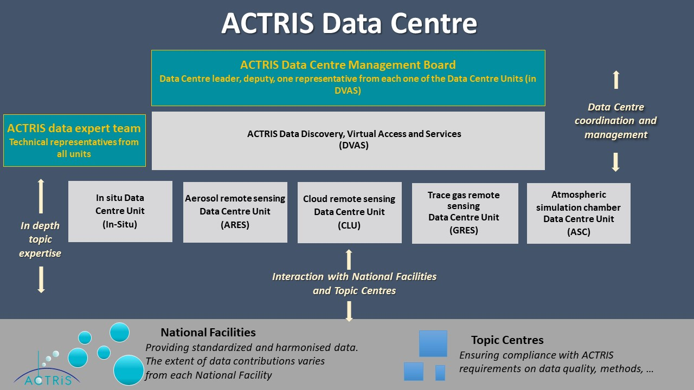
*Figure 2: Architecture of the ACTRIS Data Centre*

During the ACTRIS implementation phase (expected 2020-2024), the Central Facilities will be constructed and their services tested.

The following consortium is selected to host the ACTRIS Data Centre, and the various units with services to data producers and data users.

| Name of Central Facility and associated Unit                                | Hosting institution and contribution | Main activities                                                   |
|--------------------------------------------------------------|--------------------------------------|--------------------------------------------------------------------|
| [ACTRIS Data Discovery, Virtual Access and Services unit (DVAS)](http://actris.nilu.no/)                | NILU (lead), CNRS, CNR, FMI, BSC        | ACTRIS web interface for data, services and tools, called “The ACTRIS Data Centre”. Main activities are discovery and access to ACTRIS data and data products, digital tools provided by the topical centres and the data centre units, documentation, access to software and tools for data production. Offer visualisation of ACTRIS data products. Data production of selected Level 3 data and synergy data products. The data centre will offer bridge to external data bases and sources.|
| [ACTRIS In-Situ data centre unit (In-Situ)](http://ebas.nilu.no/)                   | NILU                                 | Data curation service for in situ data: all aerosol, cloud and trace gas in situ data. This comprises inclusion of data in the data base EBAS, archiving and documentation. Support for centralized data processing, harmonization, traceability, quality control and data product generation. Training and online tools for QA, QC. The activity enables RRT and NRT delivery.|
| [ACTRIS Aerosol remote sensing data centre unit (ARES)](https://data.earlinet.org/)              | CNR (lead), CNRS                                     |     Aerosol remote sensing data processing and curation. This includes centralized processing, traceability, harmonization and data versioning, quality control, data archiving in EARLINET DB, data provision and documentation. The activity enables RRT and NRT delivery. Production of level 3 data for climatological analysis and new products. Support and training. Tutorial activities. |
| [ACTRIS Cloud remote sensing data centre unit (CLU)](https://cloudnet.fmi.fi/)                   | FMI                                                                  |   Data curation service for cloud remote sensing data. Support for centralized cloud remote sensing data processing, traceability, harmonization, automated quality control and product generation, and data archiving. Enables RRT and NRT delivery. Production of level 3 data for NWP model evaluation. |
| [ACTRIS trace gases remote sensing data centre unit (GRES)](https://gres.aeris-data.fr/)    | CNRS                                 | Data curation service for reactive trace gases remote sensing data. This comprises standardized process for data submission, quality control, inclusion of data in the AERIS data base, metadata creation and provision and archiving. Production of level 3 data for climatological analysis, and added values products (quicklooks, links to EVDC - ESA Atmospheric Validation Data Centre).|
| [ACTRIS Atmospheric simulation chamber data centre unit (ASC)](https://data.eurochamp.org/) | CNRS                                 | Data curation service for atmospheric simulation chamber data. This includes standardized process for data submission, quality control, inclusion of data in the AERIS data base, search metadata creation and provision and archiving.|

*Table 1: Short description of the ACTRIS DC units and the research performing organizations leading and contributing to the units.*

### 1.2 The overall goal and structure of ACTRIS Data Management Plan

The ACTRIS Data Management Plan (DMP) document the key elements of the ACTRIS data management life cycle, and the plans for the data collected, processed and/or generated. The goal of the DMP is to describe the present situation and the operational ACTRIS data center. Furthermore the DMP should also describe the technical solutions agreed, that are currently under implementation, and outline the strategy and development needed towards making ACTRIS data FAIR at ACTRIS Data Centre Level.

The DMP will be updated regularly in accordance with the development, at least 4 times per year. The ACTRIS DMP is an online document which is set up to be machine-actionable as a part of the FAIR data ecosystem. The DMP should be a hub of information on ACTRIS FAIR digital objects. The goal is to make the ACTRIS DMP accessible for all stakeholders (repository operators, funders, researchers, publishers, infrastructure providers etc.) by making it available and accessible for both humans and machines. We currently use GitHub as the platform for collaboration on the DMP, this enables all actors working with or within ACTRIS to directly contribute and suggest changes to the document. Furthermore, the ACTRIS Data Management Plan should follow the glossary of terminology and definitions used in ACTRIS.

## 2. ACTRIS data and ACTRIS data levels

ACTRIS data are data from observational or exploratory National Facilities complying with the procedures established within ACTRIS. ACTRIS data comprises ACTRIS variables resulting from measurements at National Facilities that fully comply with the standard operating procedures (SOP), measurement recommendations, and quality guidelines established within ACTRIS. The ACTRIS atmospheric variables are listed in [Appendix I](https://folk.nilu.no/~richard/actris-ri-variables/Appendix_I_ACTRIS-RI_variables_21February2018.xlsx), associated to the corresponding recommended methodology.

There are 4 levels of ACTRIS data:
 * **ACTRIS level 0 data:** Raw sensor output, either mV or physical units. Native resolution, metadata necessary for next level.
 * **ACTRIS level 1 data:** Calibrated and quality assured data with minimum level of quality control.
 * **ACTRIS level 2 data:** Approved and fully quality controlled ACTRIS data product or geophysical variable.
 * **ACTRIS level 3 data:** Elaborated ACTRIS data products derived by post-processing of ACTRIS Level 0 -1 -2 data, and data from other sources. The data can be gridded or not.

Additionally to these data products which are completely under the control of ACTRIS with established procedures and standards, the ACTRIS DC will also produce additional data products of interest of the the scientific and  user communities. These are   **ACTRIS synthesis product:** data products from e.g. research activities, not under direct ACTRIS responsibility, but for which ACTRIS offers repository and access.

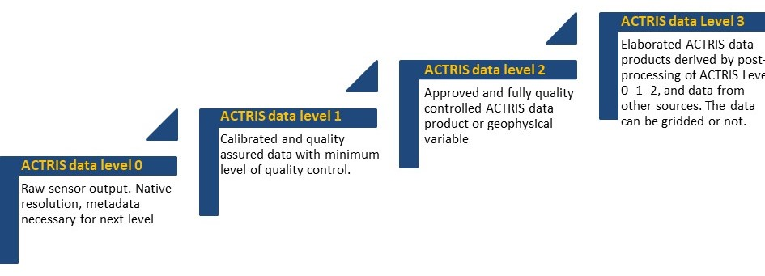
*Figure 3: ACTRIS data levels*

The list of ACTRIS variables are expected to increase during the progress of ACTRIS. Level 3 data products are expected to increase in quantity and number of variables because of the expected increase in ACTRIS data synergistic usage with other datasets. Additionally the expected technological and methodological developments fostered by ACTRIS itself will increase the ACTRIS observational capabilities and therefore the number and quality of observable atmospheric related variables (Level 1 and Level 2 products).

## 3. Data summary of the ACTRIS data centre

#### The purpose of the data collection/generation

Primary goal of ACTRIS is to produce high quality integrated datasets in the area of atmospheric sciences and provide services, including access to instrumented platforms, tailored for scientific and technological usage. The purpose of the data collection and generation of data products in ACTRIS is to provide open access to aerosol, cloud and trace gas in situ and remote sensing measurements of high quality, benefiting a large community of scientists involved in atmospheric science and related areas as well as policy makers, the private sector, educators and the general public.

See the [Stakeholder Handbook](hhttps://www.actris.eu/sites/default/files/2021-01/stakeholder%20handbook.pdf) for more information.

#### The relation to the objectives of the project as stated in [Stakeholder Handbook](https://www.actris.eu/sites/default/files/2021-01/stakeholder%20handbook.pdf)

The main objectives of ACTRIS are:

* to provide information on the 4D-compositon and variability and of the physical, optical and chemical properties of short-lived atmospheric constituents, from the surface throughout the troposphere to the stratosphere, with the required level of precision, coherence and integration;
* to provide information and understanding on the atmospheric processes driving the formation, transformation and removal of short-lived atmospheric constituents;
* to provide efficient open access to ACTRIS data and services and the means to effectively use the ACTRIS products;
* to ensure and raise the quality of data and use of up-to-date technology used in the RI and the quality of services offered to the community of users, involving partners from the private sector; and
* to promote training of operators and users and enhance linkage between research, education and innovation in the field of atmospheric science.

Management of ACTRIS data relates to measuring atmospheric composition and the ability to predict the future behavior of the atmosphere over all time scales. High quality observational data harmonized across the countries and continents facilitates this, and needs to be supported by:

* Documentation of archiving procedures and access to level 0 -> level 3 data produced by the National Facilities (NFs), Topical Centres (TCs), and Central Facilities (CFs)
* Documented and traceable processing chain of level 0 data
* Documented, traceable processing and long-term archiving and preservation of all ACTRIS level 1 to level 3 data and data products
* Access to ACTRIS data, data products, and digital tools through a single point of entry
* Documentation of data, data flow, citation service, and data attribution, including version control, data traceability, and interoperability,
* Data curation and support for campaigns and dedicated research projects and initiatives, external or internal to ACTRIS.

#### Main users of ACTRIS data and software

ACTRIS will produce data and data products essential to a wide range of communities as described in detail in the [Stakeholder Handbook](http://www.actris.eu/Portals/46/Documentation/ACTRIS%20PPP/Stakeholder%20Handbook/high_res_version.pdf?ver=2018-06-04-080105-217), section “Users” including:

* Atmospheric science research communities world-wide
  * The climate and air-quality, observational/ experimental/ modelling/ satellite communities, national and international research programmes and organisations;
* Environmental science research communities and communities from other neighboring fields: hydro-marine, bio-ecosystem, geosciences, space physics, energy, health, and food domain, to study interactions and processes in across different disciplines;
* Instrument manufacturers and sensor industries for development, testing, prototyping and demonstration;
* Operational services, National weather services, climate services for model validation, weather and climate analysis and forecasting;
* Space agencies for validation and the development of new satellite missions;
* National and regional air quality monitoring networks and environmental protection agencies for air quality assessments and validation of air pollution models;
* Policy makers and local/ regional/ national authorities for climate, air-quality, health and atmoshperic hazards related information for decision making and policy development.
* Copernicus atmospheric monitoring service (ECMWF)
* Science community working on air quality, climate change and stratospheric ozone depletion issues

### 3.1 ACTRIS In situ data centre unit (In-Situ)

The In-Situ data centre unit provides data curation service for aerosol, cloud and trace gas in situ data, as well as archiving of this data using the EBAS database. This comprises tools for harmonized data submission and meta data templates, inclusion of data and meta data in the data base, documenting (meta)data traceability and provenance, harmonization and data versioning, quality control, archiving, documentation, data identification, and data provision. Training and online tools for QA/QC are offered. The activity enables RRT and NRT data collection, compilation and delivery, and provides tutorial activities. Furthermore, support for centralized data processing, harmonization, and data product generation, both level 2 and level 3 are offered and further implemented during the implementation phase.

#### The types and formats of data generated/collected
The ACTRIS In-situ data centre unit is supported by the [EBAS database infrastructure](http://ebas.nilu.no/ResourcesATMOS/AboutEBAS.pdf). In situ data submitted to ACTRIS need to be formatted in the EBAS NASA-Ames format (ASCII file) by the data originator. There are exsisting [instructions and templates](https://ebas-submit.nilu.no/) for each instrument/group of instruments. [The EBAS NASA-Ames format](https://projects.nilu.no//ccc/tfmm/kjeller_2016/EBAS_Data_Format_2016-10.pdf) is based on the ASCII text NASA-Ames 1001 format, but uses an additional profile with metadata specifications ensuring proper documentation from the [EBAS-Submit documentation](https://ebas-submit.nilu.no/) website as well as tools for [file-generation](http://dev-ebas-file-generation-tool.nilu.no/) (*beta*) and [file-submission](https://ebas-submit-tool.nilu.no/).

ACTRIS in situ data are also available in netCDF 4 format through the [EBAS Thredds Server](https://thredds.nilu.no/thredds/catalog.html), following the [CF 1.7 convention](http://cfconventions.org/Data/cf-conventions/cf-conventions-1.7/cf-conventions.html) and the [Attribute Convention for Data Discovery 1-3 (ACDD)](http://wiki.esipfed.org/index.php/Attribute_Convention_for_Data_Discovery_1-3). EBAS metadata are available through an [OAI-PMH metadata endpoint serving](https://ebas-oai-pmh.nilu.no/oai/provider?verb=ListIdentifiers&metadataPrefix=iso19115) serving metadata with a profile meeting ISO 19115-2, CF-1.7, and ACDD specifications.

#### Re-use of existing data

The ACTRIS data user interface will include access to aerosol and trace gas in situ legacy data resulting from ACTRIS pre-projects (for In-Situ [CREATE, EUSAAR, ACTRIS-FP7](https://www.actris.eu/About/ACTRIS/Heritage.aspx). These will also be included as a part of the ACTRIS In Situ data centre unit. Legacy data resulting from ACTRIS pre-projects will be available in the same format as current products.

#### The origin of the data

The data are derived from instrument raw data, either through online or offline observations.

#### The expected size of the data

| Type                          |Number of annual datasests (end 2019)                          | Number of annual datasets (min by 2025) | Number of annual datasets (max by 2025) |
|-------------------------------|----------------------------------------------------------|-----------------------------------------|-----------------------------------------|
| ACTRIS in situ aerosol data   |           60                                             |       50                                |   120                                   |
| ACTRIS in situ cloud data     |           0                                              |       35                                |   105                                   |
| ACTRIS in situ trace gas data |           27                                             |       30                                |   60                                            |

*Table 2: Number of annual datasets*

| Type                          |Data volume (end 2019)                                          | Data volume (min by 2025)                | Data volume (max by 2025) |
|-------------------------------|-----------------------------------------------------------|------------------------------------------|------------------------------------------|
| ACTRIS in situ aerosol data   |           18 000 MB                                       |       15 000 MB                          |   50 000 MB                              |
| ACTRIS in situ cloud data     |           0 MB                                            |       1 GB                               |   3 GB                                   |
| ACTRIS in situ trace gas data |           300 MB                                          |       200 MB                             |   400 MB                                     |

*Table 3: Data volume*

#### Data utility

According to [IPCC AR5](https://www.ipcc.ch/site/assets/uploads/2018/02/SYR_AR5_FINAL_full.pdf), aerosol particles in the atmosphere are the most prominent source of uncertainty of climate predictions. Depending on their properties, they can have a warming as well as cooling effect on climate by scattering and absorbing solar radiation, and they can extend brightness and lifetime of clouds. Volatile organic compunds (VOCs) are one source of precursors for aerosol particles by forming condensable vapours during oxidation and decay in the atmosphere. By interaction with nitrogen oxides (NO_x), themselves a pollutant emitted by combustion, decaying VOCs form ozone (O_3), another pollutant. All of these, particulate matter, VOCs, NO_x, and ozone, have adverse effects on human health. Data on concentrations and properties of these compounds stored in the ACTRIS DC In Situ unit address all of the named effects:
* **In Situ** data feed into the IPCC assessment reports in order to quantify and reduce the uncertainty of climate change.
* **In Situ** data are the basis of national and international assessment reports of air quality.
* **In Situ** data feed into and validate operational air quality prediction products, e.g. by Copernicus.

#### Outline of data life cycle (workflow and workflow diagram)
Detail on the data life cycle and workflow (workflow diagrams for data production) for in situ observations can be found in [*Appendix 3: ACTRIS in situ aerosol, cloud and trace gas data lifecycle and workflow (draft)*](https://github.com/actris/data-management-plan/blob/master/DMP/ACTRIS-DMP.md#appendix-3-actris-in-situ-data-centre-unit-in-situ-data-life-cycle).

### 3.2 ACTRIS Aerosol remote sensing data centre unit (ARES)

The ARES data centre unit provides data curation and data processing service for aerosol remote sensing data coming from lidar and photometer observations. This includes centralized data processing, data storage, recording of metadata in a dedicated RDBMS, traceability, harmonization and data versioning, quality control, documentation and data provision. The unit allows for RRT and NRT data provisioning and offers support and training activities. Furthermore, level 3 data production for climatological analysis and the delivery of new data products will be further implemented and offered during the implementation phase.

The main goal is providing access of high quality and document datasets of the aerosol optical properties vertical distribution in the whole troposphere and upper stratosphere with short time resolution.
This long term dataset collected at continental scale allows:
- investigation of the relationship between near-surface processes (as pollution or air quality issues) and atmospheric aerosol contents;
- addressing the challenging issue of direct and indirect effects of aerosol in the climate change.

#### The types and formats of data generated/collected

The ACTRIS ARES data centre unit is built on the heritage of the EARLINET data base infrastructure and will integrate the photometer aerosol data processing. Aerosol remote sensing data submitted to ACTRIS need to be compliant to a specific format established by the ARES unit centralized processing suite. All further data levels are produced by the ARES processing suite. ARES provides data compliance with NetCDF4, following Climate Forecast (CF) 1.11 conventions.

* ARES Level 1 data products consist of high and low resolution total attenuated backscatter and volume depolarization ratio time series provided in NRT or RRT. Volume/particle depolarization ratio calibration products are also provided. In addition, cloud masking products and calibrated high- and low-resolution pre-processed products are provided in NRT or RRT. Data provided by photometer observations are also available. Additionally, ARES provides columnar information and synergistic lidar/photometer products as vertical profiles of aerosol microphysical properties as Level 1 data.

* ARES Level 2 data products contain fully quality assured aerosol extinction, backscatter, lidar ratio, Angstrom exponent and depolarization ratio vertical profiles and full quality controlled columnar information and aerosol microphysical properties profiles.

* ARES Level 3 data products are retrieved from the level 2 data and provide statistical analysis (including seasonality and annuality) of the most important aerosol optical parameters.

#### Re-use of existing data
The ACTRIS data user interface will include access to aerosol remote sensing legacy data resulting from ACTRIS pre-projects (for ARES [EARLINET, EARLINET-ASOS](https://www.actris.eu/About/ACTRIS/Heritage.aspx)). These will also be included as a part of the ACTRIS ARES data centre unit. Legacy data resulting from ACTRIS pre-projects will be available in the same format as current products.

#### The origin of the data

The origin of the data is derived from instrument raw data provided by the data originators in a common format (NetCDF).

#### The expected size of the data

| Type                                |Number of annual datasets (end 2019)                          | Number of annual datasets (min by 2025) | Number of annual datasets (max by 2025) |
|-------------------------------------|----------------------------------------------------------|-----------------------------------------|---------------------------------------------|
| ACTRIS aerosol remote sensing data  |           28                                             |       30                                |   52                                        |
 GRASP/GARRLiC                        |                        6                                 |             30                          |    52                                       |
|    GRASP-AOD          |                        0          |             30                          |     400                                 |

*Table 4: Number of annual datasets*

| Type                               |Data volume (end 2019)                                          | Data volume (min by 2025)                | Data volume (max by 2025)  |
|------------------------------------|-----------------------------------------------------------|------------------------------------------|---------------------------------|
| ACTRIS aerosol remote sensing data |           4 GB                                            |       2.5 TB                             |   20 TB                         |
| GRASP/GARRLiC                      |                            3.2 GB                         |     40 GB                                |           50 GB                 |
|    GRASP-AOD          |                        0          |             30 GB                          |    360 GB                                 |

*Table 5: Data volume*

#### Data utility

Atmospheric aerosols are considered one of the major uncertainties in climate forcing, and a detailed aerosol characterization is needed in order to understand their role in the atmospheric processes as well as human health and environment. The most significant source of uncertainty is the large variability in space and time. Due to their short lifetime and strong interactions, their global concentrations and properties are poorly known. For these reasons, information on the large-scale three-dimensional aerosol distribution in the atmosphere should be continuously monitored. It is undoubted that information on the vertical distribution is particularly important and that lidar remote sensing is the most appropriate tool for providing this information. ARES data products are particularly useful for addressing important issues like validation and improvement of models that predict the future state of the atmosphere and its dependence on different scenarios describing economic development, including those actions taken to preserve the quality of the environment.

* ARES Level 1 data are particularly interesting for several applications such as model assimilation and monitoring of special/critical events (volcanic eruptions, dust intrusions, ...).

* ARES Level 2 data allow for an optimal and complete optical and microphysical characterization of atmospheric aerosol. This is the fundamental starting point for any study regarding the assessment of aerosol in many atmospheric processes (climatology, climate change, Earth radiative budget, aerosol layer characterization, long range transported aerosol processes).

* ARES Level 3 data are climatological products providing statistical analysis of aerosol optical parameters. These products are useful for the characterization of different sites all over Europe as well as to underline seasonalities, annualities and trends. ARES Level 3 data from ground-based lidar and satellite observations are useful for representativeness study and for full exploitation of satellite data.

#### Outline of data life cycle (workflow and workflow diagram)

Details of the data life cycle and workflow (workflow diagrams for data production) for aerosol remote sensing observations can be found in [Appendix 4: ACTRIS aerosol remote sensing data lifecycle and workflow (draft)](https://github.com/actris/data-management-plan/blob/master/DMP/ACTRIS-DMP.md#appendix-4-actris-aerosol-remote-sensing-data-centre-unit-ares-data-life-cycle-and-workflow-diagram).

### 3.3 ACTRIS Cloud remote sensing data centre unit (CLU)

The CLU data centre unit provides data curation and data processing service of cloud remote sensing data. This includes centralized processing, traceability, harmonization and data versioning, quality control, data provision and archiving, and documentation. The activity enables RRT and NRT data compilation and delivery, and participation in training. Furthermore, data product generation of level 3 data for forecast and climate model evaluation, climatological analysis and new products is offered and further implemented during the implementation phase.

#### The types and formats of data generated/collected

The ACTRIS CLU data centre unit is making use of the so-called Cloudnet processing and archiving infrastructure,
operated at the Finnish Meteorological Institute, Helsinki, Finland.
Level 0 data submitted to ACTRIS CLU are required to be in a specified format compliant with the centralized processing suite.
All further data levels are produced by the CLU processing suite and provided for users. CLU provides harmonized data products
compliant with netCDF4 format, following CF 1.7 convention as much as possible.

#### Re-use of existing data

The ACTRIS data portal will include access to cloud remote sensing legacy data resulting from ACTRIS pre-projects.
The CLU legacy data will be available in the same format as the current products but including
no provenance information and less quality control.

#### The origin of the data

Data is derived from instrument raw data, coupled with thermodynamic profiles from NWP model.

#### The expected size of the data

| Type                              |Number of annual datasests (end 2019)                          | Number of annual datasets (min by 2025) | Number of annual datasets (max by 2025) |
|-----------------------------------|----------------------------------------------------------|-----------------------------------------|-----------------------------------------|
| ACTRIS cloud remote sensing data  |       11                                                 |      15                                 |   25                                    |

*Table 6: Number of annual datasets*

| Type                               |Data volume (end 2019)                                     | Data volume (min by 2025)             | Data volume (max by 2025)             |
|------------------------------------|------------------------------------------------------|---------------------------------------|---------------------------------------|
| ACTRIS cloud remote sensing data   |           15 TB                                      |       50 TB                           |   150 TB                              |

*Table 7: Data volume*

#### Data utility

Clouds are highly variable in time, space, and in their macro- and microphysical aspects. This variability directly impacts radiative transfer and the hydrological cycle, and the accurate representation of clouds is fundamental to climate and numerical weather prediction.
CLU products are particular valuable for investigating the response of cloud microphysical processes to changes in other atmospheric variables (aerosol-cloud-precipitation interaction), evaluating and developing the parametrization schemes used to represent cloud in climate and numerical weather prediction models, and for validating satellite products used in data assimilation.

CLU level 2 data are utilised by a large community of atmospheric scientists and operational agencies, with products permitting both process studies and model parametrization
CLU level 3 comprises climatological products for climate and forecast model evaluation, together with seasonal and diurnal composites enabling the characterisation of cloud properties across Europe.

#### Outline of data life cycle (workflow and workflow diagram)

Details on the data life cycle and workflow (workflow diagrams for data production) for remote sensing observations can be found in [Appendix 5: ACTRIS cloud remote sensing  data lifecycle and workflow (draft)](https://github.com/actris/data-management-plan/blob/master/DMP/ACTRIS-DMP.md#appendix-5-actris-cloud-remote-sensing-data-centre-unit-clu-data-life-cycle-and-workflow-diagram).

### 3.4 ACTRIS trace gases remote sensing data centre unit (GRES)

The GRES data centre unit provides data curation service for reactive trace gases remote sensing data. This includes standardized process for metadata and data submission, traceability, data versioning, quality control, inclusion of data in the data base, data provision and archiving, and documentation. In addition, it offers production of level 3 for climatological analysis and added values products (quicklooks, links to EVDC-ESA Atmospheric Validation Data Centre).

The ACTRIS-GRES unit is structured in one unique database including measurements issued from five types of instruments:
-   FTIR: Fourier Transform Infra-Red Spectrometry,
-   UVVIS: Ultra-Violet and Visible spectroscopy including
        - UV-VIS ZS (zenith-sky) SAOZ (Sytème d’Analyse par Observation Zénithale) spectrometer,
        - UVVIS MAX-DOAS (Multi-AXis Differential Optical Absorption Spectroscopy instruments),
        - PANDORA instruments.
-   LIDAR DIAL: Differential Absorption Lidar.

All data are stored in the GRES database which is hosted by the French data center for atmospheric data AERIS.

#### The types and formats of data generated/collected

Level 2 and level 3 trace gases remote sensing data produced are either profiles (O3) or columns (O3, C2H6, HCHO, NO2, NH3 …) products. The level 2b data are processed from the consolidation of level 2a data using quality assurance and quality control procedures. The level 3 data are produced from level 2b data, trace gas profiles or columns, and correspond to monthly averaged climatologies as well as coincident data with satellite overpasses.
Level 2 and level 3 trace gases remote sensing data submitted to ACTRIS need to be in GEOMS HDF data format (Generic Earth Observation Metadata Standard, http://www.ndsc.ncep.noaa.gov/data/formats) following the appropriate GEOMS template for FTIR, UVVIS and LIDAR measurements (https://evdc.esa.int/tools.data-formatting-templates/). The GEOMS data format allows the necessary requirements to setup the ACTRIS data curation service for trace gas remote sensing data. The level 2 and level 3 data will be also converted in NetCDF (https://www.unidata.ucar.edu/software/netcdf/)) version 4 format following the CF 1-7 (Climate Forecast) conventions and be disseminated. The Climate and Forecast conventions are metadata conventions for earth science data. The conventions define metadata that are included in the same file as the data making the file "self-describing".  Level 0 and 1 data submitted to ACTRIS GRES are required to be in a specified format compliant with the centralized processing suite. All further data levels are produced by the NF processing suite.

#### Re-use of existing data
The ACTRIS data user interface will include access to reactive trace gases remote sensing legacy data data resulting from AERIS project (for NDACC data) . These will also be included as a part of the ACTRIS GRES data centre unit. Legacy data resulting from AERIS project will be available in the same format as current products.

#### The origin of the data
The L2 data are derived from instrument raw data, through offline observations. All the data processing is performed by NFs.

#### The expected size of the data

| Type                                |Number of annual datasets (end 2019)                          | Number of annual datasets (min by 2025) | Number of annual datasets (max by 2025) |
|-------------------------------------|----------------------------------------------------------|-----------------------------------------|-----------------------------------------|
| ACTRIS-GRES FTIR                    |                  276                                 |         624                            |            3744                         |
| ACTRIS-GRES SAOZ                 |             2900                                         |          7250                            |           14500                         |
| ACTRIS-GRES MAX-DOAS                |             14600                                         |          14600                            |             14600                        |
| ACTRIS-GRES PANDORA                 |             37230                                          |          7665                            |             10220                         |
| ACTRIS-GRES LIDAR DIAL              |                  400                                |          100                            |            200                          |

*Table 8: Number of annual datasets*

| Type                               |Data volume (end 2019)                                          | Data volume (min by 2025)                | Data volume (max by 2025)  |
|------------------------------------|-----------------------------------------------------------|------------------------------------------|----------------------------|
| ACTRIS-GRES FTIR |                    2,5 GB                                   |              25 GB                         |          150 GB               |
| ACTRIS-GRES SAOZ  |                   0,6 GB                                   |              6 GB                         |          15 GB               |
 ACTRIS-GRES MAX-DOAS |                     600 GB                                   |              3 TB                         |          3 TB           |
  ACTRIS-GRES PANDORA  |                     1,7 TB                                  |              6 TB                         |          10 TB               |
| ACTRIS-GRES LIDAR DIAL |                     0,4 GB                                |              1 GB                      |          2 GB            |

*Table 9: Data volume*

#### Data utility

The data of GRES could be used to monitoring the evolution of key stratospheric gas trace such ozone under the effect of anthropogenic emissions, climate change and natural events. The retrieval of previous data by GRES will allow homogeneous data series to compute trends. Data could be also used in support of validation of satellite measurements deployed by international space agencies as well as models simulations.

#### Outline of data life cycle (workflow and workflow diagram)
Detail on the data life cycle and workflow (workflow diagrams for data production) for trace gases remote sensing data can be found in [Appendix 6](https://github.com/actris/data-management-plan/blob/master/DMP/ACTRIS-DMP.md#appendix-6-actris-trace-gases-remote-sensing-data-centre-unit-gres-data-life-cycle-and-workflow-diagram).

### 3.5 ACTRIS Atmospheric simulation chamber data centre unit (ASC)

The ASC data centre unit provides data curation service for data obtained from experiments in atmospheric simulation chambers (ACTRIS exploratory platforms). This includes tools for harmonized data and metadata submission, inclusion of data and metadata in the database, traceability, harmonization and data versioning, quality control, archiving, documentation and data provision. The ASC unit is structured in three pillars:

* The Database of Atmospheric Simulation Chamber Studies (DASCS) provides access to experimental data (level 2 data), typically time-series of measured parameters during an experiment in a simulation chamber.

* The Library of Analytical Resources (LAR) provides quantitative analytical resources that include infrared spectra and mass spectra of molecules and derivatives (level 3 data).

* The Library of Advanced Data Products (LADP) provides different types of mature data products (level 3 data): rate constants of reactions, quantum yields and photolysis frequencies of trace gas compounds, secondary organic aerosol (SOA) yields, mass extinction/absorption/scattering coefficients and complex refractive index of aerosols, growth factors of aerosols and modelling tools. The detailed list of ACTRIS level 3 data products is given in [Appendix 9](https://github.com/actris/data-management-plan/blob/master/DMP/ACTRIS-DMP.md#appendix-9-format-and-external-data-sources-for-level-3-variables).

**The types and formats of data generated/collected**

The ACTRIS ASC data centre unit is making use of EUROCHAMP database (https://data.eurochamp.org/) which is hosted by AERIS infrastructure. Data submitted to the DASCS pillar have to be provided by NFs in a standard format, called “EDF format” (EUROCHAMP Data Format) which is based on an ASCII text format and contains additional metadata in a header. These data are completed with rich metadata which are available from the website and give access to a technical description of the chambers (size, volume, walls, irradiation system), the experimental protocols used for the generation of the data, and an “auxiliary mechanism” which provides the chamber-dependent parameters affecting the observations. Currently, work is being conducted with regards to providing tools for access and download of data also in the netCDF 4 format, compliant with the CF 1.7 convention. This will be implemented during ACTRIS implementation phase.

Level 3 data provided in LAR are IR and mass spectra in JCAMP-DX format which is the standard format recommended by IUPAC for spectra. It is a 2D graphic format based on ASCII format. Metadata are attached and made available through the ACTRIS data user interface. These data are provided by NFs.

Level 3 data provided in LADP are of different types and have thus different formats. However, each type of data is provided in a harmonized format. Most of them are provided as a unique value with metadata attached.

**Re-use of existing data**

The ACTRIS data user interface will include access to atmospheric simulation chamber legacy data resulting from ACTRIS pre-projects (for ASChere EUROCHAMP-1, -2, and EUROCHAMP-2020). These will also be included as a part of the ACTRIS ASC data centre unit. Legacy data resulting from ACTRIS pre-projects will be available in the same format as current products.

**The origin of the data**

Data provided in DASCS and LAR pillars are derived from instrument raw data and data provided in LADP are produced from L2 data processing. All the data processing is performed by NFs.

**The expected size of the data**

| Type                                |Number of annual datasets (end 2019)                          | Number of annual datasets (min by 2025) | Number of annual datasets (max by 2025) |
|-------------------------------------|----------------------------------------------------------|-----------------------------------------|-------------------------------|
| ACTRIS-ASC DASCS                    |                   200                                    |          50                            |             300                 |
| ACTRIS-ASC LAR                 |                   20                                  |          10                          |             50               |
| ACTRIS-ASC LADP              |                   70                                     |          50                             |             200                |

 *Table 10: Number of annual datasets*

|  Type                                |Data volume (end 2019)                          | Data volumes (min by 2025) | Data volume (max by 2025) |
|-------------------------------------|----------------------------------------------------------|-----------------------------------------|-------------------------------|
| ACTRIS-ASC DASCS                    |                  1,2 GB                                  |        1,5 GB                            |             2,4 GB                 |
| ACTRIS-ASC LAR                 |                   67 MB                                  |          76 MB                        |            120 MB               |
| ACTRIS-ASC LADP              |                   26 KB                                     |          200 KB                             |             500 KB                |

*Table 11: Data volume*

**Data utility**

Atmospheric simulation chamber data contribute to better predict the behavior of the atmosphere over all time scales through a detailed understanding of the physical and chemical processes which affect air quality and climate change. ACTRIS-ASC unit gives access to different types of data and data products essential to a wide range of
communities. Many of these parameters are incorporated in air quality and climate models.

* Level 2 data provided in DASCS are of high interest for a large community of users in atmospheric science research and related areas, as well as the private sector. In particular, they are largely used for modelling activities to develop and/or validate chemical schemes of atmospheric models.

* Level 3 data provided in the LAR are of high interest for a large community of users in atmospheric sciences, analytical chemistry and related areas, as well as the private sector. Indeed, quantitative chemical analysis of infrared spectra for complex mixtures requires access to standards for the calibration of instruments. However, as the chemical species formed by these processes are often very complex (and not commercially available), their spectra are not available in the “classical” databases of analytical chemistry, or are not useful due to their low resolution. To tackle this issue, the EUROCHAMP consortium has developed its own Library of infrared spectra and has made it freely available to the scientific communities.

* Level 3 data products provided in the LADP are especially useful for researchers working on atmospheric observations, as well as atmospheric model development and validation. It includes products for the development of chemical mechanisms in atmospheric models (e.g. rate coefficients, photolysis frequencies, SOA yields, vapor pressures, etc.), products for the retrieval of satellite data and for radiative transfer modelling (e.g.), and tools to generate oxidation schemes which are very useful to interpret field measurements as well as laboratory studies.

**Outline of data life cycle (workflow and workflow diagram)**

Detail on the data life cycle andA preliminary version of the data workflow (workflow diagrams for data production) for Atmospheric Simulation chamber data can be found in [Appendix 7](https://github.com/actris/data-management-plan/blob/master/DMP/ACTRIS-DMP.md#appendix-7-actris-atmospheric-simulation-chamber-data-centre-unit-asc-data-life-cycle-and-workflow-diagram). The definition of this workflow is still under progress and a finalized version will be available in 2020.

### 3.6 ACTRIS Data Discovery, Virtual Access and Services (DVAS)
ACTRIS Data Center is a distributed data centre, and ACTRIS Data Discovery, Virtual Access and Services unit (DVAS) is responsible for organising access to measurement data from the topic data centre units, and documentation of procedures as support to observational and exploratory NFs. The DVAS unit provides the ACTRIS web interface for data download, services and digital tools as well as performing data production of Level 3 data, and synergy data products.

The ACTRIS Data Discovery, Virtual Access and Services (DVAS) web interface is called “The ACTRIS Data Centre” and incldues a searchable metadata catalogue as well as other services. The main activities are **Discovery and access** to ACTRIS data and data products, overview of digital tools provided by the topical centres and the data centre units, documentation, software and tools for data production. **Visualisation** of ACTRIS data products. **Data production** of Level 3 data using synergistic and integrated data. The data centre also offers **bridge to external data bases and sources**.

The ACTRIS DVAS unit offer acecss to elaborated aerosol, cloud and trace gas data products, issued of advanced multi-instrument synergistic algorithms, long term reanalysis, modelling and satellite data and sources. These can be produced within the DVAS unit, topic data centre units, topic centres, or extrnal contributions. The list of ACTRIS level 3 data products is detailed in the [Appendix II](https://folk.nilu.no/~richard/actris-ri-variables/Appendix_II_ACTRIS-RI_level3_variables_21February2018.xlsx), and consiste of three main categories:

        a. Level 3 data solely based on data from ACTRIS observational platforms

        b. Level 3 data and tools from multi-source data integration services, employing external ground based measurement data

        c. Level 3 data products involving regional and global model data

#### The types and formats of data generated/collected

The objective is that most of the level 3 data generated will be in [NetCDF data format](https://www.unidata.ucar.edu/software/netcdf/) and have metadata compliant to the [NetCDF CF Metadata Conventions](http://cfconventions.org). This format and metadata are widely used in the atmospheric science community, and is supported by a lot of standard visualization and analysis tools. Nevertheless, the collected data can come also from external sources accordingly, non standard formats may also be used. In these cases, they will be rather kept in their original format.

### Re-use of existing data

The generated products and online services available from ACTRIS-preproject use existing ACTRIS L0-1-2, satellite and model data.

### The origin of the data
The origin of the data is derived from ground-based and satellite observations, retrieval algorithms and model simulations.

#### The expected size of the data

| Type                  |Number of annual datasests (end 2019)   | Number of annual datasets (min by 2025) | Number of annual datasets (max by 2025) |   Comments     |
|-----------------------|-----------------------------------|-----------------------------------------|-----------------------------------------|-----------------|
|    ReOBS              |                        1          |             15                          |    30                                    |                      |
|    Combined analysis of ground based aerosol lidar profiles and satellite data              |                        1          |             4                          |    5                                   | An experimental dataset is available on legacy data. First release expected in 2025 following EarthCARE satellite mission. Annual datasets in the third column include the data from all NFs |

*Table 12: Number of annual datasets*

| Type              |Data volume (end 2019)                                          | Data volume (min by 2025)  | Data volume (max by 2025)  | Comments      |
|-------------------|----------------------------------------------------------------|----------------------------|----------------------------|---------------|
| ReOBS             |                              2 GB                              |        30 GB               |                100 GB      |               |
| Combined analysis of ground based aerosol lidar profiles and satellite data             |                              0,5 GB                              |        To be defined               |               To be defined      |  An experimental dataset is available on legacy data. First release expected in 2025 following EarthCARE satellite mission. Annual datasets in the third column include the data from all NFs |

*Table 13: Data volume*

##### Generated (on-demand services)

| Product                                                       | Typical dataset per day | Typical volume per day |
| ------------------------------------------------------------- | ----------------------- | ---------------------- |
| Satellite data subsets                                        | 100                     | 100 MB                 |
| Transport modelling products for assessment of source regions | ...                     |                        |
| Colocation service of data from contributing networks         | 400                     | 400 MB                 |
| Model Evaluation Service                                      | 30                      | 300 MB                 |
| NWP Model Evaluation Service                                  | 120                     | 100 MB                 |

#### Data utility
Data from ACTRIS is contributing to better prediction of the behavior of the atmosphere over all time scales through a detailed understanding of the physical, optical and chemical properties of aerosols, clouds and trace gases in the atmosphere, as well as data for improving knowledge of processes which affect air quality and climate change.

ACTRIS data are very diverse, covering numerous measurement methodologies resulting in a considerable diversity of the data collected. In accordance with these requirements, the ACTRIS DC is organized in 6 Units.

The DVAS unit utilizes data from all the 5 topical DC units, and produces level 3 products combining various data and also models products new and value added data products. Accordingly, the DVAS data utility can cover all the more specific data utility sections described in sections 3.1 – 3.5.

#### Outline of data life cycle (workflow and workflow diagram)

Detail on the data life cycle and workflow (workflow diagrams for data production) for level 3 data can be found in Detail on the data life cycle and workflow (workflow diagrams for data production) for level 3 data can be found in [Appendix 8](https://github.com/actris/data-management-plan/blob/master/DMP/ACTRIS-DMP.md#appendix-8-data-lifecycle-and-workflow-for-dvas-data-centre-unit)

## 4. Data Management at the ACTRIS data centre

ACTRIS data and products should be findable, accessible, interoperable and reusable (FAIR), and the data centre works towards fulfilling the FAIR principles. This chapter is describing the operational ACTRIS Data Flow from National Facilities (NF) to users now, decisions that are currently under implementation, and the work and solutions that will be implemented during the implementation phase (2020-2025). The section starts with a brief introduction to ACTRIS Access strategy, then introduction to the data management system in ACTRIS in section 4.1, including detailed descriptions of data flows within each unit (4.1.1.-4.1.5). This is followed by sections describing detailed solutions and implementation plans making ACTRIS data and products findable (4.2), accessible (4.3), interoperable (4.4), and reusable (4.5).

### 4.1 ACTRIS access and service policy

ACTRIS is offering access to a large variety of high-quality services offered by ACTRIS facilities, to a wide range of users and needs, for scientific, technological and innovation-oriented usage. Accordingly, ACTRIS has developed an [access strategy](https://www.actris.eu/sites/default/files/Documents/ACTRIS%20PPP/Deliverables/ACTRIS%20PPP_WP2_D2.6_ACTRIS%20access%20and%20service%20policy.pdf) to give clear guidelines and describe the general principles for access provided by ACTRIS to Users.
When the ACTRIS services are in operation, the Users will access the ACTRIS services through a single entry point, as shown in Figure 4 below.

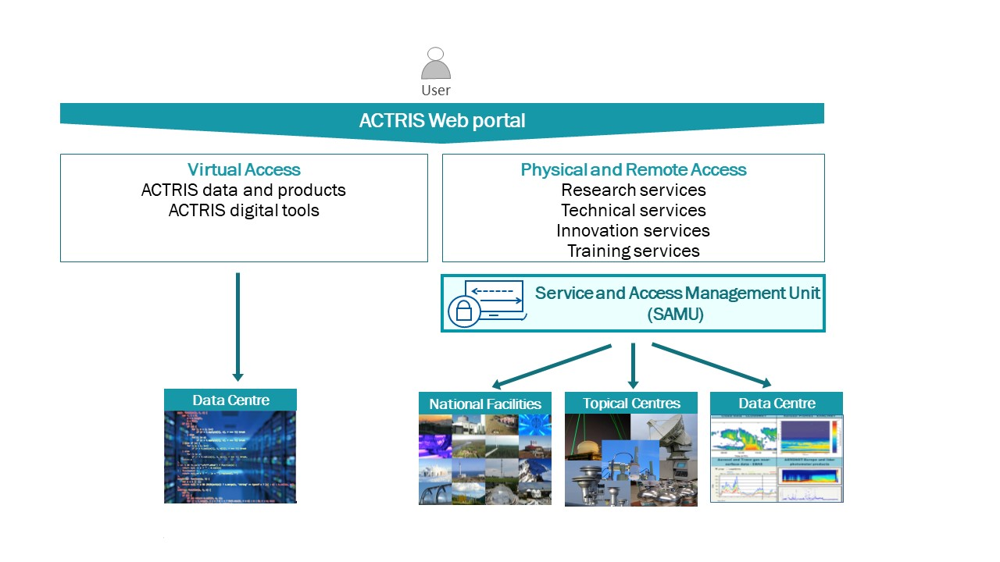
*Figure 4: Overview of ACTRIS Access strategy*

Virtual access is wide access to ACTRIS data and digital tools and does not require a selection process. Virtual access to ACTRIS data and digital tools is free access, and is given in compliance with the [ACTRIS data policy](https://www.actris.eu/sites/default/files/Documents/ACTRIS%20PPP/Deliverables/ACTRIS%20PPP_WP2_D2.3_ACTRIS%20Data%20policy.pdf) for data from ACTRIS labelled NFs. Competitive access is Physical or Remote access to the ACTRIS Facilities, including access to specific services offered by the Data Centre and shall be managed by the SAMU and requires a selection process. This can e.g. be data centre services for comprehensiv research campaigns or large volume data delivery tailored for specific purposes.

### 4.2 Introduction and overview of ACTRIS Data Management architecture

ACTRIS Data Management is handled by the individual data centre unit:

* ACTRIS In situ data centre unit for all aerosol, cloud and trace gas in situ data - In-Situ
* ACTRIS Aerosol remote sensing data centre unit - ARES
* ACTRIS Cloud remote sensing data centre unit - CLU
* ACTRIS Trace gases remote sensing data centre unit - GRES
* ACTRIS Atmospheric simulation chamber data centre unit – ASC
* ACTRIS Data Discovery, Virtual Access and Services unit - DVAS

An overview of the elements in the data flow is shown in Figure 5.

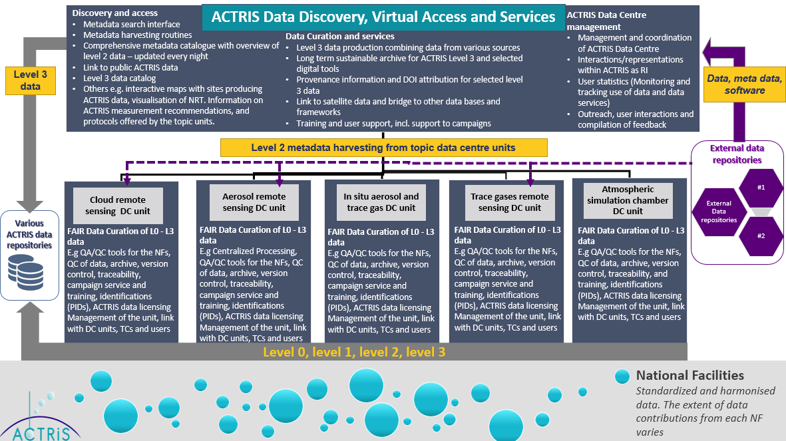
*Figure 5: Overview of ACTRIS Data Centre components, links and main activities for the various units*

#### 4.2.1 DVAS role and data management

Access to quality controlled data from the topic data centre units is organised by the ACTRIS Data Discovery, Virtual Access and Services unit (DVAS). The DVAS unit includes a frequently updated metadata catalogue for identification of data, and links to measurement data stored by the topical data centre units. DVAS also produces level 3 data, and organizes the catalogue of ACTRIS level 3 data, produced either by the topical data centre units or within DVAS. DVAS is structuring and compiling access to services, tools and documentation, and maintaining and further developing the web interface called “ACTRIS Data Centre” (currently https://actris.nilu.no).

The tasks are summarized in [Figure 5](img/figures/figure5.png) above and include the organization of ACTRIS level 3 data.

All data centre units are providing metadata, and interfaces for access to data and metadata indexed in the current ACTRIS metadata catalogue, except for ASC. Index to ASC data is under implementation, and with the aim to be ready within first part of 2021. The metadata is used to identify and access data through the ACTRIS Data Centre web portal. The metadata catalogue is regularly updated, at least every night through automatic procedures. ASC unit has developed their own metadata catalogue and data and metadata is currently available through [EUROCHAMP Data Centre portal]( https://www.eurochamp.org/DataCenter.aspx).

[Figure 7](img/section4/overview_current_architecture_v2.png) shows the current technical architecture and the interface used between the topical data center units, as well as DVAS and the ACTRIS Data Centre web interface with access for users.

The current setup is a web portal with a database that is harvesting metadata from In Situ, ARES, CLU and GRES via custom web services. Currently, machine-to-machine access is not possible for all ACTRIS data and metadata. The aim is to provide all ACTRIS metadata through a single metadata catalogue and REST API, providing discovery metadata for all ACTRIS data using ISO19115 with the [WIS metadata profile](https://wis.wmo.int/2012/metadata/WMO_Core_Metadata_Profile_v1.3_Part_1.pdf). The schema is also extended with ACTRIS specific metadata. The latest version of the [metadata catalog](https://prod-actris-md.nilu.no/version) is under development, with import and access to metadata via a REST API. Documention for the new REST API and metadata catalog is [here](https://dev-prod-md.nilu.no/index.html). The aim is to expose the API to external users by January 2021.

There is also a new version of the ACTRIS [metadata catalog](https://prod-actris-md2.nilu.no/version) implemented, with import and access to metadata via a REST API, which allows for machine-to-machine access of data and metadata. The ISO 19115 with [WIS profile](https://wis.wmo.int/2012/metadata/WMO_Core_Metadata_Profile_v1.3_Part_1.pdf) was used as a starting point for the metadata schema. Complete documentation of the metadata schema and API endpoints could be found [here](https://prod-actris-md2.nilu.no/index.html). The schema is also extended with ACTRIS specific metadata and uses the [ACTRIS vocabulary](https://vocabulary.actris.nilu.no/skosmos/en/). 

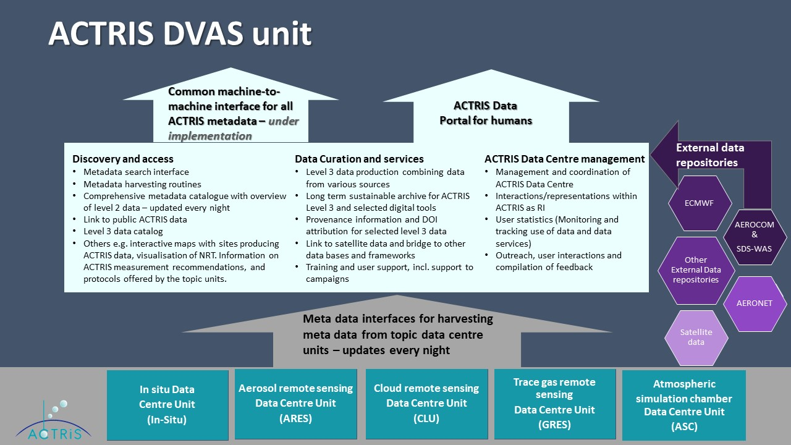
*Figure 6: Overview of the tasks of the DVAS unit*

*Figure 7: Technical architecture of the ACTRIS meta data portal*

As visualized in [figure 6](img/figures/figure6.png), DVAS organizes the level 3 data. The collected and generated level 3 datasets will be extended during the implementation phase, and the complete list of variables under implementation is included in Appendix 2. Details of the level 3 data production in operation is included in [Appendix 9](https://github.com/actris/data-management-plan/blob/master/DMP/ACTRIS-DMP.md#appendix-9-format-and-external-data-sources-for-level-3-variables).

##### Overview of when data is made available, including access mechanisms

| DC unit | Data level # | Primary archive |  Submission timeliness                            |                             External access timeliness | Licence  |
|---------|-------------------------|-----------------|---------------------------------------------------|--------------------------------------------------------|----------|
| IN-SITU |                       0 | DC unit         | 1h (RRT) / 3 days (NRT) / 6 - 12 months (full QC) | half year embargo                                      | CCBY 4.0 |
| IN-SITU |                       1 | DC unit         | 1h (RRT) / 3 days (NRT) / 6 - 12 months (full QC) | 1h (RRT) / 3 days (NRT) / 6 - 12 months (full QC)      | CCBY 4.0 |
| IN-SITU |                       2 | DC unit         | 6 - 12 months                                     | 6 - 12 months                                          | CCBY 4.0 |
| ARES    |                       0 | NF              | 1h (RT) / 3 days (NRT)                            | Upon request                                           | CCBY 4.0 |
| ARES    |                       1 | DC unit         | 1h (RT) / 3 days (NRT)                            | 1h (RT) / 3 days (NRT)                                 | CCBY 4.0 |
| ARES    |                       2 | DC unit         | 1h (RT) / 3 days (NRT)                            | 1h (RT) / 3 days (NRT), max 6 month to 1 year fully QC | CCBY 4.0 |
| ARES    |                       3 | DC unit         | Centralized release from DC                       | Biannual release                                       | CCBY 4.0 |
| CLU     |                       0 | DC unit         | 1h (RT) / 3 days (NRT)                            | half year embargo                                      | CCBY 4.0 |
| CLU     |                       1 | DC unit         | 1h (RT) / 3 days (NRT)                            | 1h (RT) / 3 days (NRT),                                | CCBY 4.0 |
| CLU     |                       2 | DC unit         | 1h (RT) / 3 days (NRT)                            | 1h (RT) / 3 days (NRT), max 1 y full QC                | CCBY 4.0 |
| GRES    |                       0 | NF              | 3 months                                          | embargo time to be decided                             | CCBY 4.0 |
| GRES    |                       1 | NF              | 3 months                                          | embargo time to be decided                             | CCBY 4.0 |
| GRES    |                       2 | DC unit         | 1 month                                           | 1 month                                                | CCBY 4.0 |
| ASC     |                       0 | NF              | not relevant                                      | Not relevant                                           | CCBY 4.0 |
| ASC     |                       1 | NF              | not relevant                                      | Not relevant                                           | CCBY 4.0 |
| ASC     |                       2 | NF + DC unit    | 1 year                                            | 1 year                                                 | CCBY 4.0 |

#Data levels are used only internally in the ACTRIS RI to denote steps in the data production workflow. Since they are used slightly differently between the ACTRIS components, they aren't used when communicating to external users to avoid confusion.

*Table 14: Overview of when data is made available. The [full version](docs/access_timeliness_06Nov2023.xlsx) of this abbreviated table is available.*

#### 4.2.2 In-Situ dataflow and data management

The data management of ACTRIS in situ aerosol, cloud, and trace gas variables (listed in Appendix 1) follows a common workflow (see Appendix 3 for details). The workflow is separated into 2 branches:
* **Online observations**: Measurement done directly on sample air stream immediately after sampling, measurement reported by instrument while sample passes through or immediately after. Instrument QA by on- and off-site comparisons to standard instruments / primary standards. RRT data provision is possible and default.
* **Offline observations**: Measurement done on sample medium in which sample is collected. Sample analysis usually disconnected from sample collection in time and location. Sample handling is documented by a series of reports, leading to final data product. QA on sample handling (e.g. field blanks) and analysis (e.g. round-robin). Rapid delivery for data possible.

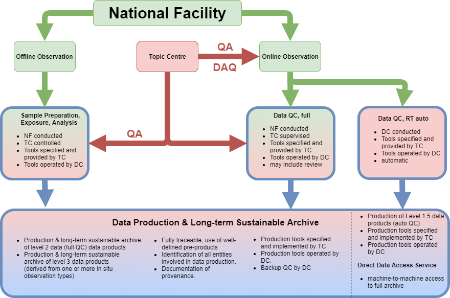

*Figure 8: Simplified workflow of the ACTRIS In Situ data centre unit, focussing on distribution of responsibilities and services to users.*

If an offline analysis process has been sufficiently streamlined, it may be described by the online workflow. Both, online and offline branches of the workflow, are accompanied by a common workflow branch for QC/QA measures. QC/QA measures cover calibrations of online instruments at the NFs, calibrations of online instruments at the TCs, and round-robin calibrations of offline measurements administred by the TCs. Each execution of a QC/QA measure is documented by a machine-readable protocol, stored centrally at the In Situ DC unit, and linked to the pertaining field observations.

ACTRIS In situ concretises the ACTRIS data levels as follows:
* **Level 0 / 0a / 0b**: by default, raw data as produced by the instrument, all main and instrument status parameters provided by instrument, brought to a well-defined data format. If needed to limit raw data volume, level 0 / 0a / 0b may be a condensed version of instrument raw data. Discovery, use, provenance, and configuration metadata attached, including all information needed for further data production, as far as known at stations level (e.g. QC metadata). Instrument model specific, time resolution native to instrument, temperature and pressure conditions as provided by instrument. Level 0 contains raw data as provided by the instrument, level 0a has received full manual QC, level 0b has received automatic QC (near-real-time branch). Levels 0 / 0a / 0b use the same data format.
* **Level 1a / 1b**: Contains physical property observed, including measures of uncertainty. Instrument status parameters, QC measurements and invalid data removed, quality control and post-calibrations applied. Time resolution native to instrument. Content specific for measured property, standard conditions of temperature and pressure. Level 1a is derived from manually QCed level 0a data, level 1b is derived from automatically QCed level 0b data.
* **Level 2a / 2b(1.5)**: Contains data averaged to a homogeneous time resolution, typically 1 h. Includes measure of atmospheric variability, content specific for measured property. Level 2a is derived from manually QCed level 1a data, level 2b(1.5) is derived from automatically QCed level 1b data. Level 2b and level 1.5 denote the same data product, depending on the context (level 1.5 is commonly used for the NRT data product in the satellite community).

##### 4.2.2.1 General Characteristics of In Situ Data Production

All In Situ data products, level 1 (RRT) and level 2 (fully QCed), are archived in the In Situ data repository, hosted in NILU’s EBAS database, and made available through DVAS. In Situ produces selected level 3 products from these ([Appendix 9](https://github.com/actris/data-management-plan/blob/master/DMP/ACTRIS-DMP.md#appendix-9-format-and-external-data-sources-for-level-3-variables)).

As a general rule in ACTRIS in situ data QC, only data subject to instrument malfunctions are flagged as invalid. Data with episodes, local contamination, etc. are flagged as such, but not as invalid, to avoid limiting data use only to certain use cases. Data level designations are used to distinguish between data having received automatic QC, and data having undergone manual QC. When calculating time averages in data production, any non-invalidating flags occurring in the source data during the averaging period are copied to the average result, while invalid data points in the source data are excluded from the average. Temporal coverage flags are applied to the average.

In the ACTRIS In-Situ data production workflow, the tasks and the responsibilities for them are specified in Appendix 3, separately for each In-Situ instrument type. The tools used to organise In-Situ data production are chosen according to the following aspects:
* Suitable to handle the entities contained in the workflow (well-formatted data or protocols, software, humans, instruments, calibration standards)
* The type of handling agents involved (software and humans for online workflow, humans for offline workflow, humans (machine assited) for QC/QA measures)
* Location of workflow execution (DC, TCs, NFs, distributed over Europe)
* The need to document provenance of data production
* The need to identify entities involved in the workflow.
* The ambition to re-use standard solutions, so they exist.
* The ambition to use widely-used standard technologies for developing custom solutions if needed.
* Preference of open-source technologies with a large user base to minimise costs while maintaining sustainability.

Both, online and offline data production workflows of ACTRIS In-Situ, are accompanied by a common workflow for documenting QC/QA measures. These cover:
* (regular routine) calibrations of instruments at the NFs.
* (intermittent) calibrations of instruments at TCs.
* (intermittent) round-robin lab intercomparisons for offline observations organised by the responsible TC.

Each QC/QA measure is documented by an identified, machine-actionable protocol, formulated in a data serialization format. The schema of the protocol is specific to type and purpose of the QC/QA measure, as well as the type of observation. Data serializations formats currently considered include [XML](https://en.wikipedia.org/wiki/XML) and [JSON](https://en.wikipedia.org/wiki/JSON). The protocols are archived in a database suitable for the chosen data serialization format. Due to a common need between ACTRIS DC units, the archive for QC/QA measure protocols will be implemented as infrastructure spanning several units. Besides In-Situ, current candidate participants include ASC and CLU.

Certain responsibilities common to both online and offline observations are by default distributed between NF, TC, and DC as follows:

**NF:**
* Conducts / participates in on-site, off-site QA measures, and round robin exercises as specified by TC.
* Reacts to feedback on instrument / observation / analysis operation and data quality from both TC and DC within 1 week, and takes corrective action within 1 month.

**TC:**
* Maintains operating procedures for each In Situ instrument type in his responsibility.
* Defines QA/QC measures necessary for an instrument type / observation.
* In collaboration with DC, specifies data and metadata items contained in QA/QC measure reports for each instrument / observation type.
* Specifies actions to be executed in each workflow task box for each instrument / observation type.
* Documents QA measures conducted by TC using the tools jointly specified / provided by TC and DC.

**DC:**

**DC Core services:**
* Archives all level 0, 1, and 2 data occurring during workflow execution.
* Archives level 3 data produced by In Situ.
* Links data to relevant QA/QC data.
* Operation of data production and QC tools for ACTRIS in situ data, administration of data production workflow ensuring homogeneous data products, e.g. via a business workflow tool connecting NFs, TC, and DC.
* Archive for documentation of QA measure results throughout ACTRIS, setup of infrastructure, and standards of operation, including identification of documents
* PID identification of all objects in ACTRIS workflows executions, incl. data (pre-) products, software, humans, organisations, instruments, including versioning, DOIs for level 2 data products.
* Document provenance throughout all ACTRIS workflows by use of standardised provenance scheme, facilitating attribution of entities involved in workflow execution.
* Training events for data submitters to all data centre units
* Reacts on requests typically within 1 week / 1 month.
* Deadline for publication of data, end of August or 1 month after closing the last issues.
* Documentation, procedures, tutorials and tools, guidance and helpdesk available to NFs
* Access to ACTRIS In Situ level 0, 1, 2, 3 data.
* Access to ACTRIS level 2 legacy data archived in the ACTRIS data repositories, will be accessible via the ACTRIS web entry point.
* Bridge to external ground-based observational data relevant for ACTRIS
* Climatology products for ACTRIS variables at National Facilities across Europe.
* Interoperability and link to other RIs and initiatives.
* Knowledge transfer and training on the use of data products and tools
* Monitoring task execution in unit, representing unit in ACTRIS bodies.
* Monitor workflow execution across In Situ TCs and DC, maintain and update workflow elements.
* Support to regional and global networks and related initiatives. ACTRIS will support international frameworks in the field of air quality and climate change, e.g. GAW including GALION, EMEP, and GCOS, and further utilize and add value to satellite based atmospheric observation.

**DC Added-value services:**
* Access to Software, digital tools and user support for processing of ACTRIS data tailored for analysis and research
* Aerosol surface in situ data – combination of variables and instruments. Production and distribution of surface in situ level 3 products (closure, model comparison, full-range PNSD, PM mass from size distribution, key particle optical properties at dry state).
* Contribution to collocation service of data from regional and global networks. Benchmark data products adding complementary data from GAW and EMEP together with ACTRIS data.
* Contribution to Satellite data – combined with ground based ACTRIS data. On-demand distribution of satellite data collocated with ACTRIS ground-based observations
* Contribution to Optimal interpolation and Gap filling tool.

**DC Campaign services:**
* Provision of digital tools and data services during observation campaigns.
* Data curation and archive of campaign data.
* Digital tools and products for campaign support.
* Campaign dashboard service.

##### 4.2.2.2 Online In Situ Data Production

Already at the station, the raw data stream from the instrument is transcribed to a homogeneous level 0 format, and annotated with discovery, use, provenance, and configuration metadata. The level 0 data are transferred to the ACTRIS DC at a RRT schedule (latest 3 h after measurement, normally 1 h). At this point, the In Situ online workflow splits into 2 branches:
1. **RRT data production:** incoming level 0 data are auto-QCed for outliers, spikes, calibration data, and automatically identifiable instrument malfunctions, and flagged accordingly, yielding level 0b. From there, levels 1b and 1.5 (final RRT data product) are produced. RRT data are offered through a data subscription service.
2. **Fully QCed data production:** data are manually QCed for outliers, spikes, calibration data, episodes (e.g. atmospheric transport, local / regional contamination), and instrument malfunctions. Tools for manual data QC are provided centrally. Manual QC is assisted by automatic pre-screening of data, similar to the auto-QC for RRT data. There are 2 options for organising the QC process, both are applied at least annually:
   1. **TC review**: data QC is conducted by NF and supervised by TC, and follows its own sub-workflow.
   2. **NF review**: data QC by an identified person under the responsibility of the NF.

   From the fully QCed level 0 data, i.e. level 0a, levels 1a and 2 (final data product) are produced.

All fully QCed data are to be submitted to the In Situ DC unit on an annual basis by 31 May of the year following the calendar year to be reported. If the TC review option is used, NFs need to submit their initial QCed version to the review process by 31 March of that year, where the review process is typically supervised by the TC.

The content of workflow tasks and the responsibilities for them are specified in Appendix 3, separately for each In Situ instrument type. As hybrid workflow with automatic and manual tasks, the In-Situ online data production uses [Apache Airflow](https://en.wikipedia.org/wiki/Apache_Airflow) for organizing the automatic tasks, coupled to the [Mantis Bug Tracker](https://en.wikipedia.org/wiki/Mantis_Bug_Tracker) issue tracker as interface for the manual workflow steps.

The following responsibilities specific to online observations are distributed between NF, TC, and DC as such:

**NF**:
* Operates the instrument according to TC recommendations.
* Conducts data QC as specified by TC, documents QC as specified jointly by TC and DC, participates in data QC review, if applicable.
* Conducts on-site QA measures and calibrations as specified by TC, and documents them using the tools specified and provided by TC.
* Uses data acquisition and handling software as provided / specified by TC.
* Maintains infrastructure for RRT data transfer.

**TC**:
* Implements and maintains data production and QC software for each In Situ instrument type in his responsibility to NF.
* Supervises on-site QA measures and calibrations, provides specification and tools for documenting these in a traceable way.
* Conducts off-site QA measures on instruments as required by instrument type.
* In collaboration with DC, specifies data and metadata items contained in data levels 0, 1, and 2 for each instrument type.
* Implements and maintains software executing task boxes in data production workflow.
* In collaboration with DC, specifies sub-workflow implementation for data QC review, including review procedures and rules, if applicable.
* Conducts and supervises data QC review, if applicable.

**DC**:

**DC Core services:**
* NRT, RRT data production.
* Data submission & curation service of online ACTRIS in situ data.
* Secondary data QC before publication of data (syntactic and semantic correctness of metadata, syntactic correctness of data, parameter dependent completeness of metadata, completeness and correctness of framework associations).

**DC Added-value services:**
* Contribution to services co-ordinated by other ACTRIS partners (source apportionment submicron organic aerosol, VOC source attribution, cloud occurrence at cloud in situ NFs).
* PM retrieval @GAW sites globally.
* Alert Service for National Facilities on instrument malfunctions.

##### 4.2.2.3 Offline In Situ Data Production

In the offline workflow for ACTRIS in situ data, data production is centred around the sample medium, following its way through the workflow:
* **Sample Medium Pre-Treatment:** Pre-heating, Impregnation, Weighing in, Pre-cleaning.
* **Sample Medium Exposure:** Transport to field station, Exposure in sampling device, Transport to lab
* **Sample Preparation:** Weighing out, Sample medium extraction, Sample medium apportioning.
* **Sample analysis.**

Again, the content of workflow tasks and the responsibilities for them are specified in Appendix 3, separately for each In Situ offline instrument type. Each step in handling a sample medium for offline observations is documented by an identified, machine-actionable protocol, formulated in a data serialization format. The infrastructure to archive and identify the protocols is shared with the infrastructure for archiving QC/QA measure protocols (see section [4.2.2.1](#4221-general-characteristics-of-in-situ-data-production)).

The following responsibilities specific to offline observations are distributed between NF, TC, and DC as such:

**NF:**
* Conduct sample medium pre-treatment, sample medium exposure, sample preparation, and sample analysis in accordance with procedures defined by TC.
* Document all sample handling steps in the documentation system specified and implemented by TC, and operated by DC.
* Evaluate sample according to TC guidelines, using the tools specified and implemented by TC, and operated by DC
* Respond and act on quality control feedback by DC.
* Participate in quality assurance measured defined and conducted by TC, e.g. round-robin exercises.

**TC:**
* Specify guidelines and implement documentation system for sample medium pre-treatment, sample medium exposure, sample preparation, and sample analysis.
* Specify guidelines and implement algorithm for sample evaluation.
* Specify guidelines for data quality control.
* Specify procedures for, implement, and conduct quality assurance measures as appropriate for observation method, document them, and store results in QA measure database operated by DC.

**DC:**

**DC Core services:**
* Operate documentation system for sample medium pre-treatment, sample medium exposure, sample preparation, and sample analysis specified and implemented by TCs.
* Operate archive for documentation of sample handling steps.
* Operate algorithm for sample evaluation.
* Implement and operate quality control step for offline level 2 data.

#### 4.2.3 ARES dataflow and data management

At the present, the ACTRIS aerosol remote sensing component is highly inhomogeneous in terms of instrumentations: most of the lidar systems are home-made or highly customized. In cases like that, the implementation of a standard, centralized and quality assured scheme for the analysis of raw data is the most efficient solution to provide FAIR and quality assured data at RI level.

The SCC (EARLINET Single Calculus Chain) is the solution adopted by the ACTRIS (Aerosol, Clouds and Trace gases Research InfraStructure Network) aerosol remote data center to ensure homogenous, traceable and quality controlled data. Main concepts at the base of the SCC are automatization and full traceability of quality-assured aerosol optical products.

The ARES DC also compiles aerosol optical and physical properties (profile and column) from combined lidar + photometer observations collected at NFs. The GARRLiC (Generalized Aerosol Retrieval from Radiometer and Lidar Combined data) retrieval will be used for this, which synergistically inverts coincident lidar and radiometer observations, starting from SCC products and AERONET-ACTRIS processing stream products. Another declination of the GRASP (Generalized Retrieval of Atmosphere and Surface Properties) algorithm is also operated: GRASP-AOD. It derives aerosol size properties from the AERONET-ACTRIS aerosol optical depths. These processing streams are fully controlled by ACTRIS.

The data curation workflow is suitable for the provision in NRT and RRT, following the same steps and procedures of the standard processing. NRT/RRT delivery of not fully quality assured data can be possible as long as a NF provides raw data to the DC in NRT/RRT.
Raw data collected at the NFs in the original acquisition data format are transcribed in a homogeneous and agreed netCDF data format to the aerosol remote sensing processing suite at the ACTRIS DC, being the ARES Level 0 data. All information needed for the steps forward in the processing chain is annotated into the file or in a dedicated database (SCC database). It is recommended that raw data should be centrally stored, and it should be under the responsibility of the NF to keep a local backup.

Level 0 data are centrally progressed at ACTRIS ARES DC level, generating Level 1 preprocessed signals and (not-fully QC data) optical properties products. On-the-fly QC procedures guarantees basic quality control on Level 1 optical properties data. Aerosol optical properties data passing also the physical quality control procedures are labelled as Level2 data.

Among the physical content QC procedures, a specific procedure checks that the SCC configuration used for processing the data is approved as Operational configuration from the related TC (namely CARS). The data originator and the CARS TC units receives feedback of the outcome of the QC. This feedback mechanism potentially allows to discover and address instrumental issues, with links to the TC. All the optical properties data compliant to all the QC requirements are made available as Level 2 data.

ARES DC will offer also products resulting from the processing at DC itself of Level 2 lidar and photometer data collected at the aerosol remote sensing NFs (this feature is currently in implementation phase). Finally, Level 3 climatological products are produced at ARES DC from lidar Level 2 optical property products.

|        Product Type       |                                  Availability (Typical)                             |
|---------------------------|-------------------------------------------------------------------------------------|
| Level 1                   |                                           RRT / NRT                                 |
| Level 2                   |                                             1 year                                  |
| Level 3                   |                                             2 year                                  |

*Table 15: ARES Data Products Availability*

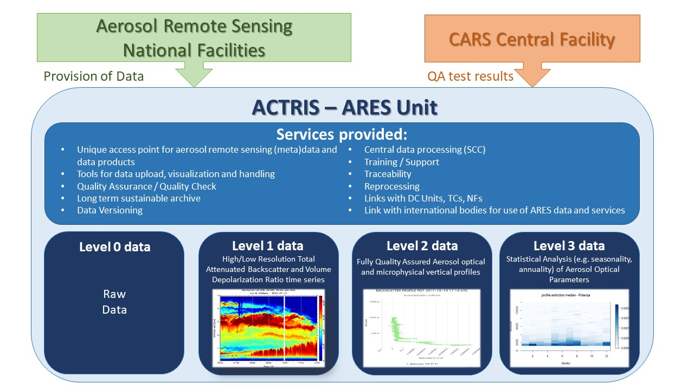
*Figure 9: ARES Data Products and Services*

Broadening the concept, the ARES-CNR activities can be grouped according to the following thematic areas:

* **Centralized Data Processing.** This is provided through the common standardized automatic analysis software developed in previous projects toward the ACTRIS RI, the Single Calculus Chain (SCC). The Single Calculus Chain (SCC) is an open-source software for analyzing aerosol lidar data to obtain aerosol optical property profiles from raw data. Main concepts at the base of the SCC are automatization and full traceability of quality-assured aerosol optical products.

* **Data Archive and Storage.** Data archive service of ACTRIS aerosol profile level 1, 2 & 3 data, including off-site backup, documenting provenance, and providing a link to QA / QC data is given. Moreover, the data, the metadata database, the user interface, the web applications, the data curation tasks, including the data ingestion, the SCC (database, calculus modules, web interface) are all hosted on dedicated servers.
 
* **Recording of metadata in a dedicated RDBMS.** The data archive for level 1 and level 2 data is suited for a relational database system keeping all metadata and measurement data in one database. The database supports historic storage of data.
 
* **Traceability.** All data products, pre-products, and sample handling protocols, as well as all software and algorithms used in production steps, are version controlled, archived following long-term archive standards, and identified through Persistent Identifiers (PIDs) in each version. Moreover, the provenance throughout all ACTRIS aerosol remote sensingworkflows if provided by the use of standardised provenance scheme, facilitating attribution of entities involved in workflow execution.
 
* **Harmonization and Data Versioning.** ARES Unit ensures that all instances of a specific data production step operated in the ACTRIS network uses the same identified version at any given time. Moreover,  ARES relational database is version controlled database and is suitable for reprocessing of the data and updates with new quality control procedures if needed. A Versioning System has been implemented at ARES directly in the RDBMS by using DML (Data Manipulation Language) triggers. A new version of a file is produced when a user tries to modify data through a DML event. New versions will be centrally produced if new QC procedures and new processing features are released. Additionally new versions of the files will be allowed and centrally handled for fixing file bugs in particular for legacy data.
 
* **Quality Control.** When the data are submitted to the ACTRIS aerosol remote sensing DC database, on-the-fly QC procedures are performed directly during the submission phase. These procedures control that the file content complies with the correct file structure. Additional scientific controls check all mandatory products reported into the files in terms of scientific content. These are typically delayed taking into account the outcome of the quality assurance procedures at TC level.The data originator receives feedback of the outcome of the QC.

* **Data Access.** Data Access. Access to ACTRIS level 0-1-2-3 data, Access to ACTRIS level 2 (and Level 1) legacy data archived in the ACTRIS data repositories via the ACTRIS web entry point, Access to Software, digital tools and user support for processing of ACTRIS data tailored for analysis and research.

* **Documentation.** Documentation, procedures, tutorials and tools, guidance and helpdesk are available to NFs.

* **Data attribution and traceability.** Provision of documentation of QA measure results throughout ACTRIS, setup of infrastructure, and standards of operation, including identification of documents, ACTRIS Data provenance, attribution, and traceability.

* **Support and Training Activities.** Workshops, schools, forums, training events for data submitters to ARES data centre units are planned. Documentation, procedures, tutorials and tools, guidance and helpdesk are available to NFs.
 
* **Level 3 Data Production.** Climatological Level 3 data for aerosol vertical profile are produced in ARES. A first dataset has been released in 2019 and new release even advanced in content are planned for each one of the NF, providing a reference dataset for climatological studies at continental scale.

* **Campaign service.** Provision of digital tools and data services for aerosol remote sensing data processing, QC and curation during observation campaigns to external users, input for campaign dashboard.

* **User Community support and services.** Access to the  Single Calculus Chain (SCC) tool for aerosol lidar data processing, On-demand distribution of not-ACTRIS aerosol lidar data products processed through ACTRIS SCC, Link to international bodies for the use of aerosol remote sensing observations, Support to regional and global networks and related initiatives (like GAW-GALION). Interoperability and link to other RIs and initiatives.

All data are stored in the ARES database which is hosted by the CNR ARES data center. Photometer-only data are stored by the French data center for atmospheric data AERIS. Only metadata for discovery will be provided to the DVAS unit.

#### 4.2.4 CLU dataflow and data management

Modern cloud remote sensing instruments can produce vast amounts of raw data. This data first need to be stored locally
at the measurement site. Then, the data are transferred to FMI servers for processing and archiving. Currently, FMI offers
an HTTP API to establish the file transfer, but it is site operators responsibility to maintain regular data flow to FMI.

It should be noted that, technically, it is also possible to execute the first processing step already on site, and
only transfer the processed measurement files, that are much smaller, to FMI for further processing.
It is currently unclear if this option will be used in the operational ACTRIS processing or not.

At FMI, the raw measurement files from various instruments are processed to obtain more standardized netCDF files with
a common metadata structure. In this stage, we also screen out noisy data points and apply possible calibration factors.
This first processing step is applied to cloud radar and lidar measurements, but the microwave radiometer (MWR) data are
processed elsewhere. FMI only receives the calibrated and processed Level 2 MWR files needed in the further processing steps.

After receiving and processing the raw data (and receiving MWR files), we generate all Level 2 cloud products with our in-house
processing suite. All processed data are stored in netCDF files, which are archived on FMIs on-premises S3 cloud storage. From the
processed files, we generate a metadata database which is synchronized with the master metadata repository
hosted by the DVAS unit. All of our metadata is available as a JSON format via restful HTTP API.
The actual metadata standard is yet to be decided, but it must comply with the netCDF conventions because
we use the netCDF file format. All data files encounter regular back-ups.

A general overview of the links between national facilities, CLU, and the corresponding topical centre, CCRES, are illustrated in Figure 10.
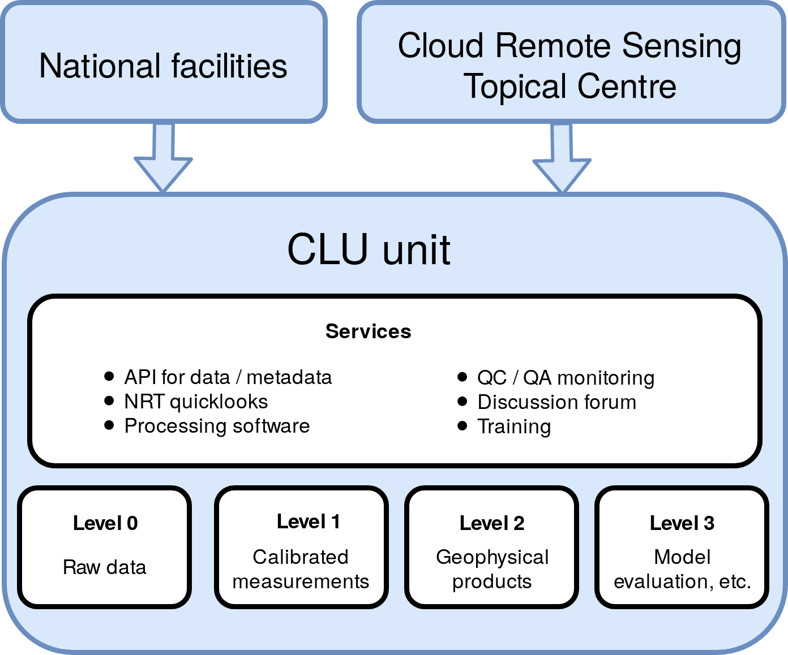
*Figure 10: CLU data products and services*

#### 4.2.5 GRES dataflow and data management

Data provided in GRES unit are L2 and L3 data produced from L0 and L1 data processing performed at NFs level. These data have to be provided by NFs in a standard format (GEOMS HDF) and to be documented with rich metadata. Data will be converted in NetCDF within the GRES unit in order to be disseminated through ACTRIS DC. NFs are also in charge of providing tools to facilitate the generation and the handling of the data. The GRES unit is in charge of:
- Creating and maintaining the metadata catalogue
- Providing a standardized process for data submission, quality control and inclusion of data in the database
- Providing a free and open access to metadata, data and tools developed by NFs through user-friendly web interfaces
- Providing an open access to documentation produced by the CF and NFs (description of algorithms, data quality, control procedures…)
- Producing level 3 data for climatological analysis and added values products (quicklooks, links to EVDC - ESA Atmospheric Validation Data Centre)
- Assuring long-term archiving of L2 and L3 data
Jointly with NFs and TCs, it also contributes to the elaboration of the data workflow.

 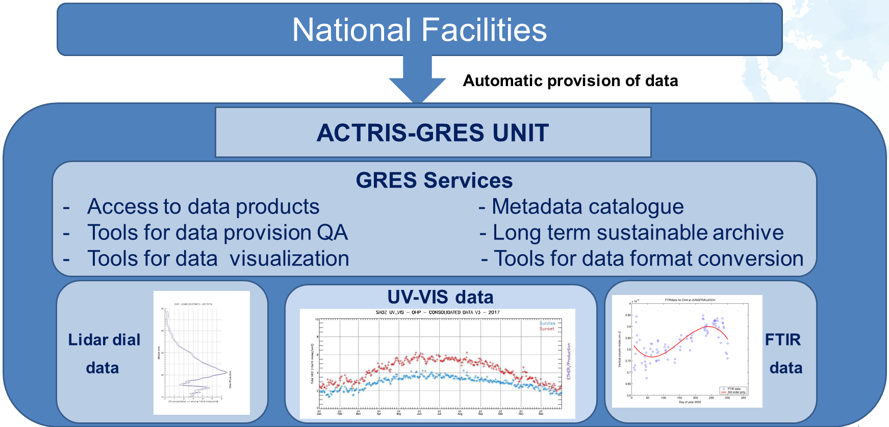
*Figure 11: GRES data products and services*

All data are stored in the GRES database which is hosted by the French data center for atmospheric data AERIS. Only metadata for discovery will be provided to the DVAS unit.

#### 4.2.6 ASC dataflow and data management
The ACTRIS ASC unit provides access to data produced from simulation chamber experiments. One specificity of this unit is that simulation chambers are often designed to address specific scientific targets (e.g. gas-phase chemistry, aerosol and cloud interactions, …) and are thus equipped with a high diversity of instrumentation in concordance with these topics. Therefore, the instrumentation differs a lot from a NF to another one. In addition, a number of instruments coupled to chambers are home-made or highly customized. These instruments are called “specific” instrumentation, in opposition to “base” instrumentation which is often similar to the one used by observation stations for in situ measurements. The diversity and complementarity of chambers and their instrumentation, which are a strength of European simulation chambers, make difficult the establishment of common protocols and data workflows and prevent from centralized data treatment at the TC level. The data treatment is therefore performed at the NF level following TC recommendations. It should also be noticed that this diversity of scientific targets generates a high number of variables.

Another specificity of the data provided through ASC unit is that they are obtained by running experiments which means that information on the experimental protocols for chamber operation has to be provided in the dataflow.

As a consequence, the dataflow is separated in two branches, one describing the experimental protocol for chamber operation and the second one describing the instrument operation (including calibration, QA/QC) and the data treatment. This second branch is itself separated in two branches, respectively for base and specific instrumentations:
* Base instrumentation covers the tools necessary to monitor the physical and chemical conditions prior and during an experiment. It concerns fundamental environmental parameters such as temperature, pressure, relative humidity and irradiation levels. It concerns also any instrumentation or variables that are covered by an ACTRIS TC, e.g., concentration–time profiles of various species such as VOCs as well as basic atmospheric contaminants including NOx, aerosol number concentration and size distribution. The related instruments are thoroughly calibrated following procedures recommended by the TCs and/or using TC services. This approach shall allow comparison of the key parameters of experiments and their main results.

* Specific instrumentation is often developed in-house, is oriented toward very specific targets and tests of novel ideas and concepts and/or covers extremely low concentration ranges, rare but atmospheric-relevant substances and detection limits. Typically, there is no common calibration method provided by the TCs for these techniques. ACTRIS Atmospheric Simulation Chamber staff will have to implement protocols enabling internal consistency of the measurements for a posteriori validations/reanalysis of the data produced by these high-technology instruments. In this context, full traceability of the methodologies, calibrations, algorithms and software versions is implemented by the RPO operating the facility.

Data provided in ASC unit are L2 and L3 data produced from L0 and L1 data processing performed at NFs level (see Figure 12). These data are provided by NFs in a standard format and are documented with rich metadata (see section 3.5). The following responsibilities specific are distributed between NF, TC, and DC as such:

NF:
-	Conduction of experiments,
-	Instrument operation, including calibration (following Standard Operation Protocols for base instrumentation),
-	Data treatment,
-	QA/QC including check for internal consistency,
-	Provision of data and metadata in standard formats to the DC,
-	Participation to the definition of SOPs jointly with the TCs (base instrumentation),
-	Participation to instrument intercomparison exercises arranged by TCs,
-	Provision of tools for data generation and handling.

TC:
-	Definition of SOPs for base instrumentation jointly with the NFs (base instrumentation),
-	Provision of standards for calibration or performing calibration (base instrumentation),
-	Coordination of instrument intercomparison exercises,
-	Development of tools for data treatment.

DC:
-	Provision of free and open access to data and tools developed by NFs through user-friendly web interfaces,
-	Development of tools for data upload and visualization,
-	Development of tools to ensure the quality and the completeness of the data provision process,
-	Creation and maintaining of the metadata catalogue,
-	Long-term archiving of L2 and L3 data,
-	Monitor statistics on data provision and usage,
-	Support and training.

*Figure 12: current overview of ASC unit*

### 4.3 Findable: Making data findable, including provisions for metadata [FAIR data]

#### 4.3.1 ACTRIS variable names and implementation of vocabulary

ACTRIS aims at using standardised, well-documented, and machine-actionable vocabulary for denoting data and metadata entities, in particular for variable names. While no single commonly accepted variable vocabulary exists for the atmospheric domain, widely used vocabularies include the [standard names of the Climate Forecast (CF) converntion](https://cfconventions.org/standard-names.html), and the [Global Change Master Directory (GCMD) keywords](https://earthdata.nasa.gov/earth-observation-data/find-data/idn/gcmd-keywords). ACTRIS collaborates with the other European Research Infrastructure of the atmospheric domain organised in the [Environmental Research Infrastructures (ENVRI)](https://envri.eu/) framework to come up with a commonly accepted variable vocabulary for the domain by contributing to maintaining and completing the CF standard name and GCMD keywords vocabularies. Further, ACTRIS collaborates with the [RDA InteroperAble Descriptions of Observable Property Terminology WG (I-ADOPT WG)](https://www.rd-alliance.org/groups/interoperable-descriptions-observable-property-terminology-wg-i-adopt-wg) in order to come up with and use a vocabulary framework for describing observations across domains. The ultimate aim is to make ACTRIS' variable vocabulary machine-actionable by serving it through a [SPARQL](https://en.wikipedia.org/wiki/SPARQL) endpoint. Canditate technologies include an [Apache Jena Fuseki](https://jena.apache.org/documentation/fuseki2/) triple-store with SPARQL server, together with a [SKOSMOS](https://skosmos.org/) [SKOS](https://en.wikipedia.org/wiki/Simple_Knowledge_Organization_System) browser and publishing tool.

Generally, ACTRIS data set names aim to be compliant with CF (Climate and Forecast) metadata conventions. In the case where no standard CF names are defined, an application will be sent to establish these. The names used are in Annex I. Currently there is no search model used by the DVAS unit (ACTRIS Data Centre web interface). Still search keywords are implemented to varying degrees on the individual data centre unit level (e.g. search keywords are used for the EBAS ISO19115 records). The ACTRIS data centre will in the future use a controlled set of vocabularies for search keywords like Global Change Master Directory (GCMD) or similar, and semantic search will be implemented to facilitate use of ACTRIS variable across scientific disciplines and domains.

ASC unit has developed a user-friendly web interface which includes searching tools based on the metadata catalogue for the three pillars, DASCS, LAR and LADP. Relevant searching criteria have been defined for each pillar.

Standard vocabulary might not always be used, but in all cases they should be mapped to standard vocabulary if existing by the DC DVAS unit.

| Data centre unit         | Vocabulary name               |          Comment            |
|--------------------------|-------------------------------|-----------------------------|
|         In Situ          | IUPAC, CF-1.7                 |                             |
|         ARES             | CF-1.7                        |                             |
|         CLU              | CF-1.7                        |                             |
|         DVAS             | Defined by primary repository |                             |
|         ASC              | GCMD, CF-1.7                  |                             |
|         GRES             | GCMD, CF-1.7                  |                             |

*Table 16: List of vocabularies*

#### 4.3.2 Metadata standards and meta data services

The ACTRIS Data Centre will collect metadata from a large range of observations employing methodologies provided by multiple data centre units covering different types of data both in terms of size, time coverage and metadata. The DVAS unit provides discovery metadata in a common format for all ACTRIS level 2 data through a public available API. The ACTRIS metadata is using a modified version of the ISO19139 WIS profile. The present situation is shown in Table 17, also including the individual APIs and metadata services provided by individual data center units.

There might be instances where standards do not cover the need for describing the data at the data centre unit. In this case, ACTRIS Data Centre will still try to provide metadata in a way that is similar to the agreed formats and standards and at the same time push for an extension of the specified standard.

| Data centre unit                  | metadata service               | end-point                                                                               |                        standard |
|--------------------------|--------------------------------|-----------------------------------------------------------------------------------------|---------------------------------|
|         DVAS             | REST API                       | https://prod-actris-md.nilu.no                                          |        openapi            |
|         In Situ          |          OAI-PMH               |  https://ebas-oai-pmh.nilu.no/oai/provider?verb=ListIdentifiers&metadataPrefix=iso19115 |       ISO 19115-2, CF-1.7,ACDD  |
|         In Situ          |          Thredds               |  https://thredds.nilu.no/thredds/catalog.html |       ISO 19115-2, NetCDF CF-1.7,ACDD  |
|         ARES             |          JSON via REST API, HTTP via Apache Server|  https://data.earlinet.org/api/services/ , https://data.earlinet.org/api/swagger-ui/# (API documentation), https://data.earlinet.org/           |       ISO 19115-2 , ECMA262-3, CF-1.11, NCML, RFC2616               |
|         CLU              |          JSON via REST API     |  https://cloudnet.fmi.fi/api/                                                                 |      Custom, see [documentation](https://actris-cloudnet.github.io/dataportal/)                      |
|         ASC              | JSON via REST API                          |  [https://eurochamp.ipsl.upmc.fr/eurochamp-datacenter-rest/rest/](https://eurochamp.ipsl.upmc.fr/eurochamp-datacenter-rest/rest/)    (api documentation with swagger under implementation)                                                                                           |      Custom JSON metadata format, compliant with ISO 19115 and Datacite schemas. CF and ACDD conventions.                            |
|         GRES             | JSON via REST API                                  |                                                                                               |       Custom JSON metadata format, compliant with ISO 19115 and Datacite schemas. CF and ACDD conventions. |

*Table 17: List of metadata standards and services*

#### 4.3.3 Traceability of ACTRIS data

The term measurement traceability is used to refer to an unbroken chain of comparisons relating an instrument's measurements to a known standard, time, processing, software etc. Calibration to a traceable standard can be used to determine an instrument's bias, precision, and accuracy. The ability to trace a measurement back to its origin is important for several reasons; It increase the quality by facilitating back-out or reprocess bad data, and conversely, it allows reward and boost good data sources and processing techniques.

Related to traceability is the term [data provenance](https://blog.diffbot.com/knowledge-graph-glossary/data-provenance/), i.e. documenting the production history of a (data) product by identifying all entities involved in data production, and the relations between them. ACTRIS will use the [PROV-O](https://www.w3.org/TR/prov-o/) framework to document provenance. Documenting data provenance ensures that proper attribution is given to data originators adequately reflecting their contributions through the data production chain.

In order to document provenance, all entities involved in data production need to be identified by persistent identifiers (PIDs). In accordance with recommendations by the [ENVRI community of infrastructures](https://envri.eu/), ACTRIS will use the following PID types to identify entities in data production:

ACTRIS data will be assigned PIDs that are available through the metadata, the table below show the status.

|Identified entity	   | PID type	                                                                     | metadata schema                     |
|---------------------|-------------------------------------------------------------------------------|----------------------------------------------|
| humans             	| [ORCiD](https://orcid.org/)                                                  	| [ORCID record schema](https://info.orcid.org/documentation/integration-guide/orcid-record/) |
| organisations       |	[Research Organisation Registry (ROR)](https://ror.org/)                      |                           |
| instruments	        | [Persistent Identifiers for eResearch (ePIC)](https://www.pidconsortium.net/)	| [Persistent Identification of Instruments (PIDINST)](https://www.rd-alliance.org/group/persistent-identification-instruments/case-statement/persistent-identification-instruments) |
| data products	      | [Persistent Identifiers for eResearch (ePIC)](https://www.pidconsortium.net/) | 	RI schema, complete metadata |
|	                    | [Digital Object Identifier (DOI)](https://www.doi.org/) __(mandatory)__       |	[DataCite](https://schema.datacite.org/) |
| data pre-products	  | [Persistent Identifiers for eResearch (ePIC)](https://www.pidconsortium.net/)	| RI schema |
| physical samples	   | [Persistent Identifiers for eResearch (ePIC)](https://www.pidconsortium.net/) |	RI schema |
|                    	| [International Geo Sample Number (IGSN)](https://www.igsn.org/)	              | [IGSN schema](https://igsn.github.io/metadata/) |
| software	           | [Persistent Identifiers for eResearch (ePIC)](https://www.pidconsortium.net/) |  	RI schema, complete metadata |
|	                    | [Digital Object Identifier (DOI)](https://www.doi.org/)                       |	[DataCite](https://schema.datacite.org/) |
*Table 18: ACTRIS PID handlers*

ACTRIS works towards PID identification. More precisely, ACTRIS will use [Digital Object Identifiers (DOIs)](https://en.wikipedia.org/wiki/Digital_object_identifier) to identify all level 2 and 3 products, and [ePIC persistent identifiers (PIDs)](https://www.pidconsortium.net/) to identify level 0 and 1 data pre-products. In addition. ACTRIS uses ePIC PIDs and DOI, for  identification of QA / QC documents.

Since the DC units serve as primary data repository for ACTRIS data products in their thematic area, the DOIs for thes products will be issued at the DC unit level. To facilitate homogeneous accounting of data provision and use, all ACTRIS DC units will offer at least one common granularity of data product DOIs, one DOI per annual dataset for each individually identified instrument and/or variable.

For identification of RRT / NRT data, ACTRIS will use constant DOIs with continuously updated content, quoted by including an access date. Options for the granularity of RRT/NRT data DOIs include one DOI for the whole NRT product per variable provided by the DC unit, and one DOI for each RRT/NRT data stream coming from an individually identified instrument.

#### 4.3.4: Version control of ACTRIS (meta)data

The ACTRIS DC aims at providing clear versioning of its data and metadata. Due to the decentralised nature of the Data Centre, this varies between the different data centre units, and implementation will be done on unit level.

As a guiding principle, all data submitted to ACTRIS passing quality assurance should be uniquely identified. In case of updates, a ID-number is generated, and previous data versions should be identifiable and kept available upon request while the latest version is served through the ACTRIS Data Centre. More details on this is in the sections for DC units.

### 4.4 Accessible: Making data openly accessible [FAIR data]

The purpose of the data collection and generation of data products in ACTRIS is to provide open access to aerosol, cloud and trace gas in situ and remote sensing measurements of high quality (see section 1).

A guiding principle is that all ACTRIS data should be readable for both humans and machines using protocols that offer no limitations to access. ACTRIS Data Centre is organized as a distributed network of centralized repositories (see Figure 6). The ACTRIS data will be offered through the [ACTRIS Data Centre portal](http://actris.nilu.no/), a web portal that allows the user to search, analyses and download data produced within ACTRIS (see Figure 7). Access to data and metadata are also possible by machine-to-machine interaction, enabling harvesting of metadata from the ACTRIS metadata catalog.

There might also be data available through the ACTRIS Data Centre that is not directly ACTRIS data, but used in the production and interpretation of ACTRIS data.

#### 4.4.1 ACTRIS data access and access protocols

ACTRIS Data is available through DVAS and the [ACTRIS portal](https://actris.nilu.no/). Machine-to-machine access is available through the [ACTRIS DC REST API](https://prod-actris-md.nilu.no/index.html). All of the data is provided through the primary repositories at the individual data centre units.

General guidelines for access to ACTRIS data and services are available in the current [ACTRIS access and service policy](https://www.actris.eu/Portals/46/Documentation/ACTRIS%20PPP/Deliverables/Public/WP2_D2.6_M32.pdf?ver=2018-10-29-152442-467). Conditions of use should be indicated in section 3.4, and is covered by the attached licence, unless stated otherwise.

The access protocol will be clearly described in the metadata. If direct access is limited due to size of data or sensitive data, contact information on institutional and/or personal level will be included.

The table shows the data access points and protocols for DVAS and data access at unit level.

| DC unit                  | data format                  | Repository URL                                                                                                                                                       |           Protocol           | Authentication and authorization needed  |
|--------------------------|------------------------------|----------------------------------------------------------------------------------------------------------------------------------------------------------------------|------------------------------|------------------------------------------|
|                 DVAS             | varies                               |                                     http://actris.nilu.no/Content/?pageid=226809f7a0ac49538914eeafb4448afa, https://prod-actris-md.nilu.no/index.html                                                                                                                                                                                     |                                        FTP      | No                                     |
|         In Situ                  |          netCDF, NasaAmes, CSV, XML              |                 http://ebas.nilu.no/, https://thredds.nilu.no/thredds/catalog.html                                                                                                                                  |              HTTP               | No                                    |
|         ARES                     |          netCDF              |                 http://data.earlinet.org/                                                                                                                          |              HTTP               | No                                   |
|         CLU              |          netCDF              |                 https://cloudnet.fmi.fi                                                                                                                               |              HTTP               | No                                    |
|                 DVAS (data portal)          | Defined by primary repository|                                  http://actris.nilu.no/                                                                                                                 |               HTTP                   | For some data                         |
|         ASC              | netCDF (data conversion by 2020)                         |                                 https://data.eurochamp.org/                                                                                    |                        HTTP                  | For some data                         |
|                 GRES             | netCDF (data conversion by 2021)                     |                             https://gres.aeris-data.fr                                                                                     |                                        FTP      | No                                     |

*Table 19: Data formats and access protocols*

For In-Situ, CLU, GRES and and ASC unit, all data, metadata, tools and documentation are provided with free and fully open access to all users without authentication with username and password.

In the ACTRIS Data Centre (DC) as distributed data centre, the authentication schemes need to be aligned with national policies and infrastructures of the contributing partners. In this setting, ACTRIS will focus on ORCiD as common a authentication solution across the RI, with authorisation handled decentrally.

A Sign-On authentication system has been implemented at ARES unit. It is based on [CAS (Central Authentication Service) project](https://www.apereo.org/projects/cas) which implements natively multiple authentication protocols (CAS, SAML, OAuth, OpenID) and provides both authentication via username and password and via Google credentials. In order to gain access to ARES products (apart from Quicklooks, simple plots of Level 1 data) a user authentication (free and open to all users) is needed. Such authentication process has been implemented with the only purpose to allow feedback to the end user in case of software or data products updates. The authentication scheme will be made compatible with the overall ACTRIS authentication solution.

In all cases where access is restricted, information on how to access the data should be available through the metadata, in order to facilitate machine to machine interaction.

If specific software tools are need to access the data, documentation about the software and how to access it should be included, preferably in the metadata. Furthermore, ACTRIS digital tools (software etc.) will be available through open access repositories like GitHub. *A open source licence for software should be encouraged and applied when possible. All software related to ACTRIS data should aim at following the practice of open access if possible. For software related to access of level 2 data, the DVAS unit is responsible together with the data centre units. To be discussed: For level 0 and 1, the topical centres and/or data centre unit are responsible for providing access to software related to ACTRIS level 0 and level 1.*

There are valuable and contributing networks to ACTRIS e.g. EMEP, GAW, EARLINET, and level 3 products covering bridge to external data bases and use of these data in combined products. The implementation and strategic and technical contributions of this is under development.

#### 4.4.2 ACTRIS Metadata Longevity Plan

ACTRIS as a European Research Infrastructure is designed as a long-term commitment by the member countries towards monitoring of short-lived components in the atmosphere. The history of the data centre units comprising the ACTRIS DC date back years, partially over 5 decades, before ACTRIS was founded. ACTRIS RI has a time horizon of at least 20 years. With this background, the ACTRIS DC units commit to maintaining metadata records for at least 5 years after initial creation.

### 4.5 Interoperable: Making data interoperable [FAIR data]

As a guiding principle, ACTRIS should make sure that metadata and data use a formal, accessible, shared and broadly applicable language for knowledge representation in order to facilitate interoperability. Still, work remains to see if a common solution could be agreed upon. The intricate nature of the data and metadata might require the use of different solutions to suit the needs of different data centre units. As mention in section 4.3 metadata standard and vocabularies commonly used in the atmospheric domain should be applied, unless the common solutions do not address the specific need for the DC unit.
Implementation of new standards for data and metadata used in the context of ACTRIS should be discussed by all the DC units. The aim should be to harmonize data and metadata as much as possible, both in terms of technical aspects related to implementation, but also making it easier for the end user to make use of the data.

By many of the DC units the Thredds Data Server (TDS) is used for serving data and metadata in an automated way as netCDF files through the OPeNDAP protocol (this apporach is implemented by In-Situ, ARES, ASC, GRES).

In addition to this, ARES provides a REST API for machine-to-machine interaction. The API serves metadata (info, provenance, versions, quality controls, etc.) in JSON format and data (specific files or datasets previously generated) in NetCDF format.

CLU has implemented a RESTful API serving both metadata and data. The CLU API is documented at https://actris-cloudnet.github.io/dataportal/.

| DC unit                  | metadata endpoint                                               | data endpoint                                        |
|--------------------------|-----------------------------------------------------------------|------------------------------------------------------|
| In-Situ                  | https://ebas-oai-pmh.nilu.no/oai/                               | https://thredds.nilu.no                              |
| ARES                     | https://data.earlinet.org/api/services/restapi?_wadl                                                        |https://data.earlinet.org/api/services/restapi?_wadl                                                                                               |
| CLU                      |         https://cloudnet.fmi.fi/api/files                                                                                       |     https://cloudnet.fmi.fi/api/files                                                    |
| DVAS                     |      https://prod-actris-md.nilu.no/                                                           |                     Data is only available at the primary repository                                 |
| ASC                      |                                                                 |                                                      |
| GRES                     |                                                                 |                                                      |

*Table 20: Metadata and data end-points for machine access for all ACTRIS DC units*

### 4.6 Reuseable: Increase data re-use [FAIR data]

The guiding principle is free and open access to ACTRIS data and ACTRIS data products, and the ACTRIS DC will facilitate data re-use by providing free and open access to ACTRIS data following the [ACTRIS access and service policy](https://www.actris.eu/sites/default/files/Documents/ACTRIS%20PPP/Deliverables/ACTRIS%20PPP_WP2_D2.6_ACTRIS%20access%20and%20service%20policy.pdf) and the open research data initiative of the European Commission.

As a result, the ACTRIS DC will implement one or multiple licenses for all ACTRIS level 2 data and NRT data that is available through the ACTRIS metadata catalog. Furthermore, the ACTRIS DC might also consider issuing a licence on the use of metadata, in order to acknowledge ACTRIS when large amounts of metadata is harvested by third party application/services. ACTRIS aims to implement a license from the time ACTRIS becomes an ERIC (probably early 2022). Until ACTRIS has decided upon and implemented one or more licenses, the current [ACTRIS data policy](http://actris.nilu.no/Content/Documents/DataPolicy.pdf) will apply.

Several features have been implemented by In-Situ, ARES, CLU (or more) units to ensure reusability and traceability, in particular traceable data flow and version control of data products, see section 4.3.

Availability of data after the measurements are completed, can vary between the data centre units. As an example, in situ data is typically submitted on an annual basis, and are therefore available the subsequent year, but other data centre units may provide NRT delivery of data; in addition, there may be campaign-based data. ACTRIS legacy data should be kept available for users, but may have a different data policy to the current ACTRIS data policy. If this is the case, this information should be available in the metadata.

| Data level     | Licence               | Comment |
|----------------|-----------------------|---------|
|        Level 0 | [CC BY 4.0](https://creativecommons.org/licenses/by/4.0/) |         |
|        Level 1 | [CC BY 4.0](https://creativecommons.org/licenses/by/4.0/) |         |
|        Level 2 | [CC BY 4.0](https://creativecommons.org/licenses/by/4.0/) |         |
|        Level 3 | [CC BY 4.0](https://creativecommons.org/licenses/by/4.0/) recommended | Open from case to case, will depend on product, needs agreement with the collaborating data producer. The recommendation is to use the same as for level 2 data. |
| Legacy Level 2 | [CC BY 4.0](https://creativecommons.org/licenses/by/4.0/) recommended | Open for the NF to decide, when the contract with ACTRIS ERIC is signed. RI Committee strongly recommends CC BY 4.0 to facilitate homogeneous use of time series, also back in time.|

*Table 21: Data licences*

| Item           |     Licence                                               | Comment |
|----------------|-----------------------------------------------------------|---------|
| Metadata       | [CC BY 4.0](https://creativecommons.org/licenses/by/4.0/) |         |
| Software       | [AGPL 3.0](https://www.gnu.org/licenses/agpl-3.0.html)    | Takes use of web services into account. |
| ACTRIS vocabulary | [CC0 1.0](https://creativecommons.org/publicdomain/zero/1.0/) | Vocabulary is a concept for the whole community. It is a goal that the ACTRIS vocabulary is used as broad as possible, e.g. within other networks.  |

*Table 22: Software and other licences approved at 1st ACTRIS GA June 2023.*

## 5. Allocation of resources

ACTRIS Data Center is a distributed data center with scientific and data expert contributions as well as funding contributions from many institutions and sources. All host countries are contributing significantly to the operation and implementation through both national and international projects, in addition to considerable support from the institutions involved. Furthermore, there is large ongoing activity of making ACTRIS data FAIR, in particular this is the core of the work within the H2020 project [ENVRI-FAIR]( https://envri.eu/home-envri-fair/). The ACTRIS DC budget in ENVRI-FAIR is ca 890 kEuro which leaves this project as one if the main funder of making ACTRIS data FAIR.

Details on costs of the various units is available upon request, and a part of the work within ACTRIS-PPP (ended December 2019) and ACTRIS-IMP (started 1 January 2020).

## 6. Data security

The main structure and installations of the ACTRIS Data Centre are located at NILU - Norwegian Institute for Air Research, Kjeller, Norway. NILU hosts EBAS archiving all in situ data sets, in addition to the ACTRIS Data Portal. The other installations are the EARLINET DB at National Research Council - Institute of Environmental Analysis (CNR), Tito Scalo, Potenza, Italy, the satellite data components at the University of Lille, Villeneuve d'Ascq, France, and the cloud profile data in the Cloudnet DB at the Finnish Meteorological Institute in Helsinki, Finland.

### 6.1 Archiving and preservation of In-Situ data

EBAS is a relational database (Sybase) developed in the mid-1990s. Data from primary projects and programmes, such as ACTRIS, GAW-WDCA, EMEP, AMAP, are physically stored in EBAS. All data in EBAS are, in addition, stored at a dedicated disk in the file tree at NILU. This includes the levels 0-1-2 of data.

The complete data system is backed up regularly. This includes incremental back up of the data base 4 times per week, and two weekly back ups of the full data base to a server in a neighbour building to ensure as complete as possible storage of all data for future use in case of e.g. fires or other damages to the physical construction. File submission is conducted by a web application which checks files for syntactic and semantic validity before uploading. As an alternative submission method, especially for regular submission or submission of many files at once, ftp upload is possible.

A dedicated ftp area is allocated to incoming files, and all activities herein are logged on a separate log file, and backed up on 2 hour frequency.

Ca 385 separate new comprehensive files including meta data with annual time series of medium to high time resolution (seconds to week) are expected per year. A significant growth in this number is not expected on annual scale. For more detail, see [Table 2](https://github.com/actris/data-management-plan/blob/master/DMP/ACTRIS-DMP.md#the-expected-size-of-the-data) and [Table 3](https://github.com/actris/data-management-plan/blob/master/DMP/ACTRIS-DMP.md#the-expected-size-of-the-data). The annual file submission will be superceeded by hourly near-real-time data submissions directly rom each instrument at the NFs. Since these hourly submissions will be aggregated to annual files, the total amount of data won't increase by this transition.

EBAS is based on data management over more than 40 years. Last 10 years there has been a European project-type cooperation from FP5 to Horizon2020, with and EMEP and GAW programmes since 1970’s as the fundament. Sharing visions and goals with the supporting long-term policy driven frameworks have ensured long-term funding for the core data base infrastructure. A long-term strategy for providing access to all ACTRIS data and other related services are in progress through the establishment of ACTRIS as a RI. ACTRIS is on the ESFRI (European Strategy Forum on Research Infrastructures) roadmap for Research Infrastructures, and a preparatory phase project is ongoing.

### 6.2 Archiving and preservation of ARES data

The ARES infrastructure is maintained in Italy by the National Research Council - Institute of Methodologies for Environmental Analysis (CNR-IMAA) with long term commitment for archiving and preservation. The ARES computational and storage infrastructure is based on a Virtualized Environment and Storage Area Network (SAN) redundant cluster. In addition to SAN, ARES have a high-performance Scale-Out Network Attached Storage (NAS).
A secondary backup site system at the CNR headquarters in Rome is implemented (more than 300 Km from the principal ARES DC site). Secondary backup involves ARES database, ARES data and SCC data.

PostgreSQL database, and web interfaces for the data originators and end-users are hosted on the virtualization environment. ARES data products are safely stored on a SAN cluster with synchronous replication. A full daily back up is made automatically and it is stored on a second NAS e then in a secondary site (CNR headquarters in Rome).
Another service is responsible for the provision of the whole database through REST-API.

The current size of the PostgresSQL EARLINET database is about 7 GB. The total amount of data submitted (NetCDF EARLINET files) is about 1.2 TB. An estimation of the growing rate of the database is 100-200MB/year. However, a significant growth in number of files to be collected is expected because of: the use of the SCC (Single Calculus Chain) for the data submission, the inclusion of new products (pre-processed data, NRT optical properties, profiles, aerosol layers properties and multiwavelength datasets), increases of the number of aerosol remote sensing NF and increase of NFs operating 24/7. We estimate that in the next period the ACTRIS aerosol profile database could grow at a rate of about 300 GB per year.

### 6.3 Archiving and preservation of CLU data

The CLU database consists of a file archive connected to a relational metadata database, due to the
nature of the typical use-case and data volume. The infrastructure comprises a webserver
and HTTP API for incoming data streams and processing servers. All data files are stored in
the FMIs on-premises S3 cloud storage, physically located in Helsinki, Finland.
All data files and metadata can be accessed via HTTP API.
Each digital object (i.e., file) has its own metadata landing page with a PID.
A back up and restoring solution of all files and database is currently under development.
Due to the data volume, most sites also hold an archive of their own Level 0 and Level 1 data,
effectively acting as an additional backup.

The current size of the CLU file archive is about 8T containing 7T of raw data and 1T products.
The data volume is estimated to grow up to 10T per year with the expected set of stations
and instruments. Around 95% of this data will be raw measurement data.
Most of the current 1T product files are legacy but will be reprocessed
and migrated to the Cloudnet data portal (https://cloudnet.fmi.fi) as much as possible.
There will be a significant increase in volume of product files when the planned move to multi-peak
and spectral products is undertaken; this is in addition to a slight increase arising through the
creation of new products. The CLU infrastructure is maintained by FMI with long-term commitment
for archiving and preservation. Publication of QA datasets will aid dataset preservation.

### 6.4 Archiving and preservation of GRES data
For the GRES unit, data are stored on disk on a server in Paris. As new data are provided once a year, a full backup is made yearly and stored on tape. We plan to have soon a second copy on tape in Palaiseau, France. The distance between both sites will be about 20km.

The GRES infrastructure is maintained by AERIS with long-term commitment for archiving and preservation.

### 6.5 Archiving and preservation of ASC data
Since the Eurochamp H2020 project, data from simulation chambers are managed by AERIS. It consists of a file archive connected to a MondoDB metadata database. Data files are stored on disk on a server located in Toulouse, France. A full daily backup is made automatically and stored on another site (in Tarbes, France). The distance between the database and the backup site is about 120km. We plan to have soon a copy on tape in Paris.

The ASC infrastructure is maintained by AERIS with long-term commitment for archiving and preservation.

### 6.6 Archiving and preservation of DVAS metadata

The DVAS unit is providing access to ACTRIS data through the [ACTRIS data portal](https://actris.nilu.no/) using the ASP.NET (Web Forms) Framework 4.5 and Internet Information Services (ISS) web-server. The metadata is harvested from each individual data center unit, currently In Situ (EBAS), ARES (EARLINET), CLU (CLOUDNET) and GRES (NDACC), using custom harvesting routines triggered by cronjobs on an Ubuntu server running custom scripts written in Perl/Python. The metadata itself is stored on a Oracle database server, version 11.2.0.4. Versioning and revision control is managed using subversion (SVN).

From February 2021, a harmonized version of ACTRIS metadata will be stored in parallel with the current solution in a Postgre database. This solution will form the basis for new services to be produced in DVAS.

## 7. Ethical aspects

[ACTRIS Ethical Guidelines](https://www.actris.eu/Portals/46/Documentation/ACTRIS%20PPP/Deliverables/Public/WP2_D2.2_M24.pdf?ver=2018-12-07-080117-913) describes the main principles of ethics to be applied within ACTRIS activities. These guidlines shall be acknowledged and followed by all persons affiliated to ACTRIS and should be supported by all participating institutions, including the Data Centre. These guidelines do not exclude other ethical issues (e.g. related to professional and scientific responsibility, governance, social and environmental responsibility and law abiding) brought up by the ACTRIS ERIC and its contractual ACTRIS partners, or by the Ethical Advisory Board of the ACTRIS ERIC. In general, everyone in ACTRIS should work in a socially ethical way keeping the integrity and fairness, and maintaining high level of trust and respect among the people working in ACTRIS and with the users and other stakeholders. One should alwaystake into account that the mission of ACTRIS is to provide effective access for a wide user community to its resources and services, in order to facilitate high-quality Earth system research, to increase the excellence in Earth system research, and to provide information and knowledge on developing sustainable solutions to societal challenges.

## 8. Appendix

### Appendix 1: List of ACTRIS variables from observational platforms and associated recommended methodology
[List of ACTRIS variables and recommended methodology](docs/Appendix_I_ACTRIS-RI_variables_3Feb2025.xlsx)

*Additional information:* During ACTRIS-2, e.g. the aerosol and cloud databases will be augmented with new classification products developed through the combination of existing sensors with additional instrumentation; and products providing information about aerosol layering and typing, together with advanced products derived from long term series or special case analyses. In addition, new parameters utilizing these products will also be prepared, and standardized pre processed lidar data and NRT optical property profiles will be available.

### Appendix 2: List of ACTRIS level 3 data products
[List of ACTRIS level 3 data products](docs/Appendix_II_ACTRIS_level3_variables_27May2020.xlsx)

### Appendix 3: ACTRIS In situ data centre unit (In-Situ) data life cycle

#### A3.1 Data Life Cycle Description

*More tables to be added regarding the workflow, currently this is an example draft*

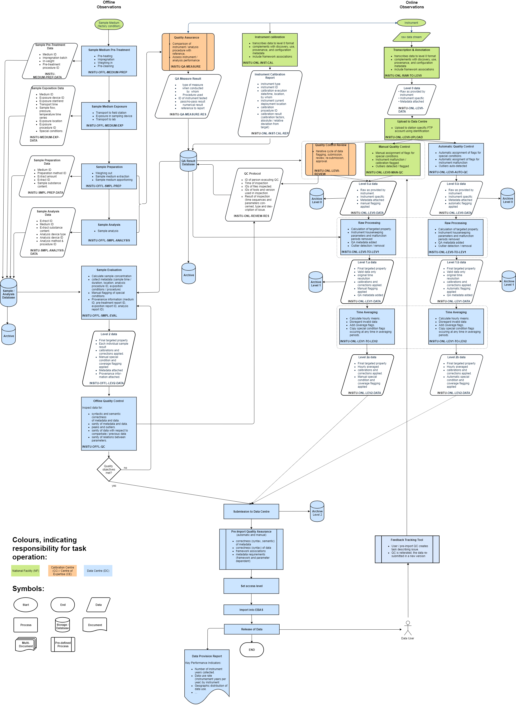

*Figure 13: ACTRIS In Situ DC unit data workflow, describing the interaction between NFs, TCs, and DC In Situ in data production.*

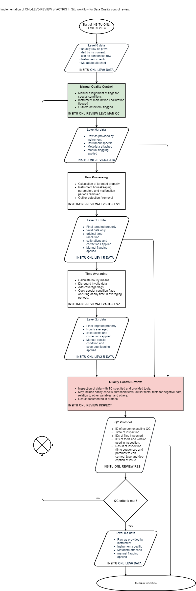

*Figure 14: ACTRIS In Situ DC unit data review workflow, a sub-workflow to the In Situ main data production workflow.*

#### A3.2 Workflow Implementation Tables, by instrument type

In this version of the DMP, this Annex focuses on the distribution of responsibilities for workflow processing tasks, and a short specification of these. A specification of metadata and data items contained in data products and pre-products will follow in a later version.

For each workflow task, responsibilities include the following roles:
* **Specification:** defining what is done in the tas. Includes step-by-step description, with formulas (algorithm description document (ADD), also called SOP, to be provided later).
* **Implementation:** taking the ADD, and turning it into software.
* **Operation:** running the software on a daily basis. Includes documentation of provenance while executing software.
* **Application:** applying the software. Usually automatic, needs to be specified for manual tasks involving humans.

The task specifications and the distribution of roles between NFs, TCs, and DC are stated in tables linked below.

##### A3.2.1 Aerosol observations

###### A3.2.1.1 Integrating nephelometer

[Nephelometer workflow implementation tables](https://sky.nilu.no/index.php/s/AyazDtaDafHHAKN)

###### A3.2.1.2 Filter Absorption Photometer

[Filter Absorption Photometer workflow implementation tables](https://sky.nilu.no/index.php/s/EQf4SkpC5GeCn5g)

###### A3.2.1.3 Mobility Particle Size Spectrometer

[Mobility Particle Size Spectrometer workflow implementation tables](https://sky.nilu.no/index.php/s/5XGJAiwdc3awSM7)

###### A3.2.1.4 Condensation Particle Counter

[Condensation Particle Counter workflow implementation tables](https://sky.nilu.no/index.php/s/WcGKkrSPHFNx6xg)

###### A3.2.1.5 Cloud Condensation Nucleus Counter

[Cloud Condensation Nucleus Counter workflow implementation tables](https://sky.nilu.no/index.php/s/EHQH7C9Sw7qK4Tr)

###### A3.2.1.6 Aerodynamic / Optical Particle Size Spectrometer

[Aerodynamic / Optical Particle Size Spectrometer workflow implementation tables](https://sky.nilu.no/index.php/s/Eqr7Dg7LbzyMATe)

###### A3.2.1.7 Aerosol Chemical Speciation Monitor

[Aerosol Chemical Speciation Monitor workflow implementation tables](https://sky.nilu.no/index.php/s/asjQNBzLqxDy7nA)

###### A3.2.1.8 Proton-induced X-ray Emission

[Proton-induced X-ray Emission workflow implementation tables](https://sky.nilu.no/index.php/s/2FoXmsFyQkDsRxM)

###### A3.2.1.9 Organic Tracers

[Organic Tracers workflow implementation tables](https://sky.nilu.no/index.php/s/zXiKc8yzkfz9Mdo)

###### A3.2.1.10 Organic Carbon / Elemental Carbon

[Organic Carbon / Elemental Carbon workflow implementation tables](https://sky.nilu.no/index.php/s/4mTpN7HpD8fmzP2)

###### A3.2.1.11 Scanning Particle Size Magnifier / (Neutral) Air Ion Spectrometer / Nano Mobility Particle Size Spectrometer

[Scanning Particle Size Magnifier / (Neutral) Air Ion Spectrometer / Nano Mobility Particle Size Spectrometer workflow implementation tables](https://sky.nilu.no/index.php/s/5X7AQEazZji4J66)

###### A3.2.1.12 Particle Size Magnifier

[Particle Size Magnifier workflow implementation tables](https://sky.nilu.no/index.php/s/4D9QQCqfdBALYjB)

##### A3.2.2 Cloud observations

###### A3.2.2.1 Integrating Cloud Probe

[Integrating Cloud Probe workflow implementation tables](https://sky.nilu.no/index.php/s/xq4JmFDWHqfCQEQ)

###### A3.2.2.2 Ice Nucleus Counter

[Ice Nucleus Counter workflow implementation tables](https://sky.nilu.no/index.php/s/ad2NnpbmAbR6X9L)

###### A3.2.2.3 Cloud Imaging Probe

[Cloud Imaging Probe workflow implementation tables](https://sky.nilu.no/index.php/s/Co2XZQcMWazaS9P)

###### A3.2.2.4 Cloud Droplet Probe

[Cloud Droplet Probe workflow implementation tables](https://sky.nilu.no/index.php/s/Tkyp2jTrDWBzm9a)

###### A3.2.2.5 Cloud Water Collector

[Cloud Water Collector workflow implementation tables](https://sky.nilu.no/index.php/s/pHqNoQLBj4WMYya)

###### A3.2.2.6 Cloud Aerosol Particle Sampler

[Cloud Aerosol Particle Sampler workflow implementation tables](https://sky.nilu.no/index.php/s/4keA5sbqn7Fdcpb)

##### A3.2.3 Trace Gas Observations

###### A3.2.3.1 Volatile Organic Compounds

[Volatile Organic Compounds workflow implementation tables](https://sky.nilu.no/index.php/s/8DbLgyiMwqZo3Nq)

###### A3.2.3.2 Nitrogen Oxides

[Nitrogen Oxides workflow implementation tables](https://sky.nilu.no/index.php/s/LADdLx3xrW6jkBa)

###### A3.2.3.3 Condensable Vapours

[Condensable Vapours workflow implementation tables](https://sky.nilu.no/index.php/s/oj6wczeJ9K2fBN3)

###### A3.2.3.4 Ozone

Filter Absorption Photometer workflow implementation tables to be added.

###### A3.2.3.5 Meteorological Base Parameters

Meteorological Base Parameters workflow implementation tables to be added.

### Appendix 4: ACTRIS Aerosol remote sensing data centre unit (ARES) data life cycle and workflow diagram
The following diagram shows the structure of the ARES workflow as discussed and agreed with the relevant TC (CARS) and the aerosol remote sensing NFs. Some parts of the workflow are still partially implemented, and others will be implemented accordingly to the implementation plan in the few years. In particular, data products different from aerosol optical property profiles are currently not integrated into the DB.

### Appendix 5: ACTRIS Cloud remote sensing data centre unit (CLU) data life cycle and workflow diagram

### Appendix 6: ACTRIS trace gases remote sensing data centre unit (GRES) data life cycle and workflow diagram

#### ftir data
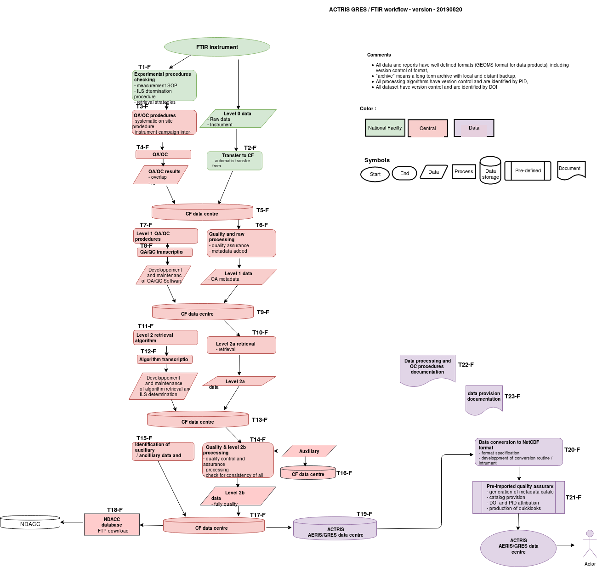

#### lidar data
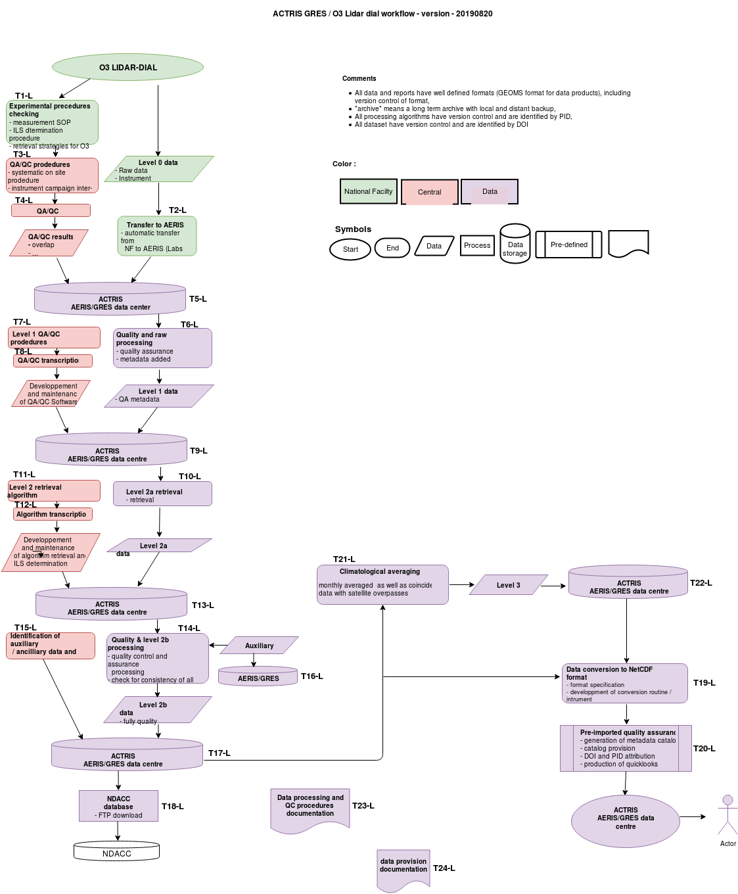

#### uvvis data
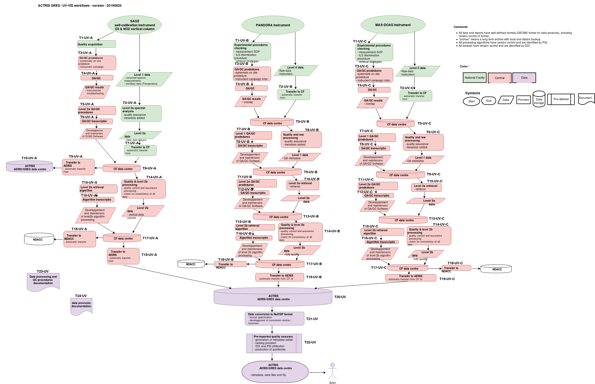

### Appendix 7: ACTRIS Atmospheric simulation chamber data centre unit (ASC) data life cycle and workflow diagram

### Appendix 8: Data lifecycle and workflow for DVAS Data Centre Unit

These will be further developed in the implementation phase, and more level 3 data will be added to the DVAS unit.

### Appendix 9: Format and external data sources for level 3 variables

Below is a list of all lev3 variables that are listed in Annex II and the checkbox indicates whether they are included in the lists below or not:

- [ ] Column Water Vapor Content
- [ ] Climatology products for ACTRIS variables @ ACTRIS National Facilities across Europe
- [x] Collocation service of data from contributing networks
- [ ] PM retrieval  @GAW sites
- [x] Single Scattering Albedo @ACTRIS National Facilities
- [ ] Integrated full-range particle number size distribution
- [ ] Source apportionment of submicron organic aerosols in Europe
- [ ] Volatile Organic Compounds (VOC) source attribution across Europe
- [ ] Cloud occurence at cloud in situ observational platforms
- [x] Direct Sun/Moon Extinction Aerosol Optical Depth (column)
- [x] Spectral Downward Sky Radiances
- [x] Aerosol columnar properties (GRASP-AOD)
- [x] ReOBS
- [x] Satellite data – combined with ground based ACTRIS data
- [x] Aerosol and Gas trend assessment
- [x] Data Interpretation and Outlier Identification Tool
- [x] Optimal interpolation and Gap filling tool
- [x] Model Evaluation Service
- [x] NWP Model Evaluation Service
- [x] Transport modelling products for assessment of source regions
- [x] Alert Service for National Facilities

##### Collected (other than ACTRIS L0-1-2)

| Product          | format  | source    | description                                                                                                                                                                                                  | Data harvest method | Level 3 data producer |
| ---------------- | ------- | --------- | ------------------------------------------------------------------------------------------------------------------------------------------------------------------------------------------------------------ |---------------------|-----------------------|
| AERONET-NASA L1  | csv     | NASA/GSFC | [https://aeronet.gsfc.nasa.gov](https://aeronet.gsfc.nasa.gov)                                                                                                                                               |                                        |                       |
| Terra+Aqua/MODIS | HDF4    | AERIS     | [https://modis.gsfc.nasa.gov](https://modis.gsfc.nasa.gov)                                                                                                                                                   |                     |                       |
| CALIPSO          | HDF4    | AERIS     | [https://www-calipso.larc.nasa.gov](https://www-calipso.larc.nasa.gov)                                                                                                                                       |                     |                       |
| CLOUDSAT         | HDF4    | AERIS     | [http://www.cloudsat.cira.colostate.edu](http://www.cloudsat.cira.colostate.edu)                                                                                                                             |                     |                       |
| PARASOL          | HDF5    | AERIS     | [http://www.icare.univ-lille1.fr/parasol](http://www.icare.univ-lille1.fr/parasol)                                                                                                                           |                     |                       |
| Aura/OMI         | HDF4    | AERIS     | [https://aura.gsfc.nasa.gov/omi](https://aura.gsfc.nasa.gov/omi.html)                                                                                                                                        |                     |                       |
| Terra/MISR       | HDF4    | AERIS     | [https://terra.nasa.gov/about/terra-instruments/misr](https://terra.nasa.gov/about/terra-instruments/misr)                                                                                                   |                     |                       |
| Metop/IASI       | BUFR    | AERIS     | [https://www.eumetsat.int/website/home/Satellites/CurrentSatellites/Metop/MetopDesign/IASI/index.html](https://www.eumetsat.int/website/home/Satellites/CurrentSatellites/Metop/MetopDesign/IASI/index.html) |                     |                       |
| MSG/SEVIRI       | NetCDF4 | AERIS     | [https://www.eumetsat.int/website/home/Satellites/CurrentSatellites/Meteosat/index.html](https://www.eumetsat.int/website/home/Satellites/CurrentSatellites/Meteosat/index.html)                             |                     |                       |
| AeroCom          | NetCDF4 | METNO     | https://aerocom.met.no/                                                                                                                                                                                      |                     |                       |
| NWP Model data   | NetCDF4 | NWP Centres  |                                                                                                                                                                                                           |                     |                       |
| SDS-WAS          | NetCDF4 |   BSC        | https://sds-was.aemet.es/                                                                                                                                                                                 |                     |                       |

##### Generated (systematic production)

| Product                                             | format               | description                                                                                                                                                                                  |
| --------------------------------------------------- | -------------------- | -------------------------------------------------------------------------------------------------------------------------------------------------------------------------------------------- |
| ReOBS                                               | NetCDF-CF            | The ReOBS project proposes an advanced method to aggregate, quality-control and harmonize in one single NetCDF file as many available geophysical variables from a NF at hourly scale for the whole data record spanned by this ensemble of variables. This file allows to easily perform multiannual and multi-variable studies combining atmospheric dynamics and thermodynamics, radiation, clouds and aerosols, from ground-based observations associated to a NF. |
| Aerosol and Gas trend assessment                                    | NetCDF-CF                            | Estimate of long term trends @ACTRIS sites, combining observations with models, interactive web visualization,  automated assessment report                                                                      |
| Data Interpretation and Outlier Identification Tool                 | NetCDF-CF                            | Quicklooks for time series data, compared to Copernicus Analysis and Reanalysis model products                                                                                                                   |
| **?** Optimal interpolation and Gap filling tool                    | NetCDF-CF                            | modal/data integration products which fill measurement gaps, eg in a time series, profile or field.                                                                                                              |
| Alert Service for National Facilities                               | [geoJSON](http://geojson.org/) **?** | Provide near real time update of special weather situations of interest for research activities at national facilities                                                                                           |

##### Generated (on-demand services)

Some products will be generated through on-line services, and will generate datasets available for a limited time on a web server.

| Product                                                             | format                               | description                                                                                                                                                                                                      |
| ------------------------------------------------------------------- | ------------------------------------ | ---------------------------------------------------------------------------------------------------------------------------------------------------------------------------------------------------------------- |
| Satellite data subsets                                              | NetCDF-CF                            | Satellite data subsets, spatially and temporally colocated with ACTRIS ground-based measurements                                                                                                                 |
| **?** Transport modelling products for assessment of source regions | NetCDF-CF                            | Backward transport modelling with FLEXPART to analyse air transirt and impact of various soucres. Develop tools to run FLEXPART operationally and automatically on a regular basis, e.g. monthly, for every site |
| Colocation service of data from contributing networks               | NetCDF-CF                            | Benchmark data products including relevant EMEP and ACTRIS data: PM and/or sulphate with  ACTRIS National Facilities  compiled in one data product                                                               |
| Model Evaluation Service                                            | NetCDF-CF                            | Automated model evaluation workflow, Evaluation reports of different complexity, NRT and reanalysis, climate models                                                                                              |
| NWP Model Evaluation Service                                        | NetCDF-CF                            | Automated model evaluation workflow, evaluation reports of different complexity for NWP models, NRT and reanalysis, NWP models

#### Production of level 3 data solely based on data from ACTRIS observational platforms

| Product                                             | format               | description                                                                                                                                                                                  |
| --------------------------------------------------- | -------------------- | -------------------------------------------------------------------------------------------------------------------------------------------------------------------------------------------- |
|    ACTRIS aerosol remote sensing profile  climatological data                                                   |     NetCDF                 |             These Level 3 data are the climatological products obtained from the fully quality controlled (Level 2) data for providing useful aggregated information to the users. The Level 3 data are centrally obtained by the ACTRIS aerosol remote sensing Data Center node of the CNR in Potenza. This allows the harmonization and reproducibility of the products.    |

#### Production of ACTRIS level 3 data and tools through multi-source data integration services, employing external ground based measurement data

| Product                                             | format               | description                                                                                                                                                                                  |
| --------------------------------------------------- | -------------------- | -------------------------------------------------------------------------------------------------------------------------------------------------------------------------------------------- |
|              Combined analysis of ground based aerosol lidar profiles and satellite data                                       |         To be defined             |       This product will be implemented in the first years of the implementation phase. A first release is expected in 2021. The product (based on previous experience in 2010) will combine the lidar observations and satellite aerosol measurements for investigating differences as a function of time and space, and other parameters (like aerosol typing). This dataset will be essential for representativeness studies. The first experimental product was a relational database. The possibility of implementing the product as NetCDF files is under investigation.         |

#### Production of ACTRIS level 3 data products involving regional and global model data

| Product                                             | format               | description                                                                                                                                                                                  |
| --------------------------------------------------- | -------------------- | -------------------------------------------------------------------------------------------------------------------------------------------------------------------------------------------- |
|                                                     |                      |                                                                                                                                                                                              |

### Appendix 10: ReOBS workflow diagram

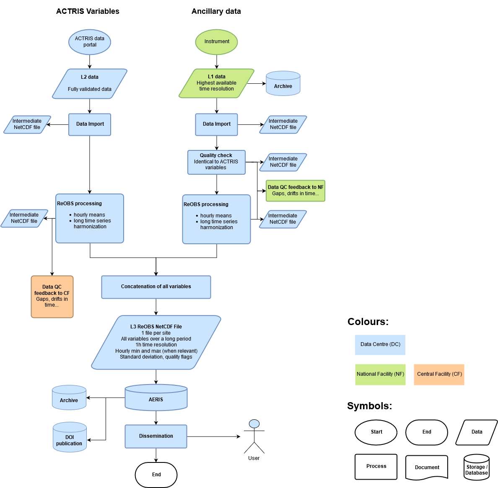

### Appendix 11: Satellite data subsets workflow diagram

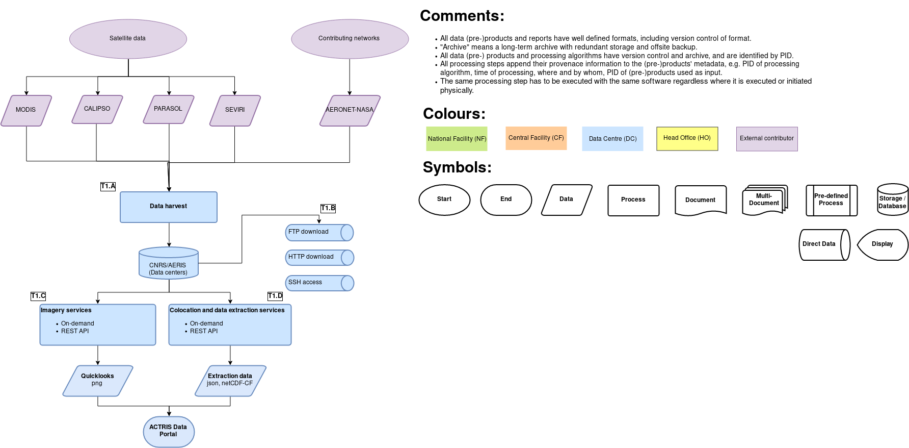

### Appendix 12: Combined  analysis of GB lidar and satellite data workflow diagram

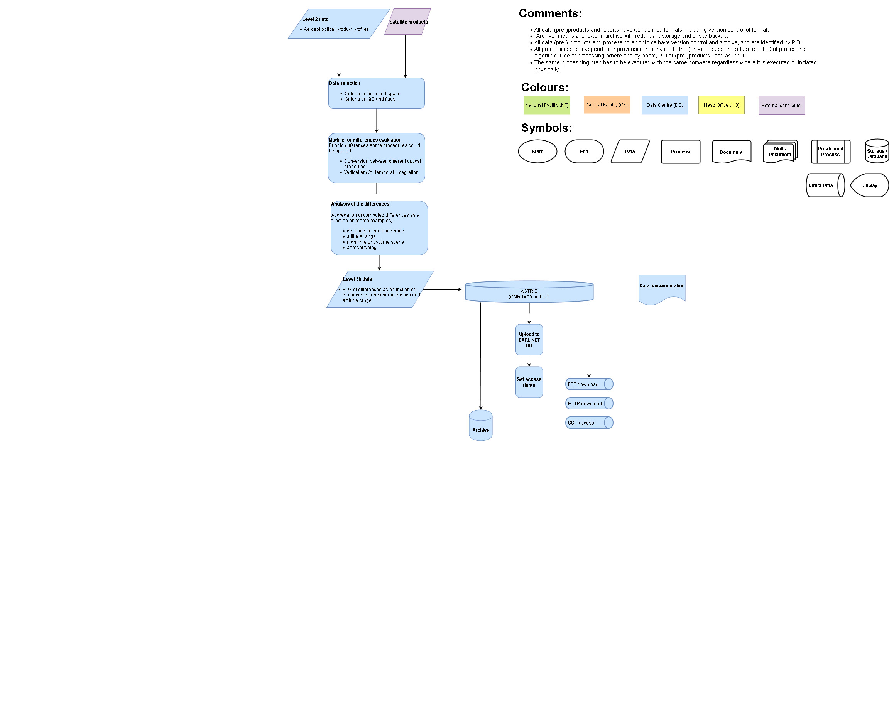

