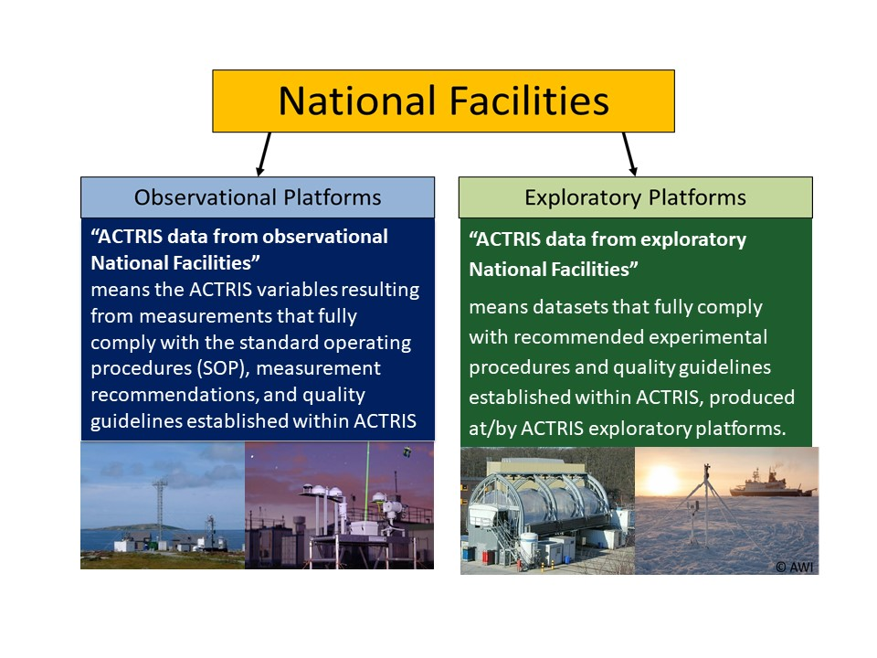
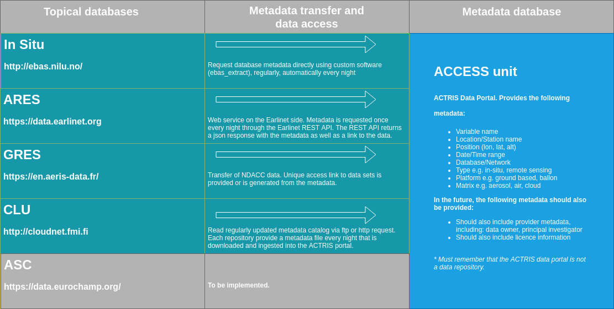
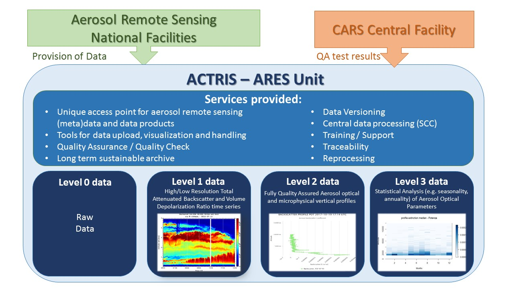

# Data Management plan for ACTRIS - Aerosols, Clouds, and Trace gases Research InfraStructure

# Table of contents

* [1. Introduction to The ACTRIS Data Centre and ACTRIS Data Management Plan](#1--introduction-to-the-actris-data-centre-and-actris-data-management-plan)
  * [1.1 The mission, overall goal and structure of the ACTRIS Data Centre](#11-the-mission-overall-goal-and-structure-of-the-actris-data-centre)
  * [1.2 The overall goal and structure of ACTRIS Data Management Plan](#12-the-overall-goal-and-structure-of-actris-data-management-plan)
* [2. ACTRIS data and ACTRIS data levels](#2-actris-data-and-actris-data-levels)
* [3. Data summary of the ACTRIS data centre](#3-data-summary-of-the-actris-data-centre)
  * [3.1. ACTRIS In Situ data centre unit (In-Situ)](#31-actris-in-situ-data-centre-unit-in-situ)
  * [3.2. ACTRIS Aerosol remote sensing data centre unit (ARES)](#32-actris-aerosol-remote-sensing-data-centre-unit-ares)
  * [3.3. ACTRIS Cloud remote sensing data centre unit (CLU)](#33-actris-cloud-remote-sensing-data-centre-unit-clu)
  * [3.4. ACTRIS trace gases remote sensing data centre unit (GRES)](#34-actris-trace-gases-remote-sensing-data-centre-unit-gres)
  * [3.5. ACTRIS Atmospheric simulation chamber data centre unit (ASC)](#35-actris-atmospheric-simulation-chamber-data-centre-unit-asc)
  * [3.6. ACTRIS data and services (ACCESS)](#36-actris-data-and-services-access)
* [4. Data Management at the ACTRIS data centre](#4-Data-Management-at-the-ACTRIS-data-centre)
  * [4.1 Introduction and overview of ACTRIS Data Management architecture](#41-introduction-and-overview-of-actris-data-management-architecture)
    * [4.1.1 ACCESS role and data management](#411-access-role-and-data-management)
	* [4.1.2 In-Situ dataflow and data management](#412-in-situ-dataflow-and-data-management)
	* [4.1.3 ARES dataflow and data management](#413-ares-dataflow-and-data-management)
	* [4.1.4 CLU dataflow and data management](##414-clu-dataflow-and-data-management)
	* [4.1.5 GRES dataflow and data management](#415-gres-dataflow-and-data-management)
	* [4.1.6 ASC dataflow and data management](#416-asc-dataflow-and-data-management)
  * [4.2 Findable: Making data findable, including provisions for metadata [FAIR data]](#42-findable-making-data-findable-including-provisions-for-metadata-fair-data)
	* [4.2.1 ACTRIS variable names and implementation of vocabulary](#421-actris-variable-names-and-implementation-of-vocabulary)
	* [4.2.2 Metadata standards and meta data services](#422-metadata-standards-and-meta-data-services)
	* [4.2.3 Traceability of ACTRIS data](#423-traceability-of-actris-data)
	* [4.2.4: Version control of ACTRIS (meta)data](#424-version-control-of-actris-metadata)
  * [4.3 Accessible: Making data openly accessible [FAIR data]](#43-accessible-making-data-openly-accessible-fair-data)
	* [4.3.1 ACTRIS data access and access protocols](#431-actris-data-access-and-access-protocols)
  * [4.4 Interoperable: Making data interoperable [FAIR data]](#44-interoperable-making-data-interoperable-fair-data)
  * [4.5 Reuseable: Increase data re-use [FAIR data]](#45-reuseable-increase-data-re-use-fair-data)
* [5. Allocation of resources](#5-Allocation-of-resources)
* [6. Data security](#6-Data-security)
* [7. Ethical aspects](#7-Ethical-aspects)
* [8. Appendix](#8-Appendix)
  * [Appendix 1: List of ACTRIS variables from observational platforms and associated recommended methodology](#appendix-1-list-of-actris-variables-from-observational-platforms-and-associated-recommended-methodology)
  * [Appendix 2: List of ACTRIS level 3 data products](#appendix-2-list-of-actris-level-3-data-products)
  * [Appendix 3: ACTRIS In situ data centre unit (In-Situ) data life cycle](#appendix-3-actris-in-situ-data-centre-unit-in-situ-data-life-cycle)
  * [Appendix 4: ACTRIS Aerosol remote sensing data centre unit (ARES) data life cycle and workflow diagram](#appendix-4-actris-aerosol-remote-sensing-data-centre-unit-ares-data-life-cycle-and-workflow-diagram)
  * [Appendix 5: ACTRIS Cloud remote sensing data centre unit (CLU) data life cycle and workflow diagram](#appendix-5-actris-cloud-remote-sensing-data-centre-unit-clu-data-life-cycle-and-workflow-diagram)
  * [Appendix 6: ACTRIS trace gases remote sensing data centre unit (GRES) data life cycle and workflow diagram](#appendix-6-actris-trace-gases-remote-sensing-data-centre-unit-gres-data-life-cycle-and-workflow-diagram)
  * [Appendix 7: ACTRIS Atmospheric simulation chamber data centre unit (ASC) data life cycle and workflow diagram](#appendix-7-actris-atmospheric-simulation-chamber-data-centre-unit-asc-data-life-cycle-and-workflow-diagram)
  * [Appendix 8: Data lifecycle and workflow for ACCESS Data Centre Unit](#appendix-8-data-lifecycle-and-workflow-for-access-data-centre-unit)
  * [Appendix 9: Format and external data sources for level 3 variables](#appendix-9-format-and-external-data-sources-for-level-3-variables)

## 1.  Introduction to The ACTRIS Data Centre and ACTRIS Data Management Plan

The Aerosol, Clouds and Trace Gases Research Infrastructure (ACTRIS) focuses on producing high-quality data for the understanding of short-lived atmospheric constituents and their interactions. These constituents have a residence time in the atmosphere from hours to weeks. The short lifetimes make their concentrations highly variable in time and space and involve processes occurring on very short timescales. These considerations separate the short-lived atmospheric constituents from long-lived greenhouse gases, and calls for a four dimensional distributed observatory. The Research Infrastructure (RI) ACTRIS is the pan-European RI that consolidates activities amongst European partners for observations of aerosols, clouds, and trace gases and for understanding of the related atmospheric processes, as well as to provide RI services to wide user groups (See the [Stakeholder Handbook](http://www.actris.eu/Portals/46/Documentation/ACTRIS%20PPP/Stakeholder%20Handbook/2018/ACTRIS%20Stakeholder%20Handbook%202018.pdf?ver=2019-03-08-140842-873) for more information). 

ACTRIS data are data from observational or exploratory National Facilities complying with the procedures established within ACTRIS.

ACTRIS observational platforms are fixed ground-based stations that produce long-term data based on a regular measurement schedule and common operation standards. These platforms perform measurements of aerosol, clouds, and reactive trace gases from the Earth surface throughout the troposphere up to the stratosphere by applying state-of-the-art remote-sensing and in situ measurement techniques under consideration of harmonized, standardized, and quality controlled instrumentation, operation procedures and data retrieval schemes. The sites are strategically located in diverse climatic regimes both within and outside Europe, and many of them contribute to one or several European and international networks, such as [EMEP](https://www.emep.int/), [NDACC](http://www.ndaccdemo.org/), or [GAW](http://www.wmo.int/pages/prog/arep/gaw/gaw_home_en.html), and are possibly partly shared with other environmental infrastructures, such as [ICOS](https://www.icos-cp.eu/), [SIOS](https://sios-svalbard.org/), [ANAEE](https://www.anaee.com/) or [eLTER](https://www.lter-europe.net/elter).

Laboratory platforms and mobile platforms that perform dedicated experiments and contribute data on
atmospheric constituents, processes, events or regions by following common ACTRIS standards are considered ACTRIS exploratory platform. In addition to these,atmospheric simulation chambers are ACTRIS exploratory platforms too. These chambers are among the most advanced tools for studying and quantifying atmospheric processes and are used to provide many of the parameters incorporated in air quality and climate models. Atmospheric simulation chamber data contribute to better predict the behavior of the atmosphere over all time scales through a detailed understanding of the physical and chemical processes, which affect air quality and climate change. Atmospheric simulation chambers are among the most advanced tools for studying and quantifying atmospheric processes and are used to provide many of the parameters incorporated in air quality and climate models. 

* Figure XX: Overview of the types of National Facilities providing data to ACTRIS Data Centre*

ACTRIS is a unique RI improving both the quality of and access to atmospheric observations, developing new methods and protocols, and harmonizing existing observations of the atmospheric variables listed in [Appendix 1](https://folk.nilu.no/~richard/actris-ri-variables/Appendix_I_ACTRIS-RI_variables_21February2018.xlsx). Appendix 1 includes an updated list of all ACTRIS variables associated to recommended measurement methodology.

### 1.1 The mission, overall goal and structure of the ACTRIS Data Centre

> The mission of the ACTRIS Data Centre (DC) is to compile, archive and provide access to well documented and traceable ACTRIS measurement data and data products, including digital tools for data quality control, analysis, visualisation, and research. As a tool for science, the highest priorities for the ACTRIS DC are to maintain and increase the availability of ACTRIS data and data products relevant to climate and air quality research for all interested users.

The overall goal of the ACTRIS Data Centre (DC) is to provide scientists and other user groups with free and open access to all ACTRIS infrastructure data, complemented with access to innovative and mature data products, together with tools for quality assurance (QA), data analysis and research. ACTRIS data and products should be **f**indable, **a**ccessible, **i**nteroperable and **r**eusable (FAIR), and the data centre work towards fulfilling the [FAIR principles](https://www.force11.org/group/fairgroup/fairprinciples). The numerous measurement methodologies applied in ACTRIS result in a considerable diversity of the data collected. In accordance with these requirements, the ACTRIS DC will be organized in 6 Units, with clear links and procedures for interaction between the data centre Units, National Facilities (NFs) and topical centres (TCs). The ACTRIS DC will be coordinated by the ACCESS unit leader and all data is linked through the [ACTRIS data portal](http://actris.nilu.no/) to provide a single access point to all data and related information. The units and short names are:

* [ACTRIS data and services access unit (ACCESS)](http://actris.nilu.no/)
* [ACTRIS In situ data centre unit (In-Situ)](http://ebas.nilu.no/)
* [ACTRIS Aerosol remote sensing data centre unit (ARES)](https://data.earlinet.org/)
* [ACTRIS Cloud remote sensing data centre unit (CLU)](http://cloudnet.fmi.fi/)
* [ACTRIS trace gases remote sensing data centre unit (GRES)](https://en.aeris-data.fr/)
* [ACTRIS Atmospheric simulation chamber data centre unit (ASC)](https://data.eurochamp.org/)

*Figure 1: Architecture of the ACTRIS Data Centre*

During the ACTRIS implementation phase (expected 2020-2024), the Central Facilities will be constructed and their services tested. The ACTRIS Central Facilities host selection was a part of ACTRIS PPP, and the following consortium is selected to host the ACTRIS Data Centre, and the various units with services to data producers and data users.

| Name of Central Facility and associated Unit                                | Hosting institution and contribution | Main activities                                                   |
|--------------------------------------------------------------|--------------------------------------|--------------------------------------------------------------------|                                    
| [ACTRIS data and services access unit (ACCESS)](http://actris.nilu.no/)                | NILU (lead), CNRS, MetNo, BSC        | ACTRIS web interface for data, services and tools, called “The ACTRIS Data Centre”. Main activities are discovery and access to ACTRIS data and data products, digital tools provided by the topical centres and the data centre units, documentation, access to software and tools for data production. Offer visualisation of ACTRIS data products. Data production of selected Level 3 data and synergy data products. The data centre will offer bridge to external data bases and sources.|
| [ACTRIS In-Situ data centre unit (In-Situ)](http://ebas.nilu.no/)                   | NILU                                 | Data curation service for in situ data: all aerosol, cloud and trace gas in situ data. This comprises inclusion of data in the data base EBAS, archiving and documentation. Support for centralized data processing, harmonization, traceability, quality control and data product generation. Training and online tools for QA, QC. The activity enables RRT and NRT delivery.|
| [ACTRIS Aerosol remote sensing data centre unit (ARES)](https://data.earlinet.org/)		   | CNR (lead), CNRS					  |	Aerosol remote sensing data processing and curation. This includes centralized processing, traceability, harmonization and data versioning, quality control, data archiving in EARLINET DB, data provision and documentation. The activity enables RRT and NRT delivery. Tutorial activities. Production of level 3 data for climatological analysis and new products. |	
| [ACTRIS Cloud remote sensing data centre unit (CLU)](http://cloudnet.fmi.fi/)		   | FMI								  |	Data curation service for cloud remote sensing data. Support for centralized cloud remote sensing data processing, traceability, harmonization, automated quality control and product generation, and data archiving. Enables RRT and NRT delivery. Production of level 3 data for NWP model evaluation. | 
| [ACTRIS Atmospheric simulation chamber data centre unit (ASC)](https://data.eurochamp.org/) | CNRS                                 | Data curation service for atmospheric simulation chamber data. This includes standardized process for data submission, quality control, inclusion of data in the XX data base, search metadata creation and provision and archiving.|
| [ACTRIS trace gases remote sensing data centre unit (GRES)](https://en.aeris-data.fr/)    | CNRS                                 | Data curation service for reactive trace gases remote sensing data. This comprises standardized process for data submission, quality control, inclusion of data in the XX data base, metadata creation and provision and archiving. Production of level 3 data for climatological analysis, and added values products (quicklooks, links to EVDC - ESA Atmospheric Validation Data Centre).|

*Table 1: Short description of the ACTRIS DC units and the research performing organizations leading and contributing to the units.*

### 1.2 The overall goal and structure of ACTRIS Data Management Plan

The ACTRIS Data Management Plan (DMP) is the key element of the comprehensive ACTRIS data management and describes the data management life cycle in detail and the plans for the data collected, processed and/or generated. The goal of the DMP is to describe the operational ACTRIS data curation, and outline the strategy and development needed towards making ACTRIS data FAIR at ACTRIS Data Centre Level.

The ACTRIS DMP is a living online document which is set up to be a machine-actionable document that is a part of the FAIR data ecosystem. The DMP should be a hub of information on ACTRIS FAIR digital objects. The goal is to make the ACTRIS DMP accessible for all stakeholders (repository operators, funders, researchers, publishers, infrastructure providers etc.) by making it available and accessible for both humans and machines. We currently use [GitHub](https://github.com/actris/data-management-plan) as the platform for collaboration on the DMP, this enables all actors working with or within ACTRIS to directly contribute and susggest changes to the document. Furthermore, the ACTRIS Data Management Plan follow the [glossary](https://www.actris.eu/About/ACTRIS/ACTRISglossary.aspx) of terminology and definitions used in ACTRIS.

## 2. ACTRIS data and ACTRIS data levels

ACTRIS data are data from observational or exploratory National Facilities complying with the procedures established within ACTRIS. ACTRIS data comprises ACTRIS variables resulting from measurements at National Facilities that fully comply with the standard operating procedures (SOP), measurement recommendations, and quality guidelines established within ACTRIS. The ACTRIS atmospheric variables are listed in [Appendix I](https://folk.nilu.no/~richard/actris-ri-variables/Appendix_I_ACTRIS-RI_variables_21February2018.xlsx), associated to the corresponding recommended methodology. 

There are 4 levels of ACTRIS data:
 * **ACTRIS level 0 data:** Raw sensor output, either mV or physical units. Native resolution, metadata necessary for next level.
 * **ACTRIS level 1 data:** Calibrated and quality assured data with minimum level of quality control.
 * **ACTRIS level 2 data:** Approved and fully quality controlled ACTRIS data product or geophysical variable.
 * **ACTRIS level 3 data:** Elaborated ACTRIS data products derived by post-processing of ACTRIS Level 0 -1 -2 data, and data from other sources. The data can be gridded or not.
 
Additionally to these data products which are completely under the control of ACTRIS with established procedures and standards, the ACTRIS DC will also produce additional data products of interest of the the scientific and  user communities. These are   **ACTRIS synthesis product:** data products from e.g. research activities, not under direct ACTRIS responsibility, but for which ACTRIS offers repository and access.

*Figure 1: ACTRIS data levels*

The list of ACTRIS variables are expected to increase during the progress of ACTRIS. Level 3 data products are expected to increase in quantity and number of variables because of the expected increase in ACTRIS data synergistic usage with other datasets. Additionally the expected technological and methodological developments fostered by ACTRIS itself will increase the ACTRIS observational capabilities and therefore the number and quality of observable atmospheric related variables (Level 1 and Level 2 products).

## 3. Data summary of the ACTRIS data centre

#### The purpose of the data collection/generation

Primary goal of ACTRIS is to produce high quality integrated datasets in the area of atmospheric sciences and provide services, including access to instrumented platforms, tailored for scientific and technological usage. The purpose of the data collection and generation of data products in ACTRIS is to provide open access to aerosol, cloud and trace gas in situ and remote sensing measurements of high quality, benefiting a large community of scientists involved in atmospheric science and related areas as well as policy makers, the private sector, educators and the general public. 

See the [Stakeholder Handbook](http://www.actris.eu/Portals/46/Documentation/ACTRIS%20PPP/Stakeholder%20Handbook/high_res_version.pdf?ver=2018-06-04-080105-217) for more information.

#### The relation to the objectives of the project

The primary goal of ACTRIS is to produce high quality integrated datasets in the area of atmospheric sciences and provide services, including access to instrumented platforms, tailored for scientific and technological usage. The main objectives of ACTRIS are:

* to provide information on the 4D-compositon and variability and of the physical, optical and chemical properties of short-lived atmospheric constituents, from the surface throughout the troposphere to the stratosphere, with the required level of precision, coherence and integration;
* to provide information and understanding on the atmospheric processes driving the formation, transformation and removal of short-lived atmospheric constituents;
* to provide efficient open access to ACTRIS data and services and the means to effectively use the ACTRIS products;
* to ensure and raise the quality of data and use of up-to-date technology used in the RI and the quality of services offered to the community of users, involving partners from the private sector; and
* to promote training of operators and users and enhance linkage between research, education and innovation in the field of atmospheric science.

* *From the Stakeholder Handbook (2018)*

Management of ACTRIS data relates to measuring atmospheric composition and the ability to predict the future behavior of the atmosphere over all time scales. High quality observational data harmonized across the countries and continents facilitates this, and needs to be supported by:

* Documentation of archiving procedures and access to level 0 -> level 3 data produced by the National Facilities (NFs), Topical Centres (TCs), and Central Facilities (CFs)
* Documented and traceable processing chain of level 0 data
* Documented, traceable processing and long-term archiving and preservation of all ACTRIS level 1 to level 3 data and data products
* Access to ACTRIS data, data products, and digital tools through a single point of entry, the ACTRIS data user interface
* Documentation of data, data flow, citation service, and data attribution, including version control, data traceability, and interoperability,
* Data curation and support for campaigns and dedicated research projects and initiatives, external or internal to ACTRIS.

#### Main users of ACTRIS data and software

ACTRIS will produce data and data products essential to a wide range of communities as described in detail in the [Stakeholder Handbook](http://www.actris.eu/Portals/46/Documentation/ACTRIS%20PPP/Stakeholder%20Handbook/high_res_version.pdf?ver=2018-06-04-080105-217), section “Users” including:

* Atmospheric science research communities world-wide
  * The climate and air-quality, observational/ experimental/ modelling/ satellite communities, national and international research programmes and organisations;
* Environmental science research communities and communities from other neighboring fields: hydro-marine, bio-ecosystem, geosciences, space physics, energy, health, and food domain, to study interactions and processes in across different disciplines;
* Instrument manufacturers and sensor industries for development, testing, prototyping and demonstration;
* Operational services, National weather services, climate services for model validation, weather and climate analysis and forecasting;
* Space agencies for validation and the development of new satellite missions;
* National and regional air quality monitoring networks and environmental protection agencies for air quality assessments and validation of air pollution models;
* Policy makers and local/ regional/ national authorities for climate, air-quality, health and atmoshperic hazards related information for decision making and policy development.
* Copernicus atmospheric monitoring service (ECMWF)
* Science community working on air quality, climate change and stratospheric ozone depletion issues

### 3.1 ACTRIS In situ data centre unit (In-Situ)

The In-Situ data centre unit provides data curation service for aerosol, cloud and trace gas in situ data and inclusion of data in EBAS database. This includes tools for harmonized data submission and meta data templates, inclusion of data and meta data in the data base, traceability, harmonization and data versioning, quality control, archiving, documentation and data provision. Training and online tools for QA, QC is offered. The activity enables RRT and NRT data compilation and delivery and provides tutorial activities. Furthermore, support for centralized data processing, harmonization, and data product generation, both level 2 and level 3 is offered and further implemented during the implementation phase.

#### The types and formats of data generated/collected
The ACTRIS In-situ data centre unit is supported by the [EBAS database infrastructure](http://ebas.nilu.no/ResourcesATMOS/AboutEBAS.pdf). In situ data submitted to ACTRIS need to be formatted in the EBAS NASA-Ames format (ASCII file) by the data originator, and there are exsisting [instructions and templates](https://ebas-submit.nilu.no/) for each instrument/group of instruments. [The EBAS NASA-Ames format](https://projects.nilu.no//ccc/tfmm/kjeller_2016/EBAS_Data_Format_2016-10.pdf) is based on the ASCII text NASA-Ames 1001 format, but contains additional metadata specifications ensuring proper documentation from the [EBAS-Submit documentation](https://ebas-submit.nilu.no/) website as well as tools for [file-generation](http://dev-ebas-file-generation-tool.nilu.no/) (*beta*) and [file-submission](https://ebas-submit-tool.nilu.no/).

ACTRIS in situ data is also available in the netCDF 4 format through the [EBAS Thredds Server](https://thredds.nilu.no/thredds/catalog.html), following the [CF 1.7 convention](http://cfconventions.org/Data/cf-conventions/cf-conventions-1.7/cf-conventions.html) and the [Attribute Convention for Data Discovery 1-3 (ACDD)](http://wiki.esipfed.org/index.php/Attribute_Convention_for_Data_Discovery_1-3).

#### Re-use of existing data

The ACTRIS data user interface will include access to aerosol and trace gas in situ legacy data resulting from ACTRIS pre-projects (for In-Situ [CREATE, EUSAAR, ACTRIS-FP7](https://www.actris.eu/About/ACTRIS/Heritage.aspx). These will also be included as a part of the ACTRIS In Situ data centre unit. Legacy data resulting from ACTRIS pre-projects will be available in the same format as current products.

#### The origin of the data

The origin of the data is derived from instrument raw data, either through online or offline observations.

#### The expected size of the data

| Type                          |Number of annual datasests (end 2019)                          | Number of annual datasets (min by 2025) | Number of annual datasets (max by 2025) |
|-------------------------------|----------------------------------------------------------|-----------------------------------------|-----------------------------------------|
| ACTRIS in situ aerosol data   |           60                                             |       50                                |   120                                   |
| ACTRIS in situ cloud data     |           0                                              |       35                                |   105                                   |
| ACTRIS in situ trace gas data |           27                                             |       30                                |   60		                               |

Table 1: *Number of annual datasets*

| Type                          |Data volume (end 2019)                                          | Data volume (min by 2025)                | Data volume (max by 2025) |
|-------------------------------|-----------------------------------------------------------|------------------------------------------|------------------------------------------|
| ACTRIS in situ aerosol data   |           18 000 MB                                       |       15 000 MB                          |   50 000 MB                              |
| ACTRIS in situ cloud data     |           0 MB                                            |       1 GB                               |   3 GB                                   |
| ACTRIS in situ trace gas data |           300 MB                                          |       200 MB                             |   400 MB	                              |

Table 2: *Data volume*

#### Data utility

Data utility specifically related to the DC unit (see data summary at ASC for under the "Data utility" section for an example)

#### Outline of data life cycle (workflow and workflow diagram)
Detail on the data life cycle and workflow (workflow diagrams for data production) for in situ observations can be found in [*Appendix 3: ACTRIS in situ aerosol, cloud and trace gas data lifecycle and workflow (draft)*](https://github.com/actris/data-management-plan/blob/master/DMP/initial-DMP.md#appendix-3-actris-in-situ-data-centre-unit-in-situ-data-life-cycle-and-workflow-diagram).

### 3.2 ACTRIS Aerosol remote sensing data centre unit (ARES)

The ARES data centre unit provides a data curation and data processing service for aerosol remote sensing data coming frm lidar and photometer obsrevations. This includes centralized data processing, data storage, recording of metadata in a dedicated RDBMS, traceability, harmonization and data versioning, quality control, documentation and data provision. The unit allows for RRT and NRT data provisioning and offers support and training activities. Furthermore, level 3 data production for climatological analysis and the delivery of new data products will be further implemented and offered during the implementation phase.

The main goal is providing access of high quality and document datasets of the aerosol optical properties vertical distribution in the whole troposphere and upper stratosphere with short time resolution.
This long term dataset collected at continental scale allows :
- investigation of the relationship between near-surface processes (as pollution or air quality issues) and atmospheric aerosol contents;
- addressing the challenging issue of direct and indirect effects of aerosol in the climate change.

#### The types and formats of data generated/collected

The ACTRIS ARES data centre unit is built on the heritage of the EARLINET Data base infrastructure and integartes the photometer aerosol data processing. Aerosol remote sensing data submitted to ACTRIS need to be compliant to a specific format established by the ARES unit centralized processing suite. All further data levels are produced by the ARES processing suite. ARES provides data compliance with NetCDF4, following Climate Forecast (CF) 1.7 conventions. 

* ARES Level 1 data products consist of high and low resolution total attenuated backscatter and volume depolarization ratio time series provided in NRT or RRT. provided by the photometer observation are also available. Additionally ARES provides columnar information and synergistic lidar/photometer products as vertical profiles of aerosol microphysical properties as Level 1 data.

* ARES Level 2 data products contain fully quality assured aerosol extinction, backscatter, lidar ratio, Angstrom exponent and depolarization ratio vertical profiles and full quality controlled columnar information and aerosol microphysical properties profiles.

* ARES Level 3 data products are retrieved from the level 2 data and provide statistical analysis (including seasonality and annuality) of the most important aerosol optical parameters.   

#### Re-use of existing data
The ACTRIS data user interface will include access to aerosol remote sensing legacy data resulting from ACTRIS pre-projects (for ARES [EARLINET, EARLINET-ASOS](https://www.actris.eu/About/ACTRIS/Heritage.aspx)). These will also be included as a part of the ACTRIS ARES data centre unit. Legacy data resulting from ACTRIS pre-projects will be available in the same format as current products.

#### The origin of the data

The origin of the data is derived from instrument raw data provided by the data originators in a common format (NetCDF).

#### The expected size of the data

| Type                                |Number of annual datasets (end 2019)                          | Number of annual datasets (min by 2025) | Number of annual datasets (max by 2025) |
|-------------------------------------|----------------------------------------------------------|-----------------------------------------|-----------------------------------------|
| ACTRIS aerosol remote sensing data  |           28                                             |       30                                |   52                                    |
 GRASP/GARRLiC      |                        6          |             30        |    52                
Table 1: *Number of annual datasets*

| Type                               |Data volume (end 2019)                                          | Data volume (min by 2025)                | Data volume (max by 2025)  |
|------------------------------------|-----------------------------------------------------------|------------------------------------------|----------------------------|
| ACTRIS aerosol remote sensing data |           4 GB                                            |       2.5 TB                             |   20 TB                    |
| GRASP/GARRLiC     |                            3.2 GB                         |     40 GB                   |           50 GB            
Table 2: *Data volume*

#### Data utility

Atmospheric aerosols are considered one of the major uncertainties in climate forcing, and a detailed aerosol characterization is needed in order to understand their role in the atmospheric processes as well as human health and environment. The most significant source of uncertainty is the large variability in space and time. Due to their short lifetime and strong interactions, their global concentrations and properties are poorly known. For these reasons, information on the large-scale three-dimensional aerosol distribution in the atmosphere should be continuously monitored. It is undoubted that information on the vertical distribution is particularly important and that lidar remote sensing is the most appropriate tool for providing this information. ARES data products are particularly useful for addressing important issues like validation and improvement of models that predict the future state of the atmosphere and its dependence on different scenarios describing economic development, including those actions taken to preserve the quality of the environment. 

* ARES Level 1 data are particularly interesting for several applications such as model assimilation and monitoring of special/critical events (volcanic eruptions, dust intrusions, ...).

* ARES Level 2 data allow for an optimal and complete optical and microphysical characterization of atmospheric aerosol. This is the fundamental starting point for any study regarding the assessment of aerosol in many atmospheric processes (climatology, climate change, Earth radiative budget, aerosol layer characterization, long range transported aerosol processes).   

* ARES Level 3 data are climatological products providing statistical analysis of aerosol optical parameters. These products are useful for the characterization of different sites all over Europe as well as to underline seasonalities, annualities and trends. 

#### Outline of data life cycle (workflow and workflow diagram)

Details of the data life cycle and workflow (workflow diagrams for data production) for aerosol remote sensing observations can be found in [Appendix 4: ACTRIS aerosol remote sensing data lifecycle and workflow (draft)](https://github.com/actris/data-management-plan/blob/master/DMP/initial-DMP.md#appendix-4-actris-aerosol-remote-sensing-data-centre-unit-ares-data-life-cycle-and-workflow-diagram).

### 3.3 ACTRIS Cloud remote sensing data centre unit (CLU)

The CLU data centre unit provides data curation and data processing service of cloud remote sensing data. This includes centralized processing, traceability, harmonization and data versioning, quality control, data provision and archiving, and documentation. The activity enables RRT and NRT data compilation and delivery, and participation in training. Furthermore, data product generation of level 3 data for forecast and climate model evaluation, climatological analysis and new products is offered and further implemented during the implementation phase. 

#### The types and formats of data generated/collected

The ACTRIS CLU data centre unit is making use of the Cloudnet database infrastructure. Cloud remote sensing data submitted to ACTRIS need to be in a specified format compliant with the centralized processing suite. CLU provides data compliant with netCDF 3 and netCDF4 formats as much as possible, and following CF 1.7 convention. Level 0 data submitted to ACTRIS CLU are required to be in a specified format compliant with the centralized processing suite. All further data levels are produced by the CLU processing suite.

#### Re-use of existing data

The ACTRIS data user interface will include access to cloud remote sensing legacy data resulting from ACTRIS pre-projects (for CLU [Cloudnet](https://www.actris.eu/About/ACTRIS/Heritage.aspx)). These will also be included as a part of the ACTRIS CLU data centre unit. Legacy data resulting from ACTRIS preprojects will be available in the same format as current products.

#### The origin of the data

Data is derived from instrument raw data, coupled with thermodynamic profiles from NWP model.

#### The expected size of the data

| Type                              |Number of annual datasests (end 2019)                          | Number of annual datasets (min by 2025) | Number of annual datasets (max by 2025) |
|-----------------------------------|----------------------------------------------------------|-----------------------------------------|-----------------------------------------|
| ACTRIS cloud remote sensing data  |       11                                                 |      15                                 |   25                                    |

Table 1: *Number of annual datasets*

| Type                               |Data volume (end 2019)                                     | Data volume (min by 2025)             | Data volume (max by 2025)             |
|------------------------------------|------------------------------------------------------|---------------------------------------|---------------------------------------|
| ACTRIS cloud remote sensing data   |           15 TB                                      |       50 TB                           |   150 TB                              |

Table 2: *Data volume*

#### Data utility

Data utility specifically related to the DC unit (see data summary at ASC for example).

#### Outline of data life cycle (workflow and workflow diagram)

Details on the data life cycle and workflow (workflow diagrams for data production) for remote sensing observations can be found in [Appendix 5: ACTRIS cloud remote sensing  data lifecycle and workflow (draft)](https://github.com/actris/data-management-plan/blob/master/DMP/initial-DMP.md#appendix-5-actris-cloud-remote-sensing-data-centre-unit-clu-data-life-cycle-and-workflow-diagram).

### 3.4 ACTRIS trace gases remote sensing data centre unit (GRES)

The GRES data centre unit provides data curation service for reactive trace gases remote sensing data, **ADD: new text, see issue and comment have this consistent with the other units.**

#### Description of the ACTRIS-GRES unit
The ACTRIS trace gases remote sensing data centre unit making use of AERIS database. Reactive trace gas remote sensing data submitted to ACTRIS need to be submitted as level 2 data following the GEOMS data format (Generic Earth Observation Metadata Standard, http://www.ndsc.ncep.noaa.gov/data/formats) and the appropriate GEOMS template for FTIR, UVVIS and LIDAR measurements.

For data access and download, the level 2 and level 3 data are be converted in NetCDF4 format following the CF (Climate Forecast) conventions. 

#### The types and formats of data generated/collected
The ACTRIS trace gases remote sensing data centre unit is supported by AERIS database. All providers will submit level 2 data following the GEOMS data format (Generic Earth Observation Metadata Standard, http://www.ndsc.ncep.noaa.gov/data/formats) and following the appropriate GEOMS template for FTIR, UVVIS and LIDAR measurements. The GEOMS data format allows the necessary requirements to setup the ACTRIS data curation service for trace gas remote sensing data.

The level 2 and level 3 data will be also converted in NetCDF ([https://www.unidata.ucar.edu/software/netcdf/](https://www.unidata.ucar.edu/software/netcdf/)) version 4 format following the CF (Climate Forecast) conventions and be disseminated. The Climate and Forecast conventions are metadata conventions for earth science data. The conventions define metadata that are included in the same file as the data making the file "self-describing".

#### Re-use of existing data
The ACTRIS data user interface will include access to reactive trace gases remote sensing legacy data data resulting from ACTRIS pre-projects (for GRES…). These will also be included as a part of the ACTRIS GRES data centre unit. Legacy data resulting from ACTRIS pre-projects will be available in the same format as current products.

#### The origin of the data
The origin of the data is derived from instrument raw data, through offline observations.

#### The expected size of the data

| Type                                |Number of annual datasets (end 2019)                          | Number of annual datasets (min by 2025) | Number of annual datasets (max by 2025) |
|-------------------------------------|----------------------------------------------------------|-----------------------------------------|-----------------------------------------|
| ACTRIS-GRES FTIR                    |                  276                                 |         200                            |             300                         |
| ACTRIS-GRES UV-VIS                  |             20000                                          |          15000                            |             30000                         |
| ACTRIS-GRES LIDAR DIAL              |                  450                                    |          300                            |             500                          |

Table 1: *Number of annual datasets*

| Type                               |Data volume (end 2019)                                          | Data volume (min by 2025)                | Data volume (max by 2025)  |
|------------------------------------|-----------------------------------------------------------|------------------------------------------|----------------------------|
| ACTRIS-GRES FTIR |                    2,5 GB                                   |              12 GB                         |          18 GB               |
| ACTRIS-GRES UV-VIS  |                     1,2 GB                                   |              6 GB                         |          10 GB               |
| ACTRIS-GRES LIDAR DIAL |                     400 MB                                |              400 MB                      |          550 MB            |

Table 2: *Data volume*

#### Data utility

Data utility specifically related to the DC unit (see data summary at ASC for example)

#### Outline of data life cycle (workflow and workflow diagram)
Detail on the data life cycle and workflow (workflow diagrams for data production) for trace gases remote sensing data can be found in [Appendix 6](https://github.com/actris/data-management-plan/blob/master/DMP/initial-DMP.md#appendix-6-actris-trace-gases-remote-sensing-data-centre-unit-gres-data-life-cycle-and-workflow-diagram).

### 3.5 ACTRIS Atmospheric simulation chamber data centre unit (ASC)

The ASC data centre unit provides data curation service for data obtained from experiments in atmospheric simulation chambers (ACTRIS exploratory platforms). This includes tools for harmonized data submission and meta data templates, inclusion of data and metadata in the database, traceability, harmonization and data versioning, quality control, archiving, documentation and data provision. The ASC unit is structured in three pillars:

* The Database of Atmospheric Simulation Chamber Studies (DASCS) provides access to experimental data (level 2 data), typically time-series of measured parameters during an experiment in a simulation chamber.

* The Library of Analytical Resources (LAR) provides quantitative analytical resources that include infrared spectra and mass spectra of molecules and derivatives (level 3 data).

* The Library of Advanced Data Products (LADP) provides different types of mature data products (level 3 data): rate constants of reactions, quantum yields and photolysis frequencies of trace gas compounds, secondary organic aerosol (SOA) yields, mass extinction/absorption/scattering coefficients and complex refractive index of aerosols, growth factors of aerosols and modelling tools. The detailed list of ACTRIS level 3 data products is given in Appendix 9.
    
**The types and formats of data generated/collected**

The ACTRIS ASC data centre unit is making use of EUROCHAMP database (https://data.eurochamp.org/) which is hosted by AERIS infrastructure. Data submitted to the DASCS pillar have to be provided by NFs in a standard format, called “EDF format” (EUROCHAMP Data Format) which is based on an ASCII text format and contains additional metadata in a header. These data are completed with rich metadata which are available from the website and give access to a technical description of the chambers (size, volume, walls, irradiation system …), the experimental protocols used for the generation of the data, and an “auxiliary mechanism” which provides the chamber-dependent parameters affecting the observations. Currently, work is being conducted with regards to providing tools for access and download of data also in the netCDF 4 format, compliant with the CF 1.7 convention. This will be implemented during ACTRIS implementation phase.

Level 3 data provided in LAR are IR and mass spectra in JCAMP-DX format which is the standard format recommended by IUPAC for spectra. It is a 2D graphic format based on ASCII format. Metadata are attached and made available through the ACTRIS data user interface. These data are provided by NFs.

Level 3 data provided in LADP are of different types and have thus different formats. However, each type of data is provided in a harmonized format. Most of them are provided as a unique value with metadata attached.

**Re-use of existing data**

The ACTRIS data user interface will include access to atmospheric simulation chamber legacy data resulting from ACTRIS pre-projects (for ASChere EUROCHAMP-1, -2, and EUROCHAMP-2020). These will also be included as a part of the ACTRIS ASC data centre unit. Legacy data resulting from ACTRIS pre-projects will be available in the same format as current products.

**The origin of the data**

Data provided in DASCS and LAR pillars are derived from instrument raw data and data provided in LADP are produced from L2 data processing. All the data processing is performed by NFs.

**The expected size of the data**

| Type                                |Number of annual datasets (end 2019)                          | Number of annual datasets (min by 2025) | Number of annual datasets (max by 2025) |
|-------------------------------------|----------------------------------------------------------|-----------------------------------------|-------------------------------|
| ACTRIS-ASC DASCS                    |                   200                                    |          50                            |             300                 |
| ACTRIS-ASC LAR                 |                   20                                  |          10                          |             50               |
| ACTRIS-ASC LADP              |                   70                                     |          50                             |             200                |

 Table 1: _Number of annual datasets

|  Type                                |Data volume (end 2019)                          | Data volumes (min by 2025) | Data volume (max by 2025) |
|-------------------------------------|----------------------------------------------------------|-----------------------------------------|-------------------------------|
| ACTRIS-ASC DASCS                    |                  1,2 GB                                  |        1,5 GB                            |             2,4 GB                 |
| ACTRIS-ASC LAR                 |                   67 MB                                  |          76 MB                        |            120 MB               |
| ACTRIS-ASC LADP              |                   26 KB                                     |          200 KB                             |             500 KB                |

Table 2: _Data volume_

**Data utility**

Atmospheric simulation chamber data contribute to better predict the behavior of the atmosphere over all time scales through a detailed understanding of the physical and chemical processes which affect air quality and climate change. ACTRIS-ASC unit gives access to different types of data and data products essential to a wide range of 
communities. Many of these parameters are incorporated in air quality and climate models.

* Level 2 data provided in DASCS are of high interest for a large community of users in atmospheric science research and related areas, as well as the private sector. In particular, they are largely used for modelling activities to develop and/or validate chemical schemes of atmospheric models.

* Level 3 data provided in the LAR are of high interest for a large community of users in atmospheric sciences, analytical chemistry and related areas, as well as the private sector. Indeed, quantitative chemical analysis of infrared spectra for complex mixtures requires access to standards for the calibration of instruments. However, as the chemical species formed by these processes are often very complex (and not commercially available), their spectra are not available in the “classical” databases of analytical chemistry, or are not useful due to their low resolution. To tackle this issue, the EUROCHAMP consortium has developed its own Library of infrared spectra and has made it freely available to the scientific communities.

* Level 3 data products provided in the LADP are especially useful for researchers working on atmospheric observations, as well as atmospheric model development and validation. It includes products for the development of chemical mechanisms in atmospheric models (e.g. rate coefficients, photolysis frequencies, SOA yields, vapor pressures, etc.), products for the retrieval of satellite data and for radiative transfer modelling (e.g.), and tools to generate oxidation schemes which are very useful to interpret field measurements as well as laboratory studies.

**Outline of data life cycle (workflow and workflow diagram)**

Detail on the data life cycle andA preliminary version of the data workflow (workflow diagrams for data production) for Atmospheric Simulation chamber data can be found in [Appendix 7](https://github.com/actris/data-management-plan/blob/master/DMP/initial-DMP.md#appendix-7-actris-atmospheric-simulation-chamber-data-centre-unit-asc-data-life-cycle-and-workflow-diagram). The definition of this workflow is still under progress and a finalized version will be available in 2020.   

### 3.6 ACTRIS data and services (ACCESS)

ACTRIS data and services access unit (ACCESS) is responsible for access to measurement data, services, tools and documentation, with scientific data management and support to observational and exploratory NFs. The access unit provides provision of ACTRIS web interface for data, services and digital tools as well as performing data production of and access to Level 3 data, quality control tools, and synergy data products.

The ACTRIS access web interface for data, services and tools, is called “The ACTRIS Data Centre” and the main activities are **Discovery and access** to ACTRIS data and data products, digital tools provided by the topical centres and the data centre units, documentation, software and tools for data production. **Visualisation** of ACTRIS data products. **Data production** of Level 3 data and synergy data products. The data centre also offers **bridge to external data bases and sources**.

The ACTRIS ACCESS unit provides elaborated aerosol, cloud and trace gas data products, issued of advanced multi-instrument synergistic algorithms, long term reanalysis, modelling and satellite data and sources.

The list of ACTRIS level 3 data products is detailed in the [Appendix II](https://folk.nilu.no/~richard/actris-ri-variables/Appendix_II_ACTRIS-RI_level3_variables_21February2018.xlsx), and consiste of three main categories:

	I. Production of level 3 data solely based on data from ACTRIS observational platforms

	II. Production of level 3 data and tools through multi-source data integration services, employing external ground based measurement data

	III. Production of level 3 data products involving regional and global model data

#### The types and formats of data generated/collected

The objective is that most of the level 3 data generated will be in [NetCDF data format](https://www.unidata.ucar.edu/software/netcdf/) and have metadata compliant to the [NetCDF CF Metadata Conventions](http://cfconventions.org). This format and metadata are widely used in the atmospheric science community, and is supported by a lot of standard visualization and analysis tools. Nevertheless, the collected data can come from external sources accordingly, non standard formats may also be used. In these cases, they will be rather kept in their original format.

### Re-use of existing data

The generated products and online services available from ACTRIS-preproject use existing ACTRIS L0-1-2, satellite and model data.

### The origin of the data
The origin of the data is derived from ground-based and satellite observations, retrieval algorithms and model simulations.

#### The expected size of the data

| Type                  |Number of annual datasests (end 2019)   | Number of annual datasets (min by 2025) | Number of annual datasets (max by 2025) |
|-----------------------|-----------------------------------|-----------------------------------------|-----------------------------------------|
|   |
|    GRASP-AOD          |                        0          |             7500                        |    7500                                 |
|    ReOBS              |                        1          |             1                           |    1                                    |

Table 2.6.1. *Number of annual datasets*

| Type              |Data volume (end 2019)                                          | Data volume (min by 2025)  | Data volume (max by 2025)  |
|-------------------|-----------------------------------------------------------|----------------------------|----------------------------|
|   |
| GRASP-AOD         |                              0 GB                         |      10.5 TB               |        17.5 TB             |
| ReOBS             |                              2 GB                         |        3 GB                |                5 GB        |

Table 2.6.2. *Data volume*

##### Generated (on-demand services)

| Product                                                       | Typical dataset per day | Typical volume per day |
| ------------------------------------------------------------- | ----------------------- | ---------------------- |
| Satellite data subsets                                        | 100                     | 100 MB                 |
| Transport modelling products for assessment of source regions | ...                     |                        |
| Colocation service of data from contributing networks         | TBD                     | TBD                    |
| Model Evaluation Service                                      | 30                      | 300 MB                 |
| NWP Model Evaluation Service                                  | 120                     | 100 MB                 |

#### Data utility

Data utility specifically related to the DC unit (see data summary at ASC for example)

#### Outline of data life cycle (workflow and workflow diagram)

Detail on the data life cycle and workflow (workflow diagrams for data production) for level 3 data can be found in Detail on the data life cycle and workflow (workflow diagrams for data production) for level 3 data can be found in [Appendix 8](https://github.com/actris/data-management-plan/blob/master/DMP/initial-DMP.md#appendix-8-data-lifecycle-and-workflow-for-access-data-centre-unit)

## 4. Data Management at the ACTRIS data centre

ACTRIS data and products should be findable, accessible, interoperable and reusable (FAIR), and the data centre works towards fulfilling the FAIR principles. This chapter is describing the complete ACTRIS Data Flow from [National Facilities (NF)](https://raw.githubusercontent.com/actris/data-management-plan/master/DMP/img/section1/Exp_Obs_NF.jpg) to users that is operational now, and the work and solutions that will be implemented during the implementation phase (2020-2025). The section starts with an introduction to the data management system in ACTRIS in section 4.1, including detailed descriptions of data flows within each unit (4.1.1.-4.1.5). This is followed by sections describing detailed solutions and implementation plans making ACTRIS data and products findable (4.2), accessible (4.3), interoperable (4.4), and reusable (4.5).

### 4.1 Introduction and overview of ACTRIS Data Management architecture

ACTRIS Data Management is handled by the individual data centre units:

* ACTRIS In situ data centre unit for all aerosol, cloud and trace gas in situ data - In-Situ
* ACTRIS Aerosol remote sensing data centre unit - ARES
* ACTRIS Cloud remote sensing data centre unit - CLU
* ACTRIS Trace gases remote sensing data centre unit - GRES
* ACTRIS Atmospheric simulation chamber data centre unit – ASC
* ACTRIS data and service access unit - ACCESS

An overview of the elements in the data flow is shown in Figure XX.

*Figure x: Schematic overview of the elements in ACTRIS data flow - Figure to be adjusted by Cathrine

#### 4.1.1 ACCESS role and data management

Access to quality controlled data from the data centre units is provided by the ACTRIS data and service access unit (ACCESS) through the web interface called “ACTRIS Data Centre”. The ACCESS unit is not only responsible for access to measurement data, but also access to services, tools and providing documentation, all which is based on metadata provided by the data Centre units, the tasks are summarized in the [Figure](https://raw.githubusercontent.com/actris/data-management-plan/master/DMP/img/section4/elements_in_the_dataflow.png) above and include the organization of ACTRIS level 3 data. 

All data centre units are providing metadata and interface for access to data in the current ACTRIS metadata catalogue, expect for ASC. The metadata is used as input to the current ACTRIS metadata catalog providing identification and access to data through the ACTRIS Data Centre web portal. Access to primary datasets are regularly updated through the metadata catalogue, typically every night or on a weekly basis, through various procedures, so potentially new data added to the topical databases are available through the portal the following day. ASC unit has developed its own metadata catalog within EUROCHAMP projects. This metadata catalog is currently available through EUROCHAMP Data Centre portal and provides identification and access to data.

[The current overview of topical databases](img/section4/overview_of_topical_databases.png) show the current technical description and solutions and the interface used between the topical DC units, and ACCESS and the ACTRIS Data Centre web interface with access for users. 

In the future, the aim is to collect all ACTRIS metadata in to a single metadata catalogue, providing discovery metadata for all ACTRIS data. Currently there are no dedicated metadata catalog for all ACTRIS data. The current setup is a web portal with a database that collects metadata from In Situ, ARES, CLU and GRES via custom APIs.
The ACCESS unit will suggest a standard that is widely used within the atmospheric domain for providing discovery metadata (likely to be ISO19139/ISO19115). The approach towards this will be discussed in more detail during a technical workshop in the end of 2019.

Figure x: ACTRIS Data Centre elements

Figure x: Current overview of topical databases (Updates of Figure Figure x: current_overview_topical_databases.png) 

As described in [figure x](https://raw.githubusercontent.com/actris/data-management-plan/master/DMP/img/section4/elements_in_the_dataflow.png), ACCESS organizes the level 3 data. The collected and generated level 3 datasets will be extended during the implementation phase, and the complete list of variables under implementation is included in Appendix II. Details of the level 3 data production in operation is included in [Appendix 9](https://github.com/actris/data-management-plan/blob/master/DMP/initial-DMP.md#appendix-9-list-of-all-level-3-variables).

#### 4.1.2 In-Situ dataflow and data management

Max 1 page, including figure. Common structure for all units
Give and overview of the role and tasks here, not too detailed. Refer to workflow annex
for details.
Bullet points to be covered by each unit leader:
* data submission
* online, offline, manual automatic
* Archiving and preservation of  data sets, level 0-2 
* level 0: how and where are these handled/archived? Comment on formats.
* level 1 – level 2 data production: where? NF? DC+ TC?
* how are the traceable data measurements now, and potentially in the future (plans for implementation)
* version control, all levels?
* what is centralized, what is at NF level etc,
* Centralised tools, manual tools, automatic tools

Make use of the concept paper for text: the subsection in section 3. Can probably use some from there.

Add figure, similar to ASC, to easily visualize data flow with main links and tasks for the NF and Unit (including some text, not much).

The data management of ACTRIS in situ aerosol, cloud, and trace gas variables (listed in Appendix 1) follows a common workflow (see Appendix 3 for details). The workflow is separated into 2 branches:
* Online observations: Measurement done directly on sample air stream immediately after sampling, measurement reported by instrument while sample passes through or immediately after. Instrument QA by on- and off-site comparisons to standard instruments / primary standards. RRT data provision is possible and default.
* Offline observations: Measurement done on sample medium in which sample is collected. Sample analysis usually disconnected from sample collection in time and location. Sample handling is documented by a series of reports, leading to final data product. QA on sample handling (e.g. field blanks) and analysis (e.g. round-robin). Rapid delivery for data possible.

Figure x: Simplified workflow of the ACTRIS In Situ data centre unit, focussing on distribution of responsibilities and services to users. *to be updated*

If an offline analysis process has been sufficiently streamlined, it may be described by the online workflow.

ACTRIS In situ concretises the ACTRIS data levels as follows:
* Level 0: raw data as produced by the instrument, all main and instrument status parameters provided by instrument, brought to a well-defined data format. Discovery, use, provenance, and configuration metadata attached, including all information needed for further data production, as far as known at stations level (e.g. QC metadata). Instrument model specific, time resolution native to instrument, temperature and pressure conditions as provided by instrument.
* Level 1: Contains physical property observed, including measures of uncertainty. Instrument status parameters, QC measurements and invalid data removed, quality control and post-calibrations applied. Time resolution native to instrument. Content specific for measured property, standard conditions of temperature and pressure.
* Level 2: Contains data averaged to a homogeneous time resolution, typically 1 h. Includes measure of atmospheric variability, content specific for measured property.

##### Online In Situ Data Production

Already at the station, the raw data stream from the instrument is transcribed to a homogeneous level 0 format, and annotated with discovery, use, provenance, and configuration metadata. The level 0 data are transferred to the ACTRIS DC at a RRT schedule (latest 3 h after measurement, normally 1 h). At this point, the In Situ online workflow splits into 2 branches:

1. RRT data production: incoming level 0 data are auto-QCed for outliers, spikes, calibration data, and automatically identifiable instrument malfunctions, and flagged accordingly, yielding level 0b. From there, levels 1b and 1.5 (final RRT data product) are produced. RRT data are offered through a data subscription service.

2. Fully QCed data production: data are manually QCed for outliers, spikes, calibration data, episodes (e.g. atmospheric transport, local / regional contamination), and instrument malfunctions. Tools for manual data QC are provided centrally. Manual QC is assisted by automatic pre-screening of data, similar to the auto-QC for RRT data. There are 2 options for organising the QC process, both are applied at least annually:
  a. TC review: data QC is conducted by NF and supervised by TC, and follows its own sub-workflow.
  b. NF review: data QC by an identified person under the responsibility of the NF. 

From the fully QCed level 0 data, i.e. level 0a, levels 1a and 2 (final data product) are produced. 

All In Situ data products, level 1.5 (RRT) and level 2 (fully QCed), are archived in the In Situ data repository, hosted in NILU’s EBAS database, and made available through ACCESS. In Situ produces selected level 3 products from these (see Appendix 9).
The content of workflow tasks and the responsibilities for them are specified in Appendix 3, separately for each In Situ instrument type. By default, the responsibilities are distributed between NF, TC, and DC as follows:

NF:
* Operates the instrument according to TC recommendations.
* Uses data acquisition and handling software provided by TC.
* Conducts / participates in on-site and off-site QA measures as specified by TC.
* Maintains infrastructure for RRT data transfer.
* Reacts to feedback on instrument operation and data quality from both TC and DC within 1 week, and takes corrective action within 1 month.

TC:
* Maintains operating procedures for each In Situ instrument type in his responsibility.
* Provides and maintains data handling software for each In Situ instrument type in his responsibility to NF.
* Supervises on-site QA measures and calibrations, provides specification and tools for documenting these in a traceable way.
* Conducts off-site QA measures on instruments as required by instrument type.
* In collaboration with DC, specifies data and metadata items contained in data levels 0, 1, and 2 for each instrument type.
* In collaboration with DC, specifies data and metadata items contained in QA measure reports for each instrument type.
* Specifies actions to be executed in each workflow task box for each instrument type.
* Provides software executing task boxes in data production workflow.
* In collaboration with DC, specifies sub-workflow for data QC review, if applicable.

DC:
* Archives all level 0, 1, and 2 data occurring during workflow execution.
* Archives level 3 data produced by In Situ.
* Operates software 

#### 4.1.3 ARES dataflow and data management

The submission of the data to ACTRIS ARES requires that level 0 data are in a specified format compliant with the centralized processing suite. Level 0 data have to be formatted in such a format and submitted to the centralized processing suite by the data originator. Processed data level 1 produced by the processing tools have to be submitted to the database by the data originator through devoted available tool. Finally, the ACTRIS ARES data centre automatically produces Level 2 and Level 3 climatological products.

|        Product Type       |                                  Availability (Typical)                                          | 
|---------------------------|--------------------------------------------------------------------------------------------------|
| Level 1                   |                                          RRT / NRT                                               |
| Level 2                   |                                             1 year                                  |  
| Level 3                   |                                             1 year                                  | 

Table 4.1.3.1. *ARES Data Products Availability *

* Figure X: ARES Data Products Availability*

#### 4.1.4 CLU dataflow and data management

*Max 1 page, including figure. Common structure for all units*

**Wait with writing this, until we have a draft of in-situ with**
* data submission - automated transfer
* Archiving and preservation of  data sets, level 0-2 - not all L0 is archived at DB yet
* level 0: how and where are these handled/archived? Comment on formats. - Mostly netcdf; after processing, all netcdf
* level 1 – level 2 data production: where? NF? DC+ TC? - under DC control, all netcdf 
* how are the traceable data measurements now, and potentially in the future (plans for implementation) - in principle, traceable through metadata in netcdf
* version control, all levels? - under development
* what is centralized, what is at NF level etc. - processing suite centralised, calibration via CCRES
* Centralised tools, manual tools, automatic tools - processing automated, but calibration requires manual tools
**Text moved from other parts of the document that belongs here, maybe in modified version:**

Level 0 data submitted to ACTRIS CLU are required to be in a specified format compliant with the centralized processing suite. All further data levels are produced by the CLU processing suite.

#### 4.1.5 GRES dataflow and data management

*Max 1 page, including figure. Common structure for all units*

**Wait with writing this, until we have a draft of in-situ with**

**Text moved from other parts of the document that belongs here, maybe in modified version:**

Trace gases remote sensing data produced are organized within one unique database and are issued from measurements using three types of instruments located at different observatory stations. The three types of instruments are:

* FTIR: Fourier Transform Infra-Red Spectrometry,
* UVVIS including UV-VIS zenith-sky or UVVIS ZS and UVVIS MAXDOAS (Multi-AXis Differential Optical Absorption Spectroscopy instruments),
* LIDAR DIAL: Differential Absorption Lidar.

This database provides access to level 2b and level 3 data of trace gases profiles (O3) or columns (O3, C2H6, HCHO, NO2, NH3 …). The level 2b data are produced from the consolidation of level 2a data using quality assurance and quality control procedures. The level 3 data are produced from level 2b data, trace gas profiles or columns, and correspond to monthly averaged climatologies as well as coincident data with satellite overpasses.

#### 4.1.6 ASC dataflow and data management

*Max 1 page, including figure. Common structure for all units*

**Wait with writing this, until we have a draft of in-situ with**

**Text moved from other parts of the document that belongs here, maybe in modified version:**

Data provided in ASC unit are L2 and L3 data produced These data are produced from L0 and L1 data processing performed at NFs level (see Figure XX). These Datadata have to be provided by NFs in a standard formats and to be completed with rich metadata (see section 3.5). NFs are also in charge of providing tools to facilitate the generation and the handling of the data.  The ASC unit is in charge of i) providing a free and open access to data and tools developed by NFs through user-friendly web interfaces, ii) developing data visualization tools, iii) developing tools to ensure the quality and the completeness of the data provision process, iv) creating and maintaining the metadata catalogue, and finally v) assuring long-term archiving of L2 and L3 data. Jointly with NFs and TCs, it also contributes to the elaboration of the data workflow.

*Figure x: current overview of ASC unit*

### 4.2 Findable: Making data findable, including provisions for metadata [FAIR data]

#### 4.2.1 ACTRIS variable names and implementation of vocabulary

Generally, ACTRIS data set names aims to be compliant with CF (Climate and Forecast) metadata conventions. In the case where no standard CF names are defined, an application will be sent to establish these. The names used are in Annex I. Currently there is no search model used by the ACCESS unit (ACTRIS Data Centre web interface). Still search keywords are implemented to varying degrees on the individual data centre unit level (e.g. search keywords are used for the EBAS ISO19115 records). The ACTRIS data centre will in the future use a controlled set of vocabularies for search keywords like Global Change Master Directory (GCMD) or similar, and semantic search will be implemented to facilitate use of ACTRIS variable across scientific disciplines and domains.

ASC unit has developed a user-friendly web interface which includes searching tools based on the metadata catalogue for the three pillars, DASCS, LAR and LADP. Relevant searching criteria have been defined for each pillar. 

Standard vocabulary might not always be used, but in all cases they should be mapped to standard vocabulary if existing by the DC ACCESS unit.

| Data centre unit         | Vocabulary name               |          Comment            |
|--------------------------|-------------------------------|-----------------------------|
|         In Situ		   | IUPAC, CF-1.7, WMO category codes?  |                             |
|         ARES     		   | CF1.7      |                             |
|         CLU              |          CF-1.7        |                             |
|		  ACCESS           | Defined by primary repository |                             |
|         ASC              | 		?				       |  			                 |
|		  GRES             | 		?				   |  				             |

*Table X: List of vocabularies used July 2019*

#### 4.2.2 Metadata standards and meta data services

**Figure needed showing the meta data flow and interfaces throughout the flow from NF to ACTRIS Data Centre – Richard and Cathrine is working on this. Made in line with the others (layout wise), clearly stating the technologies with most “FAIR” data at the top (ACTRIS DC and the various ways of getting (meta)data)**

ACTRIS will harvest metadata from a large range of observations employing methodologies provided by multiple data centre units covering different types of data both in terms of size, time coverage and metadata. The ACCESS unit aims at providing discovery metadata in a common format for all ACTRIS level 2 data, using a common standard that is WIS compliant such as ISO19139 or ISO19115. A decision about the standard is not taken, and under consideration. In any case, exceptions may occur in cases where the selected metadata standards do not meet the need to describe the data. The present situation is shown in Table (refer to the one at the end of the section). 

Future efforts will further develop the system shown in Figure XXX (that Richard is producing now) and make it possible for the ACCESS unit to harvest all metadata from the different data centre units and collect this in a central ACTRIS metadata catalog and provide this through a commonly used protocol for Metadata harvesting like OAI-PMH or similar. A decision about the standard is not taken, and under consideration. The present situation is shown in Table (refer to the one at the end of the section). ACTRIS data should be described with rich metadata. Currently metadata services are offered on data centre unit level, but the aim is to offer all ACTRIS level 2 data through a centralized metadata service.

There might be instances where standards do not cover the need for describing the data at the data centre unit. In this case, ACTRIS Data Centre will still try to provide metadata in a way that is similar to the agreed formats and standards and at the same time push for an extension of the specified standard.

ACTRIS aiming at following the INSPIRE directive for metadata formatting. Present standard(s) for metadata is at the ACCESS unit level. A decision is needed if data centre units should provide metadata according to specific standards, as well as providing metadata from the ACTRIS DC to the ENVRI cluster, EOSC etc.

Tables below show the status by July 2019.

| Data centre unit                  | metadata service               | end-point                                                                               |                        standard |
|--------------------------|--------------------------------|-----------------------------------------------------------------------------------------|---------------------------------|
|         In Situ          |          OAI-PMH               |  https://ebas-oai-pmh.nilu.no/oai/provider?verb=ListIdentifiers&metadataPrefix=iso19115 |       ISO 19115-2, CF-1.7,ACDD  |
|         ARES             |          ISO via Thredds server, JSON via REST API, HTTP via Apache Server|  https://login.earlinet.org:8443/thredds/catalog/earlinedbscan/catalog.html , https://data.earlinet.org/api/services/ , https://data.earlinet.org/           |       ISO 19115-2 , ECMA262-3, CF-1.7, NCML, RFC2616               |
|         CLU              |          To be defined     |  None                                                                 |       To be decided                      |
|	  ACCESS           	   | To be decided              |  None																		              |       To be decided             |
|         ASC              | CSW, geonetwork				|  [http://catalogue2.sedoo.fr/geonetwork/srv](http://catalogue2.sedoo.fr/geonetwork/srv)	(implementation on going)																			  |      ISO 19139				|
|         GRES             | CSW, geonetwork					|   [http://catalogue2.sedoo.fr/geonetwork/srv](http://catalogue2.sedoo.fr/geonetwork/srv)	(implementation on going)																					  |       ISO 19139 |

*Table x: List of metadata standards and services implemented by July 2019*

ACTRIS metadata should be registered or indexed in relevant metadata catalogs

| Metadata catalogs           | Description               | ACTRIS DC unit indexed                                                                    |
|-----------------------------|---------------------------|-------------------------------------------------------------------------------------------|
|         GISC Offenbach          |                           |                                                                                       |
|         NextGEOSS             |                           |                                                                                         |
|         WIGOS              |          NaN              |  None                                                                                      |
|	      Copernicus           | Defined by primary repository  |  None																		          |
|         re3data              | To be defined					|  None																			      |
|         EOSC             | To be decided					|  None																					      |  

*Table x: ACTRIS metadata registered or indexed in relevant metadata catalogs.*

#### 4.2.3 Traceability of ACTRIS data

The term measurement traceability is used to refer to an unbroken chain of comparisons relating an instrument's measurements to a known standard, time, processing, software etc. Calibration to a traceable standard can be used to determine an instrument's bias, precision, and accuracy. The ability to trace a measurements back to its origin is important for several reasons; It increase the quality by facilitating back-out or reprocess bad data, and conversely, it allows reward and boost good data sources and processing techniques. This is also to ensure that proper attribution is given to data originators adequately reflecting their contributions through the data production chain.

ACTRIS works towards establishing traceability for all variables using persistent identifiers (PIDs). This work is in development, and need close interaction with the topical centres as well as National Facilities. Currently ACTRIS is using digital object identifiers (DOIs) for some level 3 datasets though the [Data Cite Metadata Store API](https://mds.datacite.org/), and more will be implemented.

Currently, ARES unit assigns two different types of local persistent identifier (PID): 
* **Data Processing PIDs.** These PIDs identify unequivocally the characteristics of the instrument (including all its subparts) used to collect the Level 0 data. In particular, to each submitted Level 0 product it is assigned an alphanumeric ID which allows to retrieve all the details about the instrument configuration used to perform the measurement as well as the data processing configuration used to compute the corresponding Level 1 data products.    
* **Dataset PIDs.** An internal PID generation system based on an alphanumerical "prefix"/"suffix" pattern identifies univocally each dataset downloaded through the ARES interfaces.

ACTRIS data will be assigned PIDs that are available through the metadata, the table below show the status by July 2019.

| Data centre unit         | PID service                    | Description                                                                             |                        Standard |
|--------------------------|--------------------------------|-----------------------------------------------------------------------------------------|---------------------------------|
|         In Situ          | To be decided                  |                                                                                         |                                 |
|         ARES             | Internal                 |Internal generation system of alphanumerical PIDs for data processing,  Internal generation system of alphanumerical PIDs based on [Handle System](https://www.handle.net/)'s pattern for datasets                                                                                         | [RFCs 3650](http://www.rfc-editor.org/rfc/rfc3650.txt), [RFCs 3651](http://www.rfc-editor.org/rfc/rfc3651.txt), [RFCs 3652](http://www.rfc-editor.org/rfc/rfc3652.txt)                                |
|         CLU              | To be decided                  |  None                                                                                   |       To be decided             |
|	      ACCESS           | Defined by primary repository  |  None																		              |       To be decided             |
|         ASC              | To be decided					|  None																					  |       To be decided				|
|         GRES             | To be decided					|  None																					  |       To be decided				|

*Table: ACTRIS PID handlers*

#### 4.2.4: Version control of ACTRIS (meta)data

The ACTRIS DC aims at providing clear versioning of its data and metadata. Due to the decentralised nature of the Data Centre, this varies between the different data centre units, and implementation will be done on unit level.

As a guiding principle, all data submitted to ACTRIS passing quality assurance should be uniquely identified. In case of updates, a ID-number is generated, and previous data versions should be identifiable and kept available upon request while the latest version is served through the ACTRIS Data Centre.

A Versioning System has been implemented at ARES directly in the RDBMS by using DML (Data Manipulation Language) triggers. A new version of a file is produced when a user tries to modify data through a DML event. New versions will be centrally produced if new QC procedures and new processing features are released. Additionally new versions of the files will be allowed and centrally handled for fixing file bugs in particular for legacy data. 

### 4.3 Accessible: Making data openly accessible [FAIR data]

The purpose of the data collection and generation of data products in ACTRIS is to provide open access to aerosol, cloud and trace gas in situ and remote sensing measurements of high quality (see section 1).

A guiding principle is that all ACTRIS data should be readable for both humans and machines using protocols that offer no limitations to access. ACTRIS Data Centre is organized as a distributed network of centralized repositories (see Figure 1, add link to that). The main access point to ACTRIS data will be through the [ACTRIS Data Centre portal](http://actris.nilu.no/), this will be a web portal that allows the user to search, analyses and download data produced within ACTRIS (see Figure 3.x, den med oversikten). Access to data and metadata will also be made possible by machine-to-machine interaction, enabling harvesting of metadata from the ACTRIS metadata catalog. Currently, machine-to-machine access of ACTRIS data varies between the different data units and their associated repositories.

There might also be data available through the ACTRIS Data Centre that is not directly ACTRIS data, but used in the production and interpretation of ACTRIS data.

#### 4.3.1 ACTRIS data access and access protocols

General guidelines for access to ACTRIS data and services are available in the current [ACTRIS access and service policy](https://www.actris.eu/Portals/46/Documentation/ACTRIS%20PPP/Deliverables/Public/WP2_D2.6_M32.pdf?ver=2018-10-29-152442-467). Conditions of use should be indicated in section 3.4, and is covered by the attached licence, unless stated otherwise.

The access protocol will be clearly described in the metadata. If direct access is limited due to size of data or sensitive data, contact information on institutional and/or personal level will be included. The data format and access protocol must be available as machine readable metadata.

Currently all data centre units maintain the access to the data, either directly through the unit specific repository or through the ACTRIS data portal.

The table shows the data access protocols July 2019.

| DC unit                  | data format                  | Repository URL                                                                                                                                                       |           Protocol           | Authentication and authorization needed  | 
|--------------------------|------------------------------|----------------------------------------------------------------------------------------------------------------------------------------------------------------------|------------------------------|------------------------------------------|
|         In Situ		   |          netCDF, NasaAmes, CSV, XML              |                 http://ebas.nilu.no/                                                                                                                                 |              HTTP               | No                                    | 
|         ARES     		   |          netCDF              |                 http://data.earlinet.org/                                                                                                                          |              HTTP               | Yes                                   |
|         CLU              |          netCDF              |                 http://cloudnet.fmi.fi                                                                                                                               |              HTTP               | No                                    |
|		  ACCESS (data portal)          | Defined by primary repository|  				http://actris.nilu.no/														                                                                         |               HTTP      	       | For some data                         |
|         ASC              | netCDF (data conversion by 2020)			      |  				https://data.eurochamp.org/																	                                                         |       		 HTTP		       | For some data                         |
|		  GRES             | netCDF (data conversion by 2021)			  |  				https://en.aeris-data.fr/																	                                                         |       				 FTP      | No                                     |
|		  ACCESS             | varies				  |  					http://actris.nilu.no/Content/?pageid=226809f7a0ac49538914eeafb4448afa																                                                         |       				 FTP      | No                                     |

*Table 1: Data formats and access protocols*

For In-Situ, CLU, GRES and and ASC unit, all data, metadata, tools and documentation are provided with free and fully open access to all users without authentication with username and password.

A Sign-On authentication system has been implemented at ARES unit. It is based on [CAS (Central Authentication Service) project](https://www.apereo.org/projects/cas) which implements natively multiple authentication protocols (CAS, SAML, OAuth, OpenID) and provides both authentication via username and password and via Google credentials. In order to gain access to ARES products (apart from Quicklooks, simple plots of Level 1 data) a user authentication (free and open to all users) is needed. Such authentication process has been implemented with the only purpose to allow feedback to the end user in case of software or data products updates. 

In general, for all data that requires username and password, a Single-Sign-On service will be implemented, and used by all Data Centre units.

In all cases where access is restricted, information on how to access the data should be available through the metadata, in order to facilitate machine to machine interaction.

If specific software tools are need to access the data, documentation about the software and how to access it should be included, preferably in the metadata. Furthermore, ACTRIS digital tools (software etc.) will be available through open access repositories like GitHub. *A open source licence for software should be encouraged and applied when possible. All software related to ACTRIS data should aim at following the practice of open access if possible. For software related to access of level 2 data, the ACCESS unit is responsible together with the data centre units. To be discussed: For level 0 and 1, the topical centres and/or data centre unit are responsible for providing access to software related to ACTRIS level 0 and level 1.*

There are valuable and contributing networks to ACTRIS e.g. EMEP, GAW, EARLINET, and level 3 products covering bridge to external data bases and use of these data in combined products. The implementation and strategic and technical contributions of this is under development.

### 4.4 Interoperable: Making data interoperable [FAIR data]

As a guiding principle, ACTRIS should make sure that metadata and data use a formal, accessible, shared and broadly applicable language for knowledge representation in order to facilitate interoperability. Still, work remains to see if a common solution could be agreed upon. The intricate nature of the data and metadata might require the use of different solutions to suit the needs of different data centre units. As mention in section 4.2 metadata standard and vocabularies commonly used in the atmospheric domain should be applied, unless the common solutions do not address the specific need for the DC unit.
Implementation of new standards for data and metadata used in the context of ACTRIS should be discussed by all the DC units. The aim should be to harmonize data and metadata as much as possible, both in terms of technical aspects related to implementation, but also making it easier for the end user to make use of the data.

By many of the DC units the Thredds Data Server (TDS) is used for serving data and metadata in an automated way as netCDF files through the OPeNDAP protocol (this apporach is implemented by In-Situ, ARES, ASC, GRES).

In addition to this, ARES provides a REST API for machine-to-machine interaction. The API serves metadata (info, provenance, versions, quality controls, etc.) in JSON format and data (specific files or datasets previously generated) in NetCDF format. 

CLU is currently working on a RESTful API with similar services as ARES in development.

**ASC must provide information on platform that offers data/metadata in a automated way/plans for offering machine-readable data/metadata**

### 4.5 Reuseable: Increase data re-use [FAIR data]

The guiding principle is free and open access to ACTRIS data and ACTRIS data products, and the ACTRIS DC will facilitate data re-use by providing free and open access to ACTRIS data following the [ACTRIS access and service policy](https://www.actris.eu/Portals/46/Documentation/ACTRIS%20PPP/Deliverables/Public/WP2_D2.6_M32.pdf?ver=2018-10-29-152442-467) and the open research data initiative of the European Commission.

As a result, the ACTRIS DC will implement one or multiple licenses for all ACTRIS level 2 data and NRT data that is available through the ACTRIS metadata catalog. Furthermore, the ACTRIS DC might also consider issuing a licence on the use of metadata, in order to acknowledge ACTRIS when large amounts of metadata is harvested by third party application/services. ACTRIS aims to implement a license from the time ACTRIS becomes an ERIC (probably end of 2020 or early 2021). Until ACTRIS has decided upon and implemented one or more licenses, the current [ACTRIS data policy](http://actris.nilu.no/Content/Documents/DataPolicy.pdf) will apply.

Several features have been implemented by In-Situ, ARES, CLU (or more) units to ensure reusability and traceability, in particular traceable data flow and version control of data products, see section 4.2.

In order to increase the reusability of data in ASC unit, these data are completed with rich metadata which are in open access from the website. These metadata provide detailed technical description of the chambers (size, volume, walls, irradiation system ...), experimental protocols used for the generation of the data, and an “auxiliary mechanism” which provides the chamber-dependent parameters affecting the observations. This last one is very useful for modelers who aim at simulating experiments performed in simulation chambers.

As regards ARES unit, all the characteristics of the LIDAR instrument configuration (laser, telescope, acquisition and detection system, processing configuration, ...) are reported as metadata in each ARES data product. 

Availability of data can vary between the different data centre units. As an example, in situ data is typically submitted on an annual basis, and are therefore available the subsequent year, but other data centre units may provide NRT delivery of data; in addition, there may be campaign-based data. ACTRIS legacy data should be kept available for users, but may have a different data policy to the current ACTRIS data policy. If this is the case, this information should be available in the metadata.

The table shows the data and software usage licence July 2019.

| Data centre unit         |          Data licence                 |  Comment     |
|--------------------------|---------------------------------------|--------------|
|         In Situ		   |          To be decided                |              |
|         ARES     		   |          To be decided                |              |
|         CLU              |          To be decided                |              |                                                          
|		  ACCESS           | Will be defined by primary repository |              | 
|         ASC              | To be decided			               |              |
|		  GRES             | To be decided				           |              |

*Table x: Licences*

| Responsible data centre unit         |          Software licence    |  Software link                                                        |
|--------------------------------------|------------------------------|-----------------------------------------------------------------------|
|         In Situ		               |       None                   |     [EBAS IO](https://git.nilu.no/ebas/ebas-io/wikis/home)            |
|         ARES     		               |       None                   |           [Single Calculus Chain](https://scc.imaa.cnr.it)            |
|	CLU					|	MIT		|	[CloudnetPy](https://github.com/tukiains/cloudnetpy) 		|

*Table x: Software*

## 5. Allocation of resources

**Cathrine takes the lead on this section. Draft should be more like an abstract of the cost book**

### Estimate the costs for making your data FAIR. Describe how you intend to cover these costs

  Question not answered.

### Clearly identify responsibilities for data management in your project

  Question not answered.

### Describe costs and potential value of long term preservation

  Question not answered.

## 6. Data security

The main structure and installations of the ACTRIS Data Centre is located at NILU - Norwegian Institute for Air Research, Kjeller, Norway. NILU hosts EBAS archiving all in situ data sets, in addition to the ACTRIS Data Portal. The other installations are the EARLINET DB at National Research Council - Institute of Environmental Analysis (CNR), Tito Scalo, Potenza, Italy, the satellite data components at the University of Lille, Villeneuve d'Ascq, France, and the cloud profile data in the Cloudnet DB at the Finnish Meteorological Institute in Helsinki, Finland.

### 6.1 Archiving and preservation of In-Situ data

EBAS is a relational database (Sybase) developed in the mid-1990s. Data from primary projects and programmes, such as ACTRIS, GAW-WDCA, EMEP, AMAP, are physically stored in EBAS. All data in EBAS are, in addition, stored at a dedicated disk in the file tree at NILU. This include the levels 0-1-2 of data.

The complete data system is backed up regularly. This includes incremental back up of the data base 6 times per week, and one weekly back up of the full data base to a server in a neighbour building to ensure as complete as possible storage of all data for future use in case of e.g. fires or other damages to the physical construction. File submission is conducted by ftp. A separate ftp area is allocated to incoming files, and all activities herein are logged on a separate log file, and backed up on 2 hour frequency. An alert system is implemented to ensure warning messages if there are problems during file transfer from the data originators to the data centre.

Ca 455 separate new comprehensive files including meta data with annual time series of medium to high time resolution (seconds to week) is expected per year. A significant growth in this number is not expected on annual scale. In total this will sum up to ca 10GB/year from ca 150 000 single column files, including both raw data and auxiliary parameters.

EBAS is based on data management over more than 40 years. Last 10 years there has been a European project-type cooperation from FP5 to Horizon2020, with and EMEP and GAW programmes since 1970’s as the fundament. Sharing visions and goals with the supporting long-term policy driven frameworks have ensured long-term funding for the core data base infrastructure. A long-term strategy for providing access to all ACTRIS data and other related services are in progress through the establishment of ACTRIS as a RI. ACTRIS is on the ESFRI (European Strategy Forum on Research Infrastructures) roadmap for Research Infrastructures, and a preparatory phase project is ongoing.

### 6.2 Archiving and preservation of ARES data

The ARES infrastructure is composed by seven virtual servers and two different SAN (Storage Area Network). 

One server hosts a PostgreSQL database, a second and a third one are used to interface the data originators and endusers respectively. ARES data products are safely stored on a primary SAN. A full daily back up is made automatically and it is stored on a second backup SAN.

Another server is responsible for the provisioning of the whole database through THREDDS (Thematic Real-time Environmental Distributed Data Services). On the same server a CAS (Central Authentication Service) is configured to authenticate all ARES users centrally. 

The current size of the PostgresSQL EARLINET database is about 1GB. The total amount of data submitted (NetCDF EARLINET files) is about 1.3 GB. An estimation of the growing rate of the database is 100-200MB/year. However a significant growth in number of files to be collected is expected because of: the use of the SCC (Single Calculus Chain) for the data submission, the inclusion of new products (pre-processed data, NRT optical properties, profiles, aerosol layers properties and multiwavelength datasets), increases of the number of aerosol remote sensing NF and increase of NF operating 24/7. We estimate that during the Implementation Phase the ACTRIS aerosol profile database could grow at a rate of about 300 GB per year. 

The SCC is part of the ARES infrastructure and it is the standard EARLINET tool for the automatic analysis of lidar data. Three additional servers are needed to provide this further service: a calculus server where all the SCC calculus modules are installed and ran, a MySQL database where all the analysis metadata are stored in a fully traceable way and finally a web interface allowing the users to access to the SCC.

The ARES infrastructure is maintained by the National Research Council of Italy with long term commitment for archiving and preservation. The archiving on CERA database is a further measure for assuring the availability of the data through redundancy of the archive. 

### 6.3 Archiving and preservation of CLU data

The CLU database consists of a file archive connected to a relational metadata database, due to the nature of the typical use-case and data volume. The infrastructure comprises a webserver, an FTP server for incoming data streams, web and rsync server for outgoing data streams, processing servers, with data storage distributed across a series of virtual filesystems including incremental backups. Due to the data volume, most sites also hold an archive of their own Level 0 and Level 1 data, effectively acting as a second distributed database and additional backup.

The current size of the database is about 25 TB and the volume is expected to grow by close to 0.5 TB per year with the current set of stations and the standard products. However, there will be a significant increase in volume when the planned move to multi-peak and spectral products is undertaken; this is in addition to a slight increase arising through the creation of new products. The CLU infrastructure is maintained by FMI with long-term commitment for archiving and preservation. Publication of QA datasets will aid dataset preservation.

### 6.4 Archiving and preservation of GRES data

### 6.5 Archiving and preservation of ASC data

### 6.6 Archiving and preservation of ACCESS data

The ACCESS unit is providing access to all ACTRIS data sets through the [ACTRIS data portal](https://actris.nilu.no/). The metadata from the data center units (In Situ, ARES and CLU) are harvested custom APIs and services. The metadata is stored in an Oracle database at NILU.

#### 6.6.1 Level 3 data

Some higher level data products are stored at NILU in a file archive, this is data that is post-processed and usually part of data publications (http://actris.nilu.no/Content/pageid=226809f7a0ac49538914eeafb4448afa).

#### 6.6.3 ACTRIS metadata

#### 6.6.3 Other

## 7. Ethical aspects

[ACTRIS Ethical Guidelines](https://www.actris.eu/Portals/46/Documentation/ACTRIS%20PPP/Deliverables/Public/WP2_D2.2_M24.pdf?ver=2018-12-07-080117-913) describes the main principles of ethics to be applied within ACTRIS activities. These guidlines shall be acknowledged and followed by all persons affiliated to ACTRIS and should be supported by all participating institutions, including the Data Centre. These guidelines do not exclude other ethical issues (e.g. related to professional and scientific responsibility, governance, social and environmental responsibility and law abiding) brought up by the ACTRIS ERIC and its contractual ACTRIS partners, or by the Ethical Advisory Board of the ACTRIS ERIC. In general, everyone in ACTRIS should work in a socially ethical way keeping the integrity and fairness, and maintaining high level of trust and respect among the people working in ACTRIS and with the users and other stakeholders. One should alwaystake into account that the mission of ACTRIS is to provide effective access for a wide user community to its resources and services, in order to facilitate high-quality Earth system research, to increase the excellence in Earth system research, and to provide information and knowledge on developing sustainable solutions to societal challenges.

## 8. Appendix

### Appendix 1: List of ACTRIS variables from observational platforms and associated recommended methodology
[List of ACTRIS variables and recommended methodology](https://folk.nilu.no/~richard/actris-ri-variables/Appendix_I_ACTRIS-RI_variables_21February2018.xlsx)

*Additional information:* During ACTRIS-2, e.g. the aerosol and cloud databases will be augmented with new classification products developed through the combination of existing sensors with additional instrumentation; and products providing information about aerosol layering and typing, together with advanced products derived from long term series or special case analyses. In addition, new parameters utilizing these products will also be prepared, and standardized pre processed lidar data and NRT optical property profiles will be available.

### Appendix 2: List of ACTRIS level 3 data products
[List of ACTRIS level 3 data products](docs/Appendix_II_ACTRIS_level3_variables_08_Oct_2019.xlsx)

### Appendix 3: ACTRIS In situ data centre unit (In-Situ) data life cycle

#### Data Life Cycle Description

*More tables to be added regarding the workflow, currently this is an example draft*

#### Workflow Tasks Responsibilities

| Workflow Task ID           | Responsible for specification   | Responsible for implementation | Responsible for operation |
|----------------------------|---------------------------------|--------------------------------|---------------------------|
|         				     |                                 |                   			    |                           |
|              				 |                                 |                                |                           |
|                  			 |                                 |                                |                           |

Table: *Workflow Tasks Responsibilities*

#### Workflow Tasks Short Specification

| Workflow Task ID           | Short Specification   |
|----------------------------|-----------------------|
|         				     |                       |
|              				 |                       |
|                  			 |                       |

Table: *Workflow Tasks Short Specification*

### Appendix 4: ACTRIS Aerosol remote sensing data centre unit (ARES) data life cycle and workflow diagram
**Will also link to seperate document describing the workflow in more detail.**

### Appendix 5: ACTRIS Cloud remote sensing data centre unit (CLU) data life cycle and workflow diagram
**Will also link to seperate document describing the workflow in more detail.**

### Appendix 6: ACTRIS trace gases remote sensing data centre unit (GRES) data life cycle and workflow diagram

### Appendix 7: ACTRIS Atmospheric simulation chamber data centre unit (ASC) data life cycle and workflow diagram

### Appendix 8: Data lifecycle and workflow for ACCESS Data Centre Unit

### Appendix 9: Format and external data sources for level 3 variables

Below is a list of all lev3 variables that are listed in Annex II and the checkbox indicates whether they are included in the lists below or not:

- [ ] Column Water Vapor Content
- [ ] Climatology products for ACTRIS variables @ ACTRIS National Facilities across Europe
- [x] Collocation service of data from contributing networks
- [ ] PM retrieval  @GAW sites
- [x] Single Scattering Albedo @ACTRIS National Facilities
- [ ] Integrated full-range particle number size distribution
- [ ] Source apportionment of submicron organic aerosols in Europe
- [ ] Volatile Organic Compounds (VOC) source attribution across Europe
- [ ] Cloud occurence at cloud in situ observational platforms
- [x] Direct Sun/Moon Extinction Aerosol Optical Depth (column)
- [x] Spectral Downward Sky Radiances
- [x] Aerosol columnar properties (GRASP-AOD)
- [x] ReOBS  
- [x] Satellite data – combined with ground based ACTRIS data
- [x] Aerosol and Gas trend assessment
- [x] Data Interpretation and Outlier Identification Tool
- [x] Optimal interpolation and Gap filling tool
- [x] Model Evaluation Service
- [x] NWP Model Evaluation Service
- [x] Transport modelling products for assessment of source regions
- [x] Alert Service for National Facilities

##### Collected (other than ACTRIS L0-1-2)

| Product          | format  | source    | description                                                                                                                                                                                                  | Data harvest method | Level 3 data producer |
| ---------------- | ------- | --------- | ------------------------------------------------------------------------------------------------------------------------------------------------------------------------------------------------------------ |---------------------|-----------------------|
| AERONET-NASA L1  | csv     | NASA/GSFC | [https://aeronet.gsfc.nasa.gov](https://aeronet.gsfc.nasa.gov)                                                                                                                                               |					  |                       |
| Terra+Aqua/MODIS | HDF4    | AERIS     | [https://modis.gsfc.nasa.gov](https://modis.gsfc.nasa.gov)                                                                                                                                                   |                     |                       |
| CALIPSO          | HDF4    | AERIS     | [https://www-calipso.larc.nasa.gov](https://www-calipso.larc.nasa.gov)                                                                                                                                       |                     |                       |
| CLOUDSAT         | HDF4    | AERIS     | [http://www.cloudsat.cira.colostate.edu](http://www.cloudsat.cira.colostate.edu)                                                                                                                             |                     |                       |
| PARASOL          | HDF5    | AERIS     | [http://www.icare.univ-lille1.fr/parasol](http://www.icare.univ-lille1.fr/parasol)                                                                                                                           |                     |                       |
| Aura/OMI         | HDF4    | AERIS     | [https://aura.gsfc.nasa.gov/omi](https://aura.gsfc.nasa.gov/omi.html)                                                                                                                                        |                     |                       |
| Terra/MISR       | HDF4    | AERIS     | [https://terra.nasa.gov/about/terra-instruments/misr](https://terra.nasa.gov/about/terra-instruments/misr)                                                                                                   |                     |                       |
| Metop/IASI       | BUFR    | AERIS     | [https://www.eumetsat.int/website/home/Satellites/CurrentSatellites/Metop/MetopDesign/IASI/index.html](https://www.eumetsat.int/website/home/Satellites/CurrentSatellites/Metop/MetopDesign/IASI/index.html) |                     |                       |
| MSG/SEVIRI       | NetCDF4 | AERIS     | [https://www.eumetsat.int/website/home/Satellites/CurrentSatellites/Meteosat/index.html](https://www.eumetsat.int/website/home/Satellites/CurrentSatellites/Meteosat/index.html)                             |                     |                       |
| AeroCom          | NetCDF4 | METNO     | https://aerocom.met.no/                                                                                                                                                                                      |                     |                       |
| NWP Model data   | NetCDF4 | NWP Centres    |                                                                                                                                                                                                         |                     |                       |

##### Generated (systematic production)

| Product                                             | format               | description                                                                                                                                                                                  |
| --------------------------------------------------- | -------------------- | -------------------------------------------------------------------------------------------------------------------------------------------------------------------------------------------- |
| GRASP-AOD                                           | NetCDF-CF            | Aerosol size distribution retrieval from optical depth                                                                                                                                       |
| ReOBS                                               | NetCDF-CF            | The ReOBS project proposes a scientific method to aggregate, qualify and harmonize about fifty geophysical variables at hourly scale over a decade, to allow multiannual and multi-variables studies combining atmospheric dynamics and thermodynamics, radiation, clouds and aerosols, from ground-based observations. |
| Aerosol and Gas trend assessment                                    | NetCDF-CF                            | Estimate of long term trends @ACTRIS sites, combining observations with models, interactive web visualization,  automated assessment report                                                                      |
| Data Interpretation and Outlier Identification Tool                 | NetCDF-CF                            | Quicklooks for time series data, compared to Copernicus Analysis and Reanalysis model products                                                                                                                   |
| **?** Optimal interpolation and Gap filling tool                    | NetCDF-CF                            | modal/data integration products which fill measurement gaps, eg in a time series, profile or field.                                                                                                              |
| Alert Service for National Facilities                               | [geoJSON](http://geojson.org/) **?** | Provide near real time update of special weather situations of interest for research activities at national facilities                                                                                           |

##### Generated (on-demand services)

Some products will be generated through on-line services, and will generate datasets available for a limited time on a web server.

| Product                                                             | format                               | description                                                                                                                                                                                                      |
| ------------------------------------------------------------------- | ------------------------------------ | ---------------------------------------------------------------------------------------------------------------------------------------------------------------------------------------------------------------- |
| Satellite data subsets                                              | NetCDF-CF                            | Satellite data subsets, spatially and temporally colocated with ACTRIS ground-based measurements                                                                                                                 |
| **?** Transport modelling products for assessment of source regions | NetCDF-CF                            | Backward transport modelling with FLEXPART to analyse air transirt and impact of various soucres. Develop tools to run FLEXPART operationally and automatically on a regular basis, e.g. monthly, for every site |
| Colocation service of data from contributing networks               | NetCDF-CF                            | Benchmark data products including relevant EMEP and ACTRIS data: PM and/or sulphate with  ACTRIS National Facilities  compiled in one data product                                                               |
| Model Evaluation Service                                            | NetCDF-CF                            | Automated model evaluation workflow, Evaluation reports of different complexity, NRT and reanalysis, climate models                                                                                              |
| NWP Model Evaluation Service                                        | NetCDF-CF                            | Automated model evaluation workflow, evaluation reports of different complexity for NWP models, NRT and reanalysis, NWP models                     

#### Production of level 3 data solely based on data from ACTRIS observational platforms

| Product                                             | format               | description                                                                                                                                                                                  |
| --------------------------------------------------- | -------------------- | -------------------------------------------------------------------------------------------------------------------------------------------------------------------------------------------- |
|                                                     |                      |                                                                                                                                                                                              |

#### Production of ACTRIS level 3 data and tools through multi-source data integration services, employing external ground based measurement data

| Product                                             | format               | description                                                                                                                                                                                  |
| --------------------------------------------------- | -------------------- | -------------------------------------------------------------------------------------------------------------------------------------------------------------------------------------------- |
|                                                     |                      |                                                                                                                                                                                              |

#### Production of ACTRIS level 3 data products involving regional and global model data

| Product                                             | format               | description                                                                                                                                                                                  |
| --------------------------------------------------- | -------------------- | -------------------------------------------------------------------------------------------------------------------------------------------------------------------------------------------- |
|                                                     |                      |                                                                                                                                                                                              |

